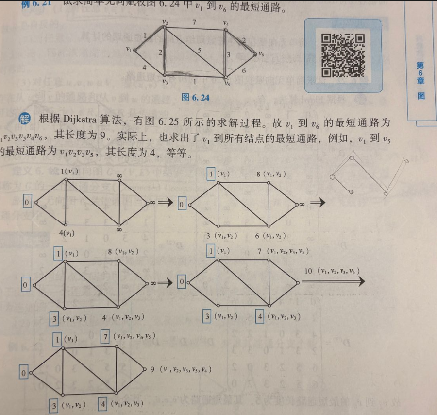

**相关笔记**: [[05.3.2-流形学习]] | [[06.4.1-图半监督学习]]

---

## 🏷️ 文档元数据
* **重要性**: ⭐⭐⭐⭐⭐ (最高优先级)
* **状态**: 基础必修

---

## 一、Dijkstra 最短路径算法 -- 从零实现

> 如何从一个起点出发，找到到图中所有其他节点的最短距离？

```python
import heapq
import numpy as np

# 📌 Dijkstra 算法的核心思想：
# 从起点出发，每一步都"贪心"地选择当前距离最小且已确定的节点
# 然后以它为跳板，看看能不能"抄近道"到达其他节点
# 就像玩扫雷：一开始只知道起点，每确定一个节点的最短距离，
# 这个节点周围邻居的距离也就被"照亮"了

# 核心数据结构：
# dist[i]  = 从起点到节点i的当前最短距离（暂定）
# visited   = 该节点的最短距离是否已"永久确定"
# prev[i]   = 到达节点i的最短路径上，前一个节点是谁（用于回溯路径）

def dijkstra(graph, start):
    """
    Dijkstra 最短路径算法

    参数:
        graph: 邻接矩阵或邻接表
               (n, n) 的二维数组，graph[i][j] = 边权重，不连通 = inf
        start: 起点索引

    返回:
        dist:  从 start 到每个节点的最短距离
        prev:  每个节点的前驱节点（用于回溯路径）
    """
    n = len(graph)
    INF = float('inf')

    # ---- 初始化 ----
    dist = [INF] * n           # 到每个节点的暂定距离（一开始全是∞）
    dist[start] = 0            # 🌟 起点到自己的距离 = 0，加上蓝框（进入P阵营）
    prev = [-1] * n            # 前驱节点（-1 = 无前驱，即尚未被访问）
    visited = [False] * n      # 是否已永久确定（加入蓝框/进入P阵营）

    # ---- 使用优先队列加速"选最小" ----
    # (距离, 节点索引) → 堆顶始终是当前距离最小且未确定的节点
    pq = [(0, start)]

    while pq:
        # 📌 关键步骤1：弹出当前T阵营中距离最小的节点（贪心）
        current_dist, u = heapq.heappop(pq)

        # 如果已经确定过，跳过（因为可能有旧的记录）
        if visited[u]:
            continue

        # 🔵 加上蓝框 → 进入P阵营，最短距离永久确定！
        visited[u] = True

        # 📌 关键步骤2：松弛 (Relaxation) — 站在新确定的节点上"四处张望"
        for v in range(n):
            w = graph[u][v]
            if w == INF or visited[v]:  # 不连通 或 已被永久确定 → 跳过
                continue

            new_dist = dist[u] + w       # "走 u → v 这条路线"的距离

            # 🌟 发现抄近道！更新暂定距离
            if new_dist < dist[v]:
                dist[v] = new_dist        # 更新暂定距离（擦掉旧记录）
                prev[v] = u               # 记录来路："上一步是从u来的"
                heapq.heappush(pq, (new_dist, v))
                # 把v和它的新暂定距离一起入队，等待未来被"永久确定"

    return dist, prev


def get_path(prev, target):
    """
    回溯最短路径（就像对照括号里的记录倒推出完整路线）
    prev: 前驱数组
    target: 终点索引
    """
    path = []
    curr = target
    while curr != -1:        # -1 表示到达了起点（无前驱）
        path.append(curr)
        curr = prev[curr]    # 沿着"来路"往回走
    path.reverse()           # 反转得到起点→终点的顺序
    return path


def dijkstra_with_path(graph, start, target):
    """
    Dijkstra 算法的完整版：计算最短距离 + 回溯最短路径
    """
    dist, prev = dijkstra(graph, start)

    if dist[target] == float('inf'):
        print(f"⚠️ 从节点 {start} 到节点 {target} 不可达")
        return float('inf'), []

    path = get_path(prev, target)
    return dist[target], path
```

```python
# ============================================
# 📌 测试：用教材中的经典例子（图见 image-3.png）
# ============================================
# 节点: v1(起点) ~ v6(终点)
# 边权重对应图中的数字

INF = float('inf')
# 邻接矩阵：行=起点，列=终点，值=边权重
graph = np.array([
    # v1  v2  v3  v4  v5  v6
    [  0,  1,  4,INF,INF,INF],  # v1
    [INF,  0,  2,  7,  5,INF],  # v2
    [INF,INF,  0,INF,  1,INF],  # v3
    [INF,INF,INF,  0,INF,  2],  # v4
    [INF,INF,INF,  3,  0,  6],  # v5
    [INF,INF,INF,INF,INF,  0],  # v6
])

start, target = 0, 5  # v1 → v6 (索引从0开始)

# ---- 运行 Dijkstra ----
dist, prev = dijkstra(graph, start)
shortest_dist, path = dijkstra_with_path(graph, start, target)

print("=" * 50)
print(f"Dijkstra 最短路径: v{start+1} → v{target+1}")
print(f"最短距离: {shortest_dist}")
print(f"最短路径: {' → '.join(f'v{i+1}' for i in path)}")
print(f"  (预期: v1 → v2 → v3 → v5 → v4 → v6, 距离=9)")
print("=" * 50)

# ---- 详细过程输出 ----
print("\n📌 每个节点的最终 dist 和 prev:")
for i in range(len(dist)):
    dist_str = f"{dist[i]}" if dist[i] != INF else "∞"
    prev_str = f"v{prev[i]+1}" if prev[i] != -1 else "起点"
    visited_str = "✓" if dist[i] != INF else "✗"
    print(f"  v{i+1}: dist={dist_str:>3}, from={prev_str:<4} [{visited_str}]")
```



```python
# ============================================
# 📌 逐步追踪 Dijkstra 的执行过程
# 模拟教材中图解的6个步骤
# ============================================

def dijkstra_step_by_step(graph, start):
    """
    打印 Dijkstra 每一步的中间状态
    输出对应教材图解中的"每个步骤后的距离表"
    """
    n = len(graph)
    INF = float('inf')

    dist = [INF] * n
    dist[start] = 0
    prev = [-1] * n
    visited = [False] * n

    step = 1

    while True:
        # ---- 找当前未确定节点中距离最小的 ----
        min_dist = INF
        u = -1
        for i in range(n):
            if not visited[i] and dist[i] < min_dist:
                min_dist = dist[i]
                u = i

        if u == -1:  # 所有节点都已确定
            break

        # 🔵 永久确定节点 u
        visited[u] = True

        # ---- 打印当前状态（对应每一张图）----
        print(f"\n{'='*50}")
        print(f"第{step}步: 锁定 v{u+1} (当前最短距离={dist[u]})")
        print(f"{'='*50}")

        # 打印距离表（T阵营 + P阵营）
        for i in range(n):
            status = "🔵P" if visited[i] else "○ T"
            dist_str = f"{dist[i]}" if dist[i] != INF else "∞"
            prev_str = f"v{prev[i]+1}" if prev[i] != -1 else "-"
            print(f"  v{i+1} [{status}] dist={dist_str:>3}, prev={prev_str}")

        # ---- 松弛：站在 u 上四处张望，看看能不能抄近道 ----
        updated = []
        for v in range(n):
            w = graph[u][v]
            if w == INF or visited[v]:
                continue

            new_dist = dist[u] + w
            if new_dist < dist[v]:
                old_dist = f"{dist[v]}" if dist[v] != INF else "∞"
                dist[v] = new_dist
                prev[v] = u
                updated.append(f"v{v+1}: {old_dist}→{new_dist}(经v{u+1})")

        if updated:
            print(f"  📌 松弛更新: {', '.join(updated)}")

        step += 1

    return dist, prev

# ---- 运行逐步追踪 ----
print("🌟 Dijkstra 逐步执行追踪 (与教材图解对应)")
print("=" * 50)
dijkstra_step_by_step(graph, start)
```

---

## 二、Dijkstra vs Floyd -- 单源 vs 全源最短路径

> Dijkstra 只能求一个起点到所有点的最短距离，如果要求任意两点之间的最短距离呢？

```python
# 📌 Dijkstra 和 Floyd 的区别：
# Dijkstra: 单源最短路径 — 从一个起点出发，求到所有节点的最短距离
#           O((V+E)logV) with 优先队列
# Floyd:    全源最短路径 — 求所有节点对之间的最短距离
#           O(V³)

def floyd_warshall(graph):
    """
    Floyd-Warshall 全源最短路径算法
    求任意两点之间的最短距离

    核心思想：动态规划
    对于每一对节点 (i, j)，尝试经过节点 k 中转
    如果 d[i][k] + d[k][j] < d[i][j]，则更新
    """
    n = len(graph)
    INF = float('inf')

    # 初始化
    dist = [[graph[i][j] for j in range(n)] for i in range(n)]

    # 🌟 三重循环：对每个"中转站" k，尝试用它来"抄近道"连接 i 和 j
    for k in range(n):
        for i in range(n):
            for j in range(n):
                # 如果 i→k 和 k→j 都通，试试走 i→k→j
                if dist[i][k] != INF and dist[k][j] != INF:
                    if dist[i][k] + dist[k][j] < dist[i][j]:
                        dist[i][j] = dist[i][k] + dist[k][j]

                # 💡 通俗比喻：
                # 原本 i 和 j 直接联系（可能很远或不通）
                # 现在发现 k 这个"中间人"认识双方
                # 通过 k 中转 → 可能更近！

    return dist

# ---- 用 Floyd 验证 Dijkstra 的结果 ----
floyd_dist = floyd_warshall(graph)
print(f"\n📌 Floyd 验证: v1→v6 的最短距离 = {floyd_dist[0][5]}")
print(f"   Dijkstra 的结果            = {dist[5]}")
print(f"   ✅ 两者结果一致" if floyd_dist[0][5] == dist[5] else "   ❌ 不一致！")
```

---

## 三、在机器学习中的应用

> 最短路径算法在机器学习中有什么实际用途？

### 1. Isomap 中的测地线距离

> Isomap 降维为什么要用 Dijkstra？它解决了什么核心问题？

```python
# ============================================
# 📌 应用1: Isomap 中的测地线距离
# ============================================
# Isomap 降维算法用 Dijkstra/Floyd 计算流形上的最短路径
# 作为高维空间中两点间真正的"测地线距离"的近似
#
# 步骤:
# 1. 构建k近邻图（只连局部邻居）
# 2. 在图上跑 Dijkstra 求任意两点的最短路径
# 3. 这些最短路径长度 = 沿流形的测地线距离
# 4. 用 MDS 在低维空间中保持这些距离

def isomap_distances(X, k=5):
    """
    计算 Isomap 中的测地线距离矩阵（Dijkstra版）
    X: 高维数据 (n, d)
    k: 近邻数
    """
    from sklearn.metrics.pairwise import euclidean_distances

    n = X.shape[0]
    INF = float('inf')

    # 计算欧氏距离
    euclidean_dist = euclidean_distances(X)

    # 构建k近邻图：只保留最近的k个邻居，其余设为∞
    graph = np.full((n, n), INF)
    for i in range(n):
        # 找最近的k+1个邻居（+1因为最近的是自己，距离为0）
        neighbors = np.argsort(euclidean_dist[i])[:k+1]
        for j in neighbors:
            if i != j:
                graph[i][j] = euclidean_dist[i][j]

    # 对称化
    graph = np.minimum(graph, graph.T)

    # 🌟 在k近邻图上跑 Floyd（对每对节点求最短路径）
    geodesic_dist = floyd_warshall(graph)

    return geodesic_dist

print("\n💡 Isomap 的核心：用 Dijkstra/Floyd 在近邻图上求测地线距离")
print("   类比：像春卷皮表面的蚂蚁，不走空中直线，只沿着皮表面爬")
print("         Dijkstra 计算的就是蚂蚁实际爬的路程 = 测地线距离")
```

### 2. 图半监督学习中的标签传播

> 标签传播和 Dijkstra 有什么共同点？

```python
# ============================================
# 📌 应用2: 图半监督学习中的标签传播
# ============================================
# 虽然标签传播不直接用 Dijkstra，但两者共享图论基础：
#   Dijkstra: 传播的是"最短距离"信息
#   标签传播: 传播的是"标签"信息
# 核心共同点：信息沿图的边结构流动
print("\n💡 图半监督学习中的标签传播 = 信息的'扩散'版本")
print("   Dijkstra 传播距离 → 确定'谁先谁后'")
print("   标签传播 传播标签 → 确定'谁是什么类'")
```

---

## 🏷️ 文档元数据
* **当前状态**：已完成 (Completed)
* **安全策略**：`.gitignore` 严格阻断 Key 泄露风险
