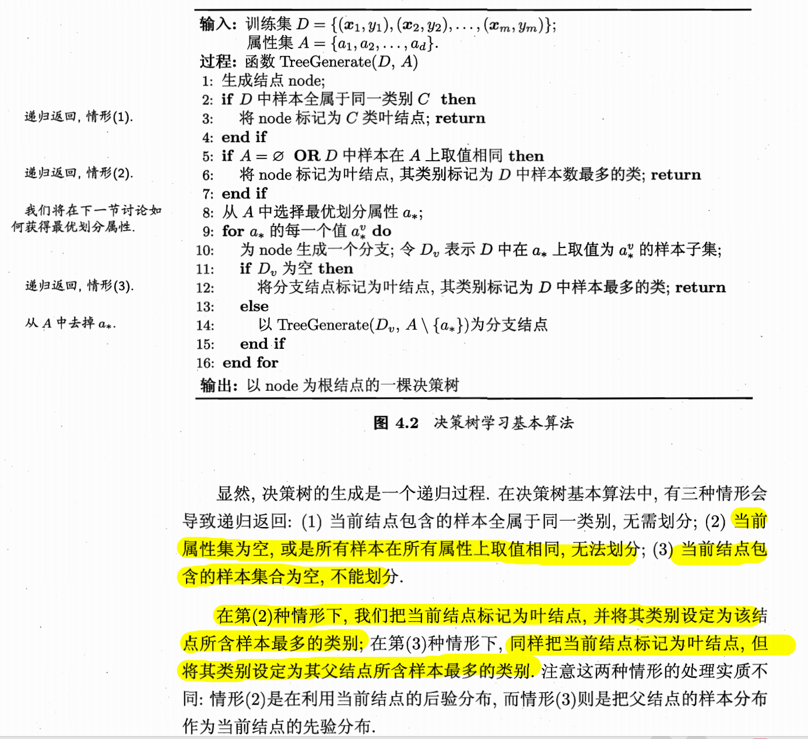
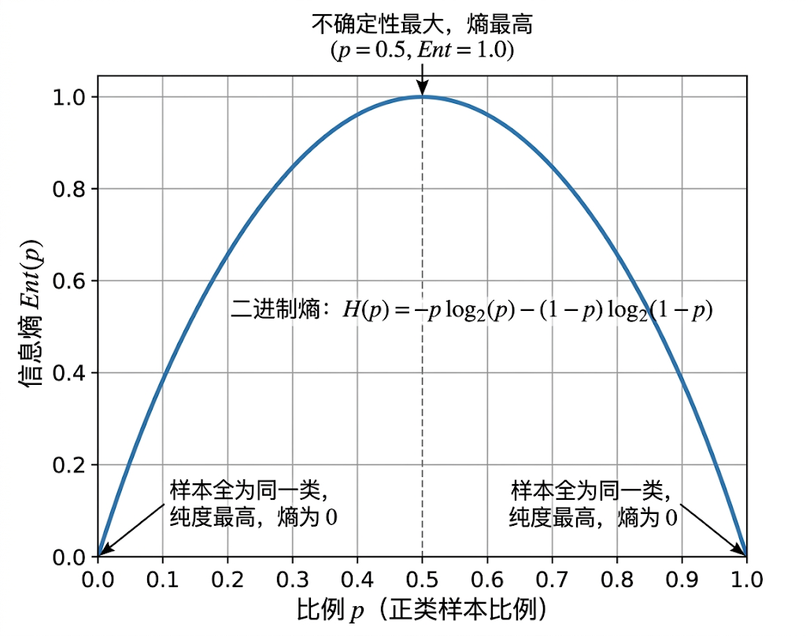

**相关笔记**: [[01.支持向量机]] | [[03.1-常见集成方法]] | [[03.2-Boosting]] | [[03.4.3-多样性增强]] | [[04.1-前置知识]]

---

## 🏷️ 文档元数据
* **重要性**: ⭐⭐⭐⭐⭐ (最高优先级)
* **状态**: 基础必修

---

## 一、为什么需要决策树？

### 1. 核心思想

```
📌 决策树本质上是一个"分而治之"(divide-and-conquer)的递归过程

把树想象成一个分类流水线——每个节点问一个问题，根据答案分流到不同分支
直到某个分支"问不出新问题了"或"答案已经明确"，停止分裂，生成叶子
```

### 2. 三种递归返回情形

```
💡 决策树在每一层递归时，按顺序经历三道"关卡"：

情形1（主动停止）：当前节点全是同一类 → 设叶子，标记为该类 → "分好了"
情形2（被迫停止）：属性用完/样本在剩余属性上取值一样 → 设叶子，投票选多数类 → "没法分"
情形3（分支空洞）：某属性值下没有样本 → 设叶子，用父节点多数类 → "没得送"
```



### 3. sklearn 起步

```python
import numpy as np
import pandas as pd
from sklearn.tree import DecisionTreeClassifier, DecisionTreeRegressor, plot_tree
from sklearn.datasets import load_iris, load_wine
from sklearn.model_selection import train_test_split, GridSearchCV, cross_val_score
from sklearn.preprocessing import LabelEncoder
from sklearn.metrics import accuracy_score, classification_report
import matplotlib.pyplot as plt

iris = load_iris()
X_train, X_test, y_train, y_test = train_test_split(
    iris.data, iris.target, test_size=0.3, random_state=42
)

# CART算法（sklearn默认）：用基尼指数做划分准则，只生成二叉树
# ⚠️ CART仅生成二叉树，而ID3/C4.5可以生成多叉树（同一个属性可取多个值分流）
tree = DecisionTreeClassifier(random_state=42)
tree.fit(X_train, y_train)

print(f"不限制深度的树 → 训练准确率: {tree.score(X_train, y_train):.3f}")
print(f"不限制深度的树 → 测试准确率: {tree.score(X_test, y_test):.3f}")
print(f"叶子节点数: {tree.get_n_leaves()}, 树深度: {tree.get_depth()}")
```

---

## 二、停止条件与剪枝

### 1. 什么时候树停止生长？

```
📌 四种停止条件：

1. max_depth：达到预设最大深度 → 人为限制，防止过拟合
2. 节点已纯：所有样本同一类 → 再分失去意义
3. 无法提升纯度：所有划分方案都不降低Gini/熵 → 已到信息极限
4. min_samples_leaf：节点样本太少 → 再分不可信
```

```python
# 💡 剪枝实战：min_samples_leaf和max_depth是最常用的防过拟合手段
for depth in [2, 3, 5, 10, None]:
    for min_leaf in [1, 5, 20]:
        dt = DecisionTreeClassifier(max_depth=depth, min_samples_leaf=min_leaf, random_state=42)
        dt.fit(X_train, y_train)
        train_acc = dt.score(X_train, y_train)
        test_acc = dt.score(X_test, y_test)
        n_leaves = dt.get_n_leaves()
        print(f"depth={str(depth):>4s}, min_leaf={min_leaf:2d} → "
              f"叶子={n_leaves:2d}, 训练={train_acc:.3f}, 测试={test_acc:.3f}")
```

---

## 三、划分准则三大指标

### 1. 信息增益（Information Gain）—— ID3 算法

```
📌 公式：Gain(D, a) = Ent(D) - Σ (|D_v|/|D|) * Ent(D_v)
       Ent(D) = -Σ p_k * log2(p_k)

💡 信息熵的直觉：衡量"惊讶程度"的平均值
  概率越小的事件发生 → 惊喜越大 → 信息量越大
  log2(1/p) 满足：单调递减 + 独立事件相加性( log(AB) = logA + logB )

⚠️ ID3的致命弱点：偏好"可取值数目多"的属性
  比如用"学号"分——每个分支一个样本，纯度100%，信息增益极大
  但完全没泛化能力，只是把训练集"背了下来"
```

```python
def entropy(y):
    """计算信息熵：-Σ p_k * log2(p_k)"""
    _, counts = np.unique(y, return_counts=True)
    p = counts / len(y)
    # 💡 当p=0时，约定 p*log2(p) = 0（极限为0）
    return -np.sum(p * np.log2(p + 1e-12))  # 加小量防log(0)

def info_gain(X, y, feature_idx):
    """计算某特征的信息增益"""
    ent_before = entropy(y)
    values, counts = np.unique(X[:, feature_idx], return_counts=True)
    ent_after = 0.0
    for v, cnt in zip(values, counts):
        subset_y = y[X[:, feature_idx] == v]
        ent_after += (cnt / len(y)) * entropy(subset_y)
    return ent_before - ent_after

# 在iris数据上验证
iris_X, iris_y = iris.data, iris.target
for i, name in enumerate(iris.feature_names):
    ig = info_gain(iris_X, iris_y, i)
    print(f"特征 '{name}' 信息增益: {ig:.4f}")
```

### 2. 增益率（Gain Ratio）—— C4.5 算法

```
📌 公式：Gain_ratio(D, a) = Gain(D, a) / IV(a)
       IV(a) = -Σ (|D_v|/|D|) * log2(|D_v|/|D|) —— "固有值"

💡 IV的逻辑：越能分叉的属性IV越大 → 放到分母上 → 压低了它的增益率
  这正好"惩罚"了ID3偏好多取值属性的毛病

⚠️ 但C4.5并非直接用增益率最大值选属性——那会矫枉过正，偏好看取值少的属性
  实际采用"C4.5启发式"两步走：
    第一步：找出信息增益高于平均水平的候选属性
    第二步：从这些候选中选增益率最高的
```

```python
def intrinsic_value(X, feature_idx):
    """计算固有值IV——和信息熵形式一样，但衡量的是属性取值的分散度"""
    _, counts = np.unique(X[:, feature_idx], return_counts=True)
    p = counts / len(X)
    return -np.sum(p * np.log2(p + 1e-12))

def c45_select_feature(X, y):
    """C4.5启发式特征选择：先筛选高增益，再选增益率最高的"""
    n_features = X.shape[1]
    gains = np.array([info_gain(X, y, i) for i in range(n_features)])
    avg_gain = gains.mean()
    candidates = [i for i in range(n_features) if gains[i] >= avg_gain]
    best_idx = max(candidates, key=lambda i: gains[i] / intrinsic_value(X, i))
    return best_idx

best = c45_select_feature(iris_X, iris_y)
print(f"\nC4.5启发式选出的最佳特征: {iris.feature_names[best]}")
```

### 3. 基尼指数（Gini Index）—— CART 算法

```
📌 基尼值的物理直觉："随机摸两次球，颜色不一样的概率"

Gini(D) = 1 - Σ p_k²

从反面入手的思想：
  "不一致概率" = 1 - "一致概率"
  一致概率 = 两次都摸到第1类的概率 + 两次都摸到第2类的概率 + ...
           = Σ p_k²

基尼指数越小 → 两次颜色不一致的概率越小 → 数据纯度越高
```

```python
def gini(y):
    """计算基尼值：1 - Σ p_k²"""
    _, counts = np.unique(y, return_counts=True)
    p = counts / len(y)
    return 1 - np.sum(p ** 2)

def gini_index(X, y, feature_idx):
    """计算某特征的基尼指数（划分后的加权平均）"""
    values, counts = np.unique(X[:, feature_idx], return_counts=True)
    gini_after = 0.0
    for v, cnt in zip(values, counts):
        subset_y = y[X[:, feature_idx] == v]
        gini_after += (cnt / len(y)) * gini(subset_y)
    return gini_after  # 越小越好

for i, name in enumerate(iris.feature_names):
    gi = gini_index(iris_X, iris_y, i)
    print(f"特征 '{name}' 基尼指数: {gi:.4f}")
```

### 4. 三大指标对比总结

```
┌─────────────┬───────┬─────────────────────────┬──────────┬──────────────────┐
│ 指标         │ 算法  │ 核心逻辑                │ 计算复杂度│ 偏好              │
├─────────────┼───────┼─────────────────────────┼──────────┼──────────────────┤
│ 信息增益     │ ID3   │ 不确定性减少量(log运算)  │ 最高      │ 偏爱多取值属性    │
│ 增益率       │ C4.5  │ 增益/IV，惩罚多取值     │ 最高      │ 通过两步法平衡    │
│ 基尼指数     │ CART  │ 不一致概率(平方运算)     │ 最低      │ 中庸，最主流      │
└─────────────┴───────┴─────────────────────────┴──────────┴──────────────────┘

💡 实践中两者生成的树非常相似——基尼指数和信息熵在p=0.5时都达到峰值
  基尼指数曲线比熵曲线稍矮一点，但选属性时影响不大
  基尼指数是sklearn默认的原因：省去对数运算，快
```

```python
# sklearn中切换划分准则
tree_entropy = DecisionTreeClassifier(criterion='entropy', random_state=42)
tree_gini = DecisionTreeClassifier(criterion='gini', random_state=42)
tree_entropy.fit(X_train, y_train)
tree_gini.fit(X_train, y_train)
print(f"\nentropy划分 → 测试准确率: {tree_entropy.score(X_test, y_test):.3f}, 深度: {tree_entropy.get_depth()}")
print(f"gini划分    → 测试准确率: {tree_gini.score(X_test, y_test):.3f}, 深度: {tree_gini.get_depth()}")
```

---

## 四、信息熵图像与划分哲学

### 1. 信息熵函数图像特性



```
💡 信息熵图像关键特性：
  1. 凸函数，二分类下是倒扣的U形
  2. 最小值=0（全部同一类，绝对纯净）
  3. 最大值=log2(|Y|)（各类均匀分布，不确定性最大，如50% vs 50%）
```

### 2. 基尼 vs 信息熵：两种划分哲学

```
🌟 基尼杂质：倾向于"孤立大群体"
  优先寻找能迅速切出一块极纯区域的方案
  比如切一刀分出40个全是苹果的堆，剩下苹果和梨还混在一起也不管
  结果是树长得比较"歪"——一边深一边浅

🌟 信息熵：倾向于"全局整齐"
  对数函数对低概率类别变化敏感，追求两边子节点都尽可能有序
  比如切完后两边都是一半苹果一半梨（但比例比原堆更均衡）
  结果是树长得更"矮胖"、更平衡

💡 分水果比喻：筐里有80个苹果+20个梨
  基尼：切出40个全是苹果的 → "这堆太纯了，Gini降得飞快！"
  信息熵：两堆都变成"40苹果+5梨"和"40苹果+15梨" → "两边都比原来有序了"
```

---

## 五、缺失值处理（C4.5 核心）

### 1. 两大策略

```
💡 C4.5处理缺失值的两大策略：

1️⃣ 属性选择阶段：信息增益要乘 ρ（无缺失值样本比例）
  Gain(D, a) = ρ × Gain(D̃, a)
  逻辑：ρ是对"未知风险"的折让
  - 缺失越多 → ρ越小 → 增益被拉低 → 惩罚"坑太多"的属性
  - 如果缺失90%，就算剩余10%增益很高，乘0.1后也被大幅拉低

2️⃣ 样本划分阶段：缺失样本按权重分配去所有分支
  已知取值的样本：正常去对应分支，权重w_x不变（初始都是1）
  缺失取值的样本：同时去所有分支，权重按 r̃_v（已知数据中各分支的比例）分配
  例子：70%西瓜"青绿"30%"乌黑"，一个色泽缺失的瓜 → 0.7权重去青绿，0.3去乌黑
```

```python
# 📌 手写C4.5缺失值信息增益（演示ρ惩罚机制）
def info_gain_with_missing(X, y, feature_idx, missing_mask=None):
    """
    计算带缺失值的信息增益（C4.5风格）
    返回 ρ × Gain(D̃, a)，其中ρ是无缺失样本比例
    """
    if missing_mask is None:
        missing_mask = np.isnan(X[:, feature_idx]) | (X[:, feature_idx] == -1)

    complete_mask = ~missing_mask
    rho = complete_mask.sum() / len(y)  # 无缺失样本比例

    if rho == 0:
        return 0.0  # 全缺失 → 这个属性没用了

    X_complete = X[complete_mask]
    y_complete = y[complete_mask]
    feature_idx_clipped = min(feature_idx, X_complete.shape[1] - 1)

    gain_on_complete = info_gain(X_complete, y_complete, feature_idx_clipped)
    return rho * gain_on_complete  # 📌 核心：用ρ惩罚
```

### 2. arg min 与 min 的区别

```
📌 a* = arg min Gini_index(D, a)：找到的是"哪个属性"导致了最小值

min：关注的"最小值是多少"（结果本身）
arg min：关注的"谁导致了这个最小值"（原因/变量）
选最佳划分属性时，用的是arg min，因为我们要的不是最小的基尼值本身，而是哪个属性导致了它
```

---

## 六、调参与实战

### 1. GridSearchCV 网格搜索

```python
wine = load_wine()
X_wine_train, X_wine_test, y_wine_train, y_wine_test = train_test_split(
    wine.data, wine.target, test_size=0.3, random_state=42
)

# 💡 决策树核心调参项：
#   max_depth         — 最大深度（防止长得太深 → 过拟合）
#   min_samples_split — 节点最少样本数，少于此数不分裂
#   min_samples_leaf  — 叶子最少样本数，少于此数不生成（更强约束）
#   criterion         — 'gini' vs 'entropy'
#   ccp_alpha         — 最小成本复杂度剪枝（後剪枝，sklearn 0.22+）

param_grid = {
    'max_depth': [3, 5, 7, 10, None],
    'min_samples_split': [2, 5, 10],
    'min_samples_leaf': [1, 2, 5],
    'criterion': ['gini', 'entropy'],
}

grid = GridSearchCV(
    DecisionTreeClassifier(random_state=42),
    param_grid, cv=5, scoring='accuracy', n_jobs=-1
)
grid.fit(X_wine_train, y_wine_train)

print(f"\n最佳参数: {grid.best_params_}")
print(f"最佳交叉验证准确率: {grid.best_score_:.3f}")
print(f"测试集准确率: {grid.best_estimator_.score(X_wine_test, y_wine_test):.3f}")
```

### 2. 特征重要性

```python
best_tree = grid.best_estimator_
importances = best_tree.feature_importances_
indices = np.argsort(importances)[::-1]
print("\n特征重要性排名（基尼重要性 = 该特征带来的节点纯度提升之和）：")
for i, idx in enumerate(indices):
    print(f"  {i+1}. {wine.feature_names[idx]:>20s} → {importances[idx]:.4f}")
```

### 3. 后剪枝：ccp_alpha

```python
# ccp_alpha越大 → 剪得越狠 → 树越小 → 降低过拟合风险
path = DecisionTreeClassifier(random_state=42).cost_complexity_pruning_path(
    X_wine_train, y_wine_train
)

for alpha_log in np.linspace(-4, -1, 5):
    alpha = 10 ** alpha_log
    dt_pruned = DecisionTreeClassifier(ccp_alpha=alpha, random_state=42)
    dt_pruned.fit(X_wine_train, y_wine_train)
    print(f"ccp_alpha={alpha:.4f} → 叶子={dt_pruned.get_n_leaves():2d}, "
          f"深度={dt_pruned.get_depth()}, 训练={dt_pruned.score(X_wine_train, y_wine_train):.3f}, "
          f"测试={dt_pruned.score(X_wine_test, y_wine_test):.3f}")
```

---

## 七、总结：三种划分准则选型速查

```
💡 算法家族背景速查：
  ID3     → 信息增益，允许多叉树，偏爱多取值属性
  C4.5    → 增益率+启发式两步走，允许多叉树，支持缺失值处理
  CART    → 基尼指数（分类）/ MSE（回归），仅二叉树，sklearn默认

💡 实战建议：
  追求计算效率/大数据集  → criterion='gini'（省掉log运算）
  担心多取值偏差         → criterion='entropy'或用GridSearch找最佳参数
  特征有缺失值           → sklearn的DecisionTreeClassifier本身不支持缺失值，
                           需先用SimpleImputer填充，或考虑用HistGradientBoosting
  进一步防止过拟合       → ccp_alpha后剪枝 + min_samples_leaf + max_depth

⚠️ 常见坑：
  1. 不设max_depth → 树长到纯为止 → 完美"背下"训练集 → 测试集一塌糊涂
  2. 数据未编码 → 类别标签是字符串 → sklearn报错 → 先做LabelEncoder
  3. ID3偏好学号/日期 → 看似增益高 → 实际过拟合 → 用C4.5或CART避开
```

---

## 🏷️ 文档元数据
* **当前状态**：已完成 (Completed)
* **安全策略**：`.gitignore` 严格阻断 Key 泄露风险
