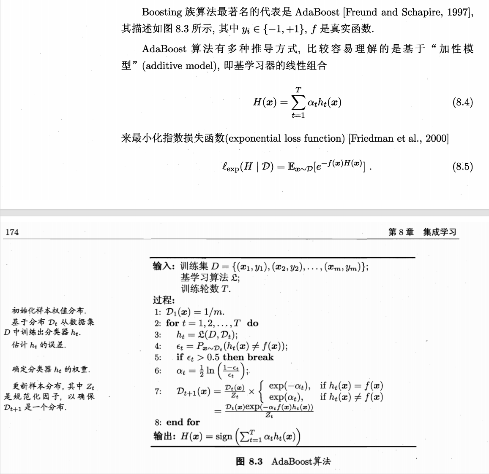

**相关笔记**: [[02.决策树]] | [[03.1-常见集成方法]] | [[03.4.1-误差-分歧分解]] | [[03.4.2-多样性度量]] | [[03.4.3-多样性增强]]

---

## 🏷️ 文档元数据
* **重要性**: ⭐⭐⭐⭐⭐ (最高优先级)
* **状态**: 基础必修

---

## 一、AdaBoost 核心机制 — 代码演示

AdaBoost 如何通过"补习错题"的方式逐步提升弱学习器？

# AdaBoost 就像一个"补习老师"：每次考试后，把学生做错的题标成高亮重点，
# 下次考试加倍考这些错题，直到学生把薄弱点全部攻克

import numpy as np
from sklearn.datasets import make_classification
from sklearn.model_selection import train_test_split, cross_val_score
from sklearn.tree import DecisionTreeClassifier
from sklearn.ensemble import AdaBoostClassifier
from sklearn.metrics import accuracy_score

# 造数据
X, y = make_classification(n_samples=1000, n_features=20, random_state=42)
X_train, X_test, y_train, y_test = train_test_split(X, y, test_size=0.3, random_state=42)

---

### 1. AdaBoost 的标准用法

如何用 sklearn 快速搭建 AdaBoost？

# base_estimator: 基学习器，通常用"决策桩"（深度=1的决策树）
#   深度为1意味着这棵树只问一个问题，比瞎猜好不了多少——真正的"弱学习器"
# n_estimators:  串联多少个弱学习器
# learning_rate: 学习率/步长，控制每个弱学习器对最终结果的贡献力度
#   ⚠️ learning_rate 与 n_estimators 是跷跷板关系：lr小则需更多estimator
ada = AdaBoostClassifier(
    estimator=DecisionTreeClassifier(max_depth=1, random_state=42),
    n_estimators=100,           # 100轮"补习"
    learning_rate=1.0,          # 每轮纠错的激进程度
    algorithm='SAMME.R',        # 🌟 SAMME.R: 用概率预测，比SAMME收敛更快
    random_state=42
)
ada.fit(X_train, y_train)
print(f"📌 AdaBoost 测试准确率: {ada.score(X_test, y_test):.4f}")

---

### 2. 手动重现 AdaBoost 的权重更新逻辑

样本权重是如何根据预测结果动态调整的？

# 下面的代码手动演练一轮 AdaBoost 的"样本权重更新"机制
# 核心公式: w_new = w_old * exp(-alpha * y_true * y_pred) / Z
#   - 预测正确: y_true*y_pred=+1, 乘以 e^{-alpha} → 权重降低（这题会了，不重点考了）
#   - 预测错误: y_true*y_pred=-1, 乘以 e^{+alpha} → 权重暴增（这题还不会，下次加倍考！）

# 取一个小样本集模拟
np.random.seed(42)
n_samples = 10
X_demo = np.random.randn(n_samples, 2)
y_demo = np.array([1, 1, 1, 1, 1, 1, -1, -1, -1, -1])
# 注意：AdaBoost需要标签为 +1/-1 或 0/1, sklearn内部会自动转换

# --- 第1轮：所有样本权重相等 ---
weights = np.ones(n_samples) / n_samples  # 初始权重：每人 0.1
print(f"\n📌 第0轮 初始权重: {weights}")

# 训练第一个决策桩
stump = DecisionTreeClassifier(max_depth=1, random_state=42)
stump.fit(X_demo, y_demo)
pred_1 = stump.predict(X_demo)
err_1 = np.sum(weights[pred_1 != y_demo])  # 🌟 错误率 = 错题权重之和
print(f"第1轮 预测: {pred_1}")
print(f"第1轮 错误率: {err_1:.4f}")

# 🌟 计算模型话语权 alpha（学霸拿大头，学渣拿小头）
alpha_1 = 0.5 * np.log((1 - err_1) / max(err_1, 1e-10))
print(f"第1轮 alpha(话语权): {alpha_1:.4f}")

# 🌟 更新样本权重：错的加倍，对的减半
weights = weights * np.exp(-alpha_1 * y_demo * pred_1)
weights = weights / np.sum(weights)  # 归一化，保证总和=1
print(f"第1轮后 新权重: {np.round(weights, 4)}")
print(f"  💡 做错的样本权重 {weights[pred_1 != y_demo].round(4)} (变大了！)")
print(f"  💡 做对的样本权重 {weights[pred_1 == y_demo].round(4)} (变小了！)")

---

### 3. 指数损失函数 (Exponential Loss) 的代码体现

为什么 AdaBoost 对错题"零容忍"？

# 公式: L_exp = E[exp(-y * f(x))]
#   预测正确: y*f(x) > 0, exp(-正数) → 损失趋近0（几乎不惩罚）
#   预测错误: y*f(x) < 0, exp(+正数) → 损失爆炸增长（严厉惩罚！）
# 这个设计让AdaBoost对错题"零容忍"，强制模型去攻克难点

def exponential_loss(y_true, y_pred_scores):
    """计算指数损失，y_pred_scores为模型的决策函数输出（非最终预测标签）"""
    return np.mean(np.exp(-y_true * y_pred_scores))

# 用 AdaBoost 的决策函数输出来看损失
scores = ada.decision_function(X_test)  # 实数值，非硬分类
loss = exponential_loss(y_test * 2 - 1, scores)  # 把 0/1 标签转为 -1/+1
print(f"\n📌 指数损失值: {loss:.4f}")
print("💡 损失越小 → 模型对每个样本的预测越正确")

---

### 4. 权重更新与错误率的关系 — 数值演示

alpha 如何同时影响"话语权"和"惩罚力度"？

# 演示如何 alpha 同时影响：
#   1. 模型在最终投票中的"话语权"
#   2. 样本权重更新的"惩罚/奖励"力度

print("\n" + "="*50)
print("🔍 alpha 的双重角色演示")
print("="*50)

for err in [0.1, 0.3, 0.49]:
    alpha = 0.5 * np.log((1 - err) / err)
    # 对正确样本：乘以 exp(-alpha)；对错误样本：乘以 exp(+alpha)
    weight_factor_correct = np.exp(-alpha)
    weight_factor_wrong   = np.exp(+alpha)
    print(f"  错误率={err:.2f} → alpha={alpha:.3f} | "
          f"正确样本权重×{weight_factor_correct:.3f} | "
          f"错误样本权重×{weight_factor_wrong:.3f}")
# 💡 规律：错误率越低 → alpha越大 → 学霸说话分量重，且它搞错的样本被加倍放大
print("💡 错误率低 → alpha大 → 学霸话语权重 → 学霸的错题更被重视")

---

### 5. 超参数调优：learning_rate vs n_estimators

learning_rate 和 n_estimators 之间存在怎样的跷跷板关系？

print("\n" + "="*50)
print("🔍 learning_rate 与 n_estimators 的跷跷板关系")
print("="*50)
# ⚠️ 经验法则: lr 小 + n_estimators 多 = 泛化好但训练慢
#             lr 大 + n_estimators 少 = 训练快但可能欠拟合
for lr in [0.1, 0.5, 1.0, 2.0]:
    for n in [50, 100, 200]:
        ada_tmp = AdaBoostClassifier(
            estimator=DecisionTreeClassifier(max_depth=1),
            n_estimators=n, learning_rate=lr,
            algorithm='SAMME.R', random_state=42
        )
        scores = cross_val_score(ada_tmp, X_train, y_train, cv=5, scoring='accuracy')
        print(f"  lr={lr:.1f}, n={n:3d}: CV={scores.mean():.4f} (+/- {scores.std():.4f})")

---

## 二、Boosting 算法流程总结

AdaBoost 的完整迭代流程是怎样的？

# 1. 初始化所有样本权重相等: w_i = 1/m
# 2. for t in 1..T:
#     a. 在加权数据上训练弱学习器 h_t
#     b. 计算 h_t 的加权错误率 ε_t
#     c. if ε_t > 0.5: break  # 比瞎猜还差，不练了
#     d. 计算话语权 α_t = 0.5 * ln((1-ε_t)/ε_t)
#     e. 更新样本权重:
#        - 正确样本: w *= exp(-α_t)  →  降权
#        - 错误样本: w *= exp(+α_t)  →  加权
#     f. 归一化权重
# 3. 最终输出: H(x) = sign(Σ α_t * h_t(x))
#
# 💡 AdaBoost 是"师徒制"：每个新徒弟专攻前一个徒弟的错题
# 💡 指数损失对错题零容忍 → 迫使模型不断攻克难点
# 💡 α 既管"谁说话有分量"，又管"谁的错题更该被重视"

---

## 🏷️ 文档元数据
* **当前状态**：已完成 (Completed)
* **安全策略**：`.gitignore` 严格阻断 Key 泄露风险
