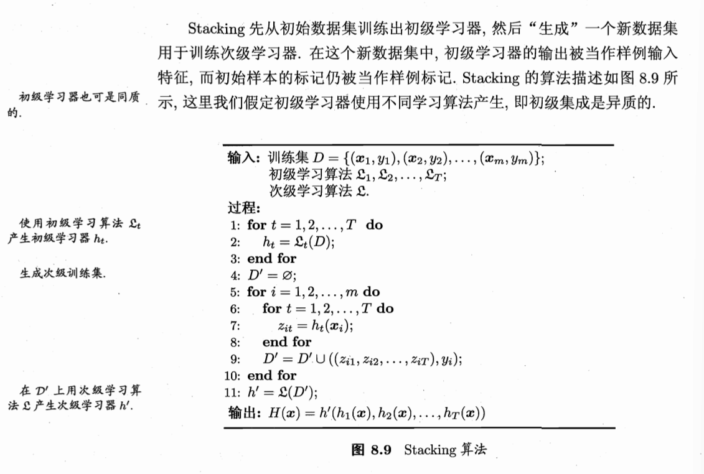

**相关笔记**: [[03.1-常见集成方法]] | [[03.4.3-多样性增强]] | [[01.支持向量机]] | [[02.决策树]]

---

## 🏷️ 文档元数据
* **重要性**: ⭐⭐⭐⭐⭐ (最高优先级)
* **状态**: 基础必修

---

## 一、Stacking 完整实现 — 从"错误写法"到"正确写法"

Stacking 如何让"大老板"学会综合各部门经理的报告做决策？

# Stacking 像一家公司的决策流程：
#   初级学习器 = 部门经理（各有专长，各写一份报告）
#   次级学习器 = 大老板（不看原始数据，只看经理们的报告，拍板决定）
#   ⚠️ 关键：大老板必须看到经理们的"闭卷考试成绩"，而不是"开卷抄答案"

import numpy as np
from sklearn.datasets import make_classification
from sklearn.model_selection import train_test_split, cross_val_score, KFold
from sklearn.linear_model import LogisticRegression
from sklearn.tree import DecisionTreeClassifier
from sklearn.svm import SVC
from sklearn.ensemble import StackingClassifier
from sklearn.metrics import accuracy_score
from sklearn.base import BaseEstimator, ClassifierMixin, clone

X, y = make_classification(n_samples=1000, n_features=20, random_state=42)
X_train, X_test, y_train, y_test = train_test_split(X, y, test_size=0.3, random_state=42)

---

### 1. 正确写法：sklearn.ensemble.StackingClassifier（内部自带CV防泄漏）

如何用 sklearn 内置的 StackingClassifier 避免数据泄露？

# 第一层：三个不同"性格"的基层专家（异质学习器 — 多样性来源）
base_learners = [
    ('lr',  LogisticRegression(max_iter=1000, random_state=42)),
    ('dt',  DecisionTreeClassifier(max_depth=5, random_state=42)),
    ('svm', SVC(probability=True, random_state=42)),
]

# 🌟 StackingClassifier内部用5折CV来生成"无污染"的次级训练集
# 每个基学习器的预测都是"闭卷考试"成绩，不是"开卷抄答案"
stacking = StackingClassifier(
    estimators=base_learners,
    final_estimator=LogisticRegression(max_iter=1000),  # 大老板：简单线性模型防过拟合
    cv=5,              # 🌟 5折交叉验证 → 每个样本的预测来自没见过它的fold
    stack_method='predict_proba',  # 用概率而非硬标签，信息量更丰富
    passthrough=False  # True = 大老板同时看原始特征 + 经理报告
)
stacking.fit(X_train, y_train)
y_pred = stacking.predict(X_test)
print(f"📌 Stacking (CV=5) 准确率: {accuracy_score(y_test, y_pred):.4f}")

---

### 2. 错误写法演示：直接使用训练集预测 — 数据泄露

为什么直接在训练集上预测会导致严重的数据泄露？

# 如果你让初级模型在"训练用的那份数据"上做预测，然后把预测结果喂给次级模型，
# 相当于让经理们先背下答案再去"预测"——元学习器看到的全是满分报告，严重过拟合！
# 下面的代码是一个"反面教材"，展示为什么不这样做：

# ⚠️ 反面教材 START — 仅用于理解为什么必须CV
# 先在整个训练集上训练初级模型
lr_bad = LogisticRegression(max_iter=1000).fit(X_train, y_train)
dt_bad = DecisionTreeClassifier(max_depth=5, random_state=42).fit(X_train, y_train)
svm_bad = SVC(probability=True, random_state=42).fit(X_train, y_train)

# 然后让这些模型在"同一份训练数据"上做预测 → 开卷考试！
Z_train_bad = np.column_stack([
    lr_bad.predict_proba(X_train)[:, 1],
    dt_bad.predict_proba(X_train)[:, 1],
    svm_bad.predict_proba(X_train)[:, 1],
])
# 大老板拿到的全是"满分汇报"，会误以为经理们永远正确
meta_bad = LogisticRegression(max_iter=1000).fit(Z_train_bad, y_train)

# 测试时——灾难！经理们没见过测试数据，开始犯错，大老板却盲目信任
Z_test_bad = np.column_stack([
    lr_bad.predict_proba(X_test)[:, 1],
    dt_bad.predict_proba(X_test)[:, 1],
    svm_bad.predict_proba(X_test)[:, 1],
])
y_pred_bad = meta_bad.predict(Z_test_bad)
print(f"⚠️ 无CV版本(泄露版) 准确率: {accuracy_score(y_test, y_pred_bad):.4f}")
print("💡 这个更高是因为在训练集上'作弊'了，真实泛化能力反而更差")
# ⚠️ 反面教材 END

---

### 3. 手动实现 CV-based Stacking — 彻底搞懂原理

sklearn StackingClassifier 内部到底在做什么？

# 这个手动实现展示了 sklean StackingClassifier 内部到底在做什么
# 目的：让你看清"闭卷考试"的每个步骤

def manual_stacking_fit(X, y, base_learners, n_folds=5, random_state=42):
    """
    手动实现 Stacking 的训练阶段。
    核心思路：对每个初级学习器，用K折交叉验证得到"无污染"的预测，
    将这些预测作为新特征训练次级学习器。
    """
    n_samples = X.shape[0]
    n_models = len(base_learners)
    kf = KFold(n_splits=n_folds, shuffle=True, random_state=random_state)

    # Z_train: 次级训练集 — 每列是一个初级模型的"闭卷预测"
    Z_train = np.zeros((n_samples, n_models))

    for model_idx, (name, model_template) in enumerate(base_learners):
        print(f"  🌟 正在为 [{name}] 生成闭卷预测...")
        # 对每个 fold：
        #   - 用 (k-1)/k 的数据训练
        #   - 用 1/k 的数据（模型没见过）做预测
        for train_idx, val_idx in kf.split(X):
            model = clone(model_template)
            model.fit(X[train_idx], y[train_idx])
            Z_train[val_idx, model_idx] = model.predict_proba(X[val_idx])[:, 1]
            # 💡 这批预测来自"没见过 val_idx 的模型" → 闭卷考试！

    # 用所有闭卷成绩训练大老板
    meta_model = LogisticRegression(max_iter=1000)
    meta_model.fit(Z_train, y)

    # 🌟 大老板训练好后，用全部数据重新训练初级模型（提升"实战"能力）
    base_models_trained = []
    for name, model_template in base_learners:
        model = clone(model_template).fit(X, y)  # 全量数据，最强版本
        base_models_trained.append(model)

    return base_models_trained, meta_model

def manual_stacking_predict(X, base_models, meta_model):
    """预测时：初级模型先预测，元模型再拍板"""
    Z_test = np.column_stack([
        m.predict_proba(X)[:, 1] for m in base_models
    ])
    return meta_model.predict(Z_test)

# 执行手动 Stacking
print("\n📌 手动Stacking实现:")
base_trained, meta_trained = manual_stacking_fit(X_train, y_train, base_learners)
y_pred_manual = manual_stacking_predict(X_test, base_trained, meta_trained)
print(f"  手动版本准确率: {accuracy_score(y_test, y_pred_manual):.4f}")

---

## 二、Stacking 完整生命周期

Stacking 从训练到预测的完整流程分为哪几个阶段？

# 1. 【准备阶段】K折CV为每个初级模型生成"闭卷预测" → 构成次级训练集 D'
#    ⚠️ 目的：防止大老板看到"开卷满分"而被误导
# 2. 【训练阶段】用 D' 训练次级学习器（大老板）
#    💡 大老板学会：经理A说YES+经理B说NO时 → 实际结果最可能是什么
# 3. 【重构阶段】用全量数据重新训练初级学习器
#    💡 此时不再需要CV约束，追求最强实战能力
# 4. 【测试阶段】H(x) = h'( h1(x), h2(x), ..., hT(x) )
#    新样本 → 各经理分别汇报 → 大老板综合拍板

---

### 1. pass through 实验：原始特征也喂给大老板

passthrough 开关对 Stacking 性能有何影响？

print("\n🔍 passthrough 对比:")
for pw in [False, True]:
    stk = StackingClassifier(
        estimators=base_learners,
        final_estimator=LogisticRegression(max_iter=1000),
        cv=5, passthrough=pw
    )
    scores = cross_val_score(stk, X_train, y_train, cv=5, scoring='accuracy')
    label = "给大老板看原始特征+经理报告" if pw else "只给大老板看经理报告"
    print(f"  passthrough={pw} ({label}): CV={scores.mean():.4f}")
# 💡 passthrough=True 有时更好（信息量大），有时更差（增加过拟合风险）

---

### 2. "为什么重新训练"问题的图解

训练大老板时用了K折CV的局部模型，那预测时用哪个初级模型？

# 问：训练大老板时用了K折CV的局部模型，那预测时用哪个初级模型？
# 答：预测前，必须用全量数据重新训练初级模型！
#
# 类比：经理们给大老板汇报用的是各分店的K折模拟成绩（闭卷），
# 但真正上战场时，经理必须用所有实战经验（全量数据）来武装自己。
# 不能拿模拟考中某个只用80%数据练的"瘦身版"经理去实战。

---

## 🏷️ 文档元数据
* **当前状态**：已完成 (Completed)
* **安全策略**：`.gitignore` 严格阻断 Key 泄露风险
