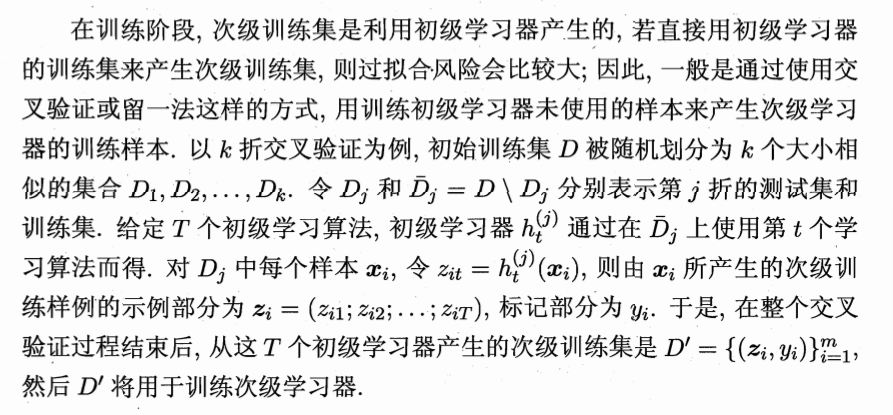

## **Stacking（堆叠）算法**的伪代码解析

我们可以把 Stacking 想象成一个 **“公司决策流程”**：
*   **初级学习器**：公司里的各个部门经理（基层专家），每个人有自己的专业背景和看问题的方式（异质的）。
*   **次级学习器**：公司的大老板（综合决策者），他不直接看原始数据，而是看经理们的汇报报告，然后综合给出最终决定。

### 一、 输入部分 (Inputs)
*   **训练集 $D$**：这是原始的业务数据，包含 $m$ 个样本，每个样本有它的原始特征 $\mathbf{x}_i$ 和真实结果 $y_i$。
*   **初级学习算法 $\mathfrak{L}_1, \mathfrak{L}_2, \ldots, \mathfrak{L}_T$**：你要培养经理的方法。这里通常选择 $T$ 种**完全不同**的算法（比如决策树、神经网络、SVM等），因为不同算法犯的错误不一样，这样能保证模型的多样性。
*   **次级学习算法 $\mathfrak{L}$**：培养大老板的方法，通常选用比较简单的线性模型（如逻辑回归），用来防止过拟合。

### 二、 过程部分 (Process)

#### 第一阶段：培养基层专家
*   **1: for $t = 1, 2, \ldots, T$ do**
    (开始循环：准备训练 $T$ 个初级学习器。)
*   **2: $h_t = \mathfrak{L}_t(D)$;**
    (让第 $t$ 个初级算法去学习所有的原始数据 $D$，学成之后，得到了一个具体的初级模型 $h_t$。)
*   **3: end for**
    (循环结束。现在你手里有了 $T$ 个训练有素的初级模型 $h_1$ 到 $h_T$。)

#### 第二阶段：整理汇报材料（特征转换的核心）
*   **4: $D' = \emptyset$;**
    (准备一个空白的新账本 $D'$，这是专门给大老板看的数据集。)
*   **5: for $i = 1, 2, \ldots, m$ do**
    (开始循环：把原始数据里的 $m$ 个样本，一个一个拿出来处理。)
*   **6: for $t = 1, 2, \ldots, T$ do**
    (开始内层循环：对于拿出来的这第 $i$ 个样本，去问所有的 $T$ 个初级模型。)
*   **7: $z_{it} = h_t(\mathbf{x}_i)$;**
    (让第 $t$ 个初级模型对第 $i$ 个样本进行预测，得出的预测结果记为 $z_{it}$。这就是该部门经理的“汇报结论”。)
*   **8: end for**
    (内层循环结束。此时针对第 $i$ 个样本，你收集齐了 $T$ 个经理的预测结果。)
*   **9: $D' = D' \cup ((z_{i1}, z_{i2}, \ldots, z_{iT}), y_i)$;**
    (**关键步骤！** 把这 $T$ 个预测结果打包成一个**新的特征向量**，然后依然配上它原本的真实标签 $y_i$，存入新账本 $D'$ 中。
    *注意：此时样本的特征不再是身高等物理属性，而是变成了“模型1的预测值、模型2的预测值…”*)
*   **10: end for**
    (外层循环结束。新数据集 $D'$ 彻底构建完毕，它包含了 $m$ 行数据，每行有 $T$ 个新特征。)

#### 第三阶段：培养大老板
*   **11: $h' = \mathfrak{L}(D')$;**
    (大老板出场！拿着刚才做好的新账本 $D'$，使用次级算法进行训练，最终得到一个能明辨是非的次级模型 $h'$。大老板学会了：当经理A说“是”、经理B说“否”时，到底听谁的胜算比较大。)

### 三、 输出部分 (Output)
*   **输出: $H(\mathbf{x}) = h'(h_1(\mathbf{x}), h_2(\mathbf{x}), \ldots, h_T(\mathbf{x}))$**
*   **逻辑**：当一个全新的未知样本 $\mathbf{x}$ 到来时，系统会先把它喂给所有的初级模型得出 $T$ 个预测值，然后再把这 $T$ 个预测值喂给大老板模型 $h'$，由大老板拍板给出最终判定。

### 💡 一个进阶研究提示
如果我们**直接按照图上第 7 行的逻辑写代码，会导致严重的“数据泄露” (Data Leakage)**，从而引发严重过拟合。

因为初级模型 $h_t$ 已经“见过”样本 $x_i$ 的真实标签了，它输出的 $z_{it}$ 会显得过分准确。在实际工程实现中，第 5-10 行获取 $z_{it}$ 的过程，必须通过**交叉验证 (Cross-Validation / Out-of-Fold Predictions)** 来完成，即：用没有见过 $x_i$ 的模型来预测 $x_i$。这一点在未来动手写代码时需要特别注意。

---
### 下面给出具体解释为什么会产生过拟合的的风险

#### 1. 为什么“直接使用”会产生极大的过拟合风险？

假设我们“直接用初级学习器的训练集来产生次级训练集”：
*   **经理们的“开卷考试”**：你让各个部门经理（初级模型）去研究了公司过去一年的所有原始项目数据（训练集 $D$）。然后，你**又拿这批一模一样的数据**去问他们 **（因为在训练初级模型时用的就是这一批数据）**：“你们觉得这些项目该怎么决策？”
*   **被粉饰的太平**：因为经理们刚刚才把这些数据“背”下来了，即使他们本身能力一般，这时候也能给出几乎 $100\%$ 准确的预测结果。
*   **大老板被严重误导**：大老板（次级模型）拿到这份极其完美的汇报后，会得出错误的结论：“哇，A经理和B经理的判断简直是真理，永远不会出错！” 于是，大老板在训练自己的决策逻辑时，赋予了这些经理极高的绝对信任权重。
*   **灾难降临（测试阶段）**：当真正全新的、未知的项目（测试集）到来时，经理们因为没见过，必然会犯错。但是大老板已经被之前的“开卷满分”洗脑了，盲目相信经理们的错误预测，导致整个系统最终的决策彻底崩盘。

**用学术语言总结**：初级模型对它训练过的数据的预测，往往过于乐观（带有拟合偏差）。如果次级模型直接学习这种“过于乐观”的预测，就会学到虚假的关系，这就是严重的过拟合。

#### 2. 如何解决？交叉验证（Out-of-Fold 预测）

为了防止大老板被骗，文本中提出必须“用训练初级学习器**未使用**的样本来产生次级学习器的训练样本”。具体做法是使用 **$k$ 折交叉验证**。

我们来看看这个机制是如何运作的（结合图片中的数学符号）：

1.  **分组隔离**：把原始数据集 $D$ 随机平分成 $k$ 份（例如 5 份）。
2.  **轮流做“闭卷考试”**：
    *   在第 $j$ 次训练时，我们把其中 1 份作为测试卷（这就是 $D_j$），剩下的 4 份作为复习资料（这就是 $\bar{D}_j$）。
    *   让初级算法在复习资料 $\bar{D}_j$ 上刻苦学习，培养出一个特定的经理 $h_t^{(j)}$。
    *   **最关键的一步**：让这位刚学成的经理 $h_t^{(j)}$，去考他**完全没见过**的那张测试卷 $D_j$。他给出的答案 $z_{it}$，才是他真实水平的体现。
3.  **收集真实成绩单**：循环 $k$ 次，所有的样本就都被“闭卷”预测过一次了。
4.  **训练大老板**：现在，大老板拿到的新账本 $D'$，里面的每一条汇报数据 $z_i = (z_{i1}; z_{i2}; \dots; z_{iT})$，都是经理们在**没看过答案**的情况下做出来的。大老板通过这个账本训练自己，就能准确知道：谁在什么情况下容易犯错，谁的抗风险能力更强。

通过这种“留一法”或“交叉验证”的巧妙设计，Stacking 算法既充分利用了所有数据，又完美避开了“模型自卖自夸”的过拟合陷阱。

---
### 补充：
> 实际上，在 $D'$ 训练好大老板（次级学习器）之后，为了让初级学习器的能力达到最强，我们会用 $100\%$ 的数据重新训练一个初级学习器。

#### 1. 测试阶段的输入逻辑
在测试集（或新样本）上预测时，流程是这样的：
1.  把新样本 $x$ 输入给**初级学习器**。
2.  初级学习器输出预测值 $z$。
3.  把这个 $z$ 输入给**次级学习器**。
4.  次级学习器给出最终答案。

**关键点在于第 1 步：**
如果你不重新训练一个“全量数据版”的初级学习器，那么你拿什么去给测试集做第一步的预测呢？
*   难道用交叉验证时生成的 $k$ 个局部模型 $h_t^{(1)} \dots h_t^{(k)}$ 里的其中一个吗？那只用了 $80\%$ 的数据，能力不是最强的。
*   难道把这 $k$ 个局部模型再做一次平均吗？那会让结构变得极其复杂，甚至变成了“集成的集成”。

所以，为了让第 1 步产生的 $z$ 尽可能准确，我们最标准、最简单做法就是用 **100% 的训练数据** 重新练一个最强的初级学习器 $h_t$。

#### 2. 为什么要追求“100% 数据”？
在机器学习中，**数据量就是生命线**。
*   **训练次级学习器时**：我们用 $k$ 折交叉验证是为了**保证诚实**，防止过拟合，所以不得不忍受模型每次只看 $(k-1)/k$ 的数据。
*   **最终实战预测时**：过拟合的风险已经通过次级学习器的训练规避掉了。此时我们的目标是**追求极致的精度**。用 100% 的数据训练出来的初级学习器，其泛化能力通常优于只用 80% 数据练出来的模型。

#### 3. 总结 Stacking 的完整生命周期

| 阶段 | 动作 | 目的 |
| :--- | :--- | :--- |
| **准备阶段** | $k$ 折交叉验证生成次级训练集 $D'$ | 为了让大老板（次级）看到经理们（初级）**闭卷考试**的真实水平。 |
| **训练阶段** | 用 $D'$ 训练次级学习器 $h'$ | 让大老板学会如何综合经理们的意见。 |
| **重构阶段** | **用全量数据重新训练初级学习器 $h_t$** | **为了让经理们在实战中拥有最强的业务能力。** |
| **测试阶段** | $H(x) = h'(h_1(x), \dots, h_T(x))$ | 结合最强的基层建议，由训练好的大老板拍板。 |
