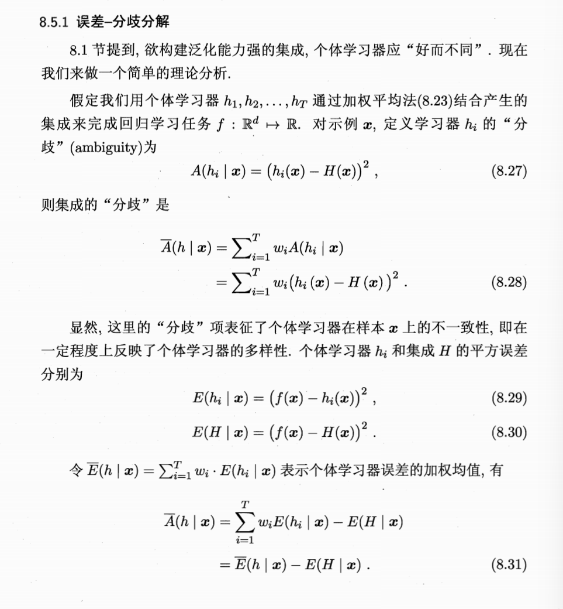
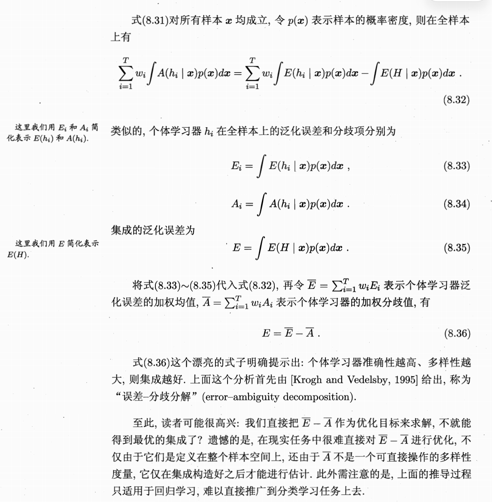

## 误差-分歧分解(为什么个体学习器要好而不同)

> 集成学习中的**“误差-分歧分解”（Error-Ambiguity Decomposition）**。从数学上证明了为什么集成学习需要个体学习器“好而不同”。

### 1. 定义个体与集成的“分歧”
首先，我们要量化个体学习器 $h_i$ 与集成模型 $H$ 之间的不一致程度。
*   **个体分歧 (8.27)**：定义为个体输出与集成输出之差的平方：
    $A(h_i | \mathbf{x}) = (h_i(\mathbf{x}) - H(\mathbf{x}))^2$
*   **集成分歧 (8.28)**：这是所有个体分歧的加权平均：
    $\bar{A}(h | \mathbf{x}) = \sum_{i=1}^T w_i (h_i(\mathbf{x}) - H(\mathbf{x}))^2$
    > **逻辑点**：这个项衡量了群体内部的“多样性”。如果大家预测得都一样，这个值就是 0。

### 2. 定义误差项
为了建立分歧与准确度之间的联系，我们需要定义平方误差：
*   **个体误差 (8.29)**：$E(h_i | \mathbf{x}) = (f(\mathbf{x}) - h_i(\mathbf{x}))^2$
*   **集成误差 (8.30)**：$E(H | \mathbf{x}) = (f(\mathbf{x}) - H(\mathbf{x}))^2$
    （其中 $f(\mathbf{x})$ 是真实值）

### 3. 核心恒等式的推导 (8.31)
这是最关键的一步。通过代数展开，我们可以得到：
$$\bar{A}(h | \mathbf{x}) = \sum_{i=1}^T w_i E(h_i | \mathbf{x}) - E(H | \mathbf{x})$$
为了方便理解，我们可以令 $\bar{E}(h | \mathbf{x}) = \sum w_i E(h_i | \mathbf{x})$（个体误差的加权平均），则有：
$$\bar{A} = \bar{E} - E$$

> **隐藏的代数逻辑**：
> 这个推导本质上利用了平方差的展开。你可以尝试将 $(f-h_i)^2$ 展开，并利用 $H = \sum w_i h_i$ 的性质，会发现交叉项刚好抵消或合并，最终剩下的就是个体误差平均值减去集成误差。

### 4. 泛化到全样本空间 (8.32 - 8.36)
以上的推导是针对单个样本 $\mathbf{x}$ 的。为了得到泛化误差，我们需要对整个样本分布 $p(\mathbf{x})$ 进行积分：
*   **积分转化 (8.32)**：将式 (8.31) 两边乘以概率密度 $p(\mathbf{x})$ 并积分。
*   **定义泛化项 (8.33-8.35)**：
    *   $E_i$：个体学习器的泛化误差。
    *   $A_i$：个体学习器的泛化分歧。
    *   $E$：集成的泛化误差。
*   **最终结论 (8.36)**：
    $$E = \bar{E} - \bar{A}$$

### 5. 该公式给我们的启示？
公式 **$E = \bar{E} - \bar{A}$** 具有极其重要的物理含义：
1.  **准确性 ($\bar{E}$)**：要让集成误差 $E$ 小，每个个体学习器的平均误差 $\bar{E}$ 必须小，即个体要“好”。
2.  **多样性 ($\bar{A}$)**：要让集成误差 $E$ 进一步减小，分歧项 $\bar{A}$ 必须大，即个体要“不同”。
3.  **完美抵消**：集成的效果提升，完全取决于个体学习器之间的多样性（分歧）。

### 6. 现实中的遗憾
虽然这个公式非常漂亮，但图末也提到了几个现实困难：
*   **难以直接优化**：在实际任务中，我们很难直接最小化 $\bar{E} - \bar{A}$，因为分歧项 $\bar{A}$ 通常要在集成构建完成后才能估算。
*   **适用范围**：这个推导目前仅严格适用于**回归学习**，难以直接推广到分类任务中。

---

## 相关笔记

- [[3.1-常见集成方法]] — "好而不同"原则直接源于此分解
- [[3.2-Boosting]] — Boosting的序列纠错机制在此有理论根据
- [[3.4.2-多样性度量]] — 实践中量化分歧项的工具
- [[3.4.3-多样性增强]] — 增大分歧项的具体技术
- [[6.4.2-基于分歧的方法]] — 半监督学习中"分歧"提升泛化能力的理论基础