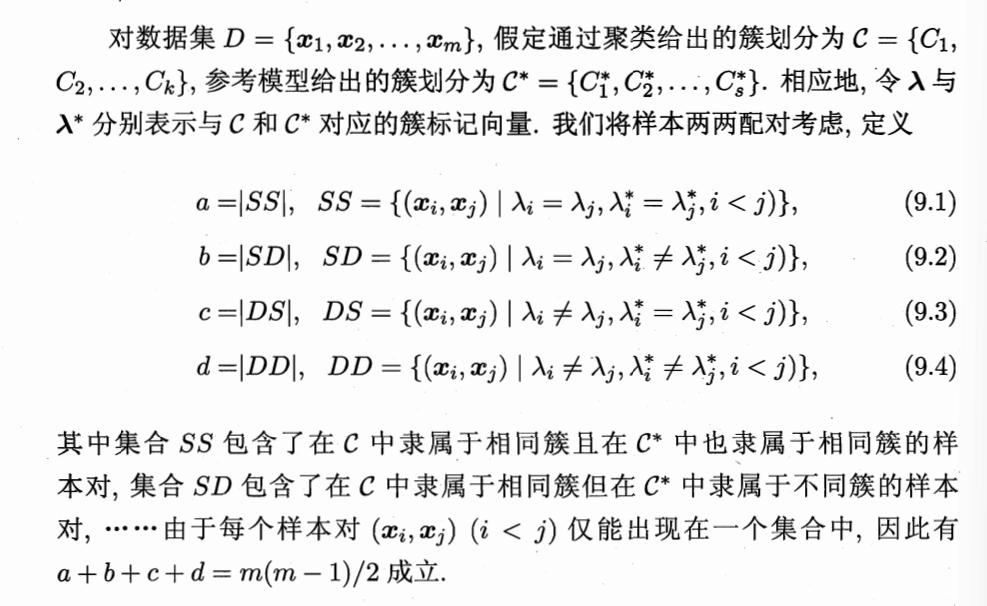
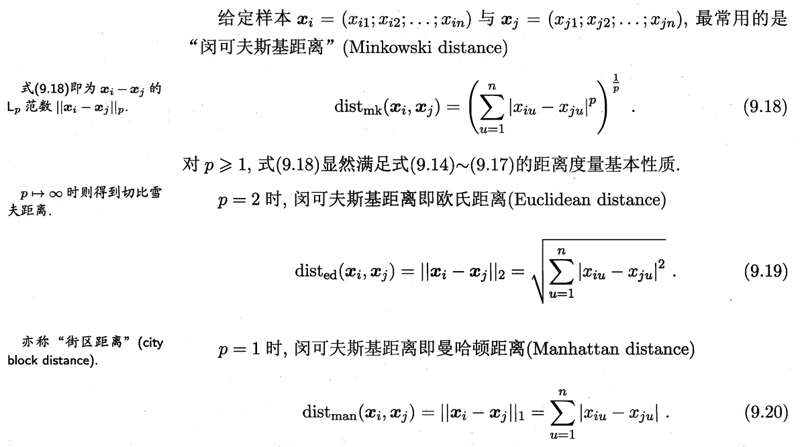
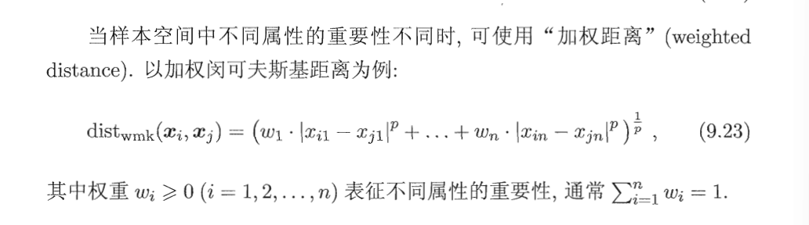

## 1. 一些基本辨析：

### 1.1 $\lambda_j$ 的含义
> $\lambda_j$ 本身是一个数字，它的取值范围是 $\{1, 2, \dots, k\}$。
它的意义是：“第 $j$ 个样本所归属的那个簇的编号”。

### 1.2 性能度量：外部指标 vs 监督学习
* **直觉发现**：外部指标（External Index）在评估时非常像监督学习。
* **本质原因**：
    * **相似点**：两者都有“参考答案”（参考模型）。外部指标是用人工标注或已知分类来“对答案”。
    * **不同点**：
        * **监督学习**：训练时**看**答案，目标是拟合答案。
        * **外部指标**：训练时**不看**答案（盲测），评估时才拿答案来衡量算法表现。
* **结论**：外部指标是**用“监督”的眼光去审视“无监督”的结果**，常用于验证新算法的有效性。

### 1.3 样本对状态

我们从一堆样本中随机摸出两个样本 $(x_i, x_j)$，对比“算法给出的结果 ($\lambda$)”和“参考标准 ($\lambda^*$)”，有以下四种结果：

* **$a$ (SS, Same Same)**：算法说它们是一类，标准也说它们是一类。**（皆大欢喜，算法对了）**
* **$b$ (SD, Same Different)**：算法说它们是一类，标准说它们不是。**（算法分错了，分得太粗）**
* **$c$ (DS, Different Same)**：算法说它们不是一类，标准说它们是一类。**（算法分错了，分得太细）**
* **$d$ (DD, Different Different)**：算法说它们不是一类，标准也说它们不是。**（皆大欢喜，算法也对了）**

---
## 2. 性能度量指标
### 2.1 性能度量外部指标
> 这三个指标虽然公式不同，但核心逻辑是一致的：**衡量算法给出的划分（$C$）与参考标准（$C^*$）之间的“重合度”**。它们通过组合 $a, b, c, d$ 这四个“计数器”，从不同的侧重点来打分。

#### 1. Jaccard 系数 (JC)
**公式：** $$JC = \frac{a}{a+b+c}$$
* **含义：** 专注于 **“相同性”** 的纯度。
* **为什么是这个形式：**
    * 分母 $a+b+c$ 代表了 **所有“至少有一个模型认为这对样本属于同类”** 的情况。
    * 它完全排除了 $d$（即双方都认为不属于同类的情况）。
    * **直观理解**：在所有被认为“有关系”的样本对中，算法和标准完全达成共识（$a$）的比例是多少？这在处理稀疏数据(真正属于同类的点只占极少数，绝大多数点对之间其实都是“没关系”的)时非常有用，因为 $d$（不属于同类的对子）通常数量巨大，如果不排除 $d$，指标会显得异常高。

#### 2. FM 指数 (FMI)
**公式：** $$FMI = \sqrt{\frac{a}{a+b} \cdot \frac{a}{a+c}}$$
* **含义：** 聚类精度（Precision）与召回率（Recall）的**几何平均值**。
* **为什么是这个形式：**
    * $\frac{a}{a+b}$：**精度**。在算法认为属于同类的所有对子中，有多少是真的属于同类？
    * $\frac{a}{a+c}$：**召回率**。在标准答案里所有属于同类的对子中，算法抓住了多少？
    * **直观理解**：这和分类问题中的 $F1$-score（调和平均）逻辑类似，只是用了几何平均。它要求算法既不能分得太粗（会导致 $b$ 变大，精度下降），也不能分得太细（会导致 $c$ 变大，召回率下降）。

#### 3. Rand 指数 (RI)
**公式：** $$RI = \frac{a+d}{a+b+c+d} = \frac{2(a+d)}{m(m-1)}$$
* **含义：** 整体的**准确率（Accuracy）**。
* **为什么是这个形式：**
    * 分母是总的样本配对数（即上一问提到的 $m(m-1)/2$）。
    * 分子 $a+d$ 是算法**所有做对决策**的总和：既包括了该聚在一起的聚在了一起（$a$），也包括了该分开的分开了（$d$）。
    * **直观理解**：这是最符合直觉的指标。它把聚类看成一个二分类问题（这对样本是同类还是异类？），计算算法预测对的比例。

#### 总结与对比

| 指标 | 关注点 | 特点 |
| :--- | :--- | :--- |
| **JC** | 纯粹的重合度 | 对“不属于同类”的配对（$d$）不敏感，适合簇很多、数据稀疏的情况。 |
| **FMI** | 精度与召回的平衡 | 对簇的大小和数量变化比较稳健。 |
| **RI** | 全局准确率 | 最直观，但当簇的数量非常多时，由于 $d$ 会变得极大，RI 往往会趋近于 1，导致区分度下降。 |

**在科研实践中：**
正在处理的数据集里，若大部分样本本来就不属于同一类（即 $d$ 远大于 $a$），通常会优先看 **JC** 或 **FMI**，因为它们不会被巨大的 $d$ 给“带跑偏”。

---
### 2.2 性能度量内部指标
> - 我们可以认为 **外部指标**是“对答案”，那么**内部指标**就是“看状态”。
> - 在没有参考标准（无标签）的情况下，我们只能通过观察聚类结果本身的 **“紧凑性”** 和 **“分离度”** 来判断好坏。下面的公式看起来复杂，但其实是在量化一个核心常识：**好的聚类应该“内聚”（同一类挨得紧）且“耦合低”（不同类离得远）。**

#### 1. 基础构件：如何描述一个“簇”
这些公式是衡量指标的“原材料”：

* **$avg(C)$（平均距离）**：簇内所有点两两之间距离的平均值。它代表了簇的**平均紧凑程度**。
* **$diam(C)$（直径）**：簇内两点之间最远的距离。它代表了簇的**最大散布空间**。
* **$d_{min}(C_i, C_j)$（最小距离）**：两个簇之间最近的两个点的距离。代表了簇间**最脆弱的间隔**。
* **$d_{cen}(C_i, C_j)$（中心距离）**：两个簇中心点（质心）之间的距离。代表了簇间的**核心分离度**。

#### 2. DBI 指数 (Davies-Bouldin Index)
这是最常用的内部指标之一。

#### **公式逻辑：**
$$DBI = \frac{1}{k} \sum_{i=1}^k \max_{j \neq i} \left( \frac{avg(C_i) + avg(C_j)}{d_{cen}(\boldsymbol{\mu}_i, \boldsymbol{\mu}_j)} \right)$$

* **分子**：$avg(C_i) + avg(C_j)$。如果这两个簇都很散，分子就大。
* **分母**：$d_{cen}(\boldsymbol{\mu}_i, \boldsymbol{\mu}_j)$。如果两个中心离得近，分母就小。
* **核心比值**：这个比值衡量的是“簇的疏散程度”与“簇间距离”的关系。比值越大，说明簇越散且靠得越近（重叠严重）。
* **$\max$ 的意义**：对于每个簇 $i$，都找一个跟它“最像/最容易混淆”的簇 $j$，取那个最差的情况。

##### **结论：越小越好**
DBI 越小，意味着分母（间距）越大，分子（散布）越小。即：**每个簇都很紧凑，且它们之间分得很开。**

#### 3. Dunn 指数 (Dunn Index)
它比 DBI 更加严苛，关注的是“最差表现”。

#### **公式逻辑：**
$$DI = \min_{1 \le i \le k} \left\{ \min_{j \neq i} \left( \frac{d_{min}(C_i, C_j)}{\max_{1 \le l \le k} diam(C_l)} \right) \right\}$$

* **分子（分子要大）**：$d_{min}(C_i, C_j)$。找全场**离得最近**的两个簇。我们希望即便离得最近，也要有一定的间隙。
* **分母（分母要小）**：$\max diam(C_l)$。找全场**直径最大**（最散）的那个簇。
* **直观理解**：它是“全场最短间隔”与“全场最大直径”的比值。

以下是这两层 $\min$ 的具体含义拆解：

### 1. 第一层（内部）：$\min_{j \neq i}$ —— 寻找“最危险的邻居”
公式内部的 $\min_{j \neq i} \left( \dots \right)$ 针对的是**特定的某一个簇 $C_i$**。
* **目的**：对于簇 $C_i$，我们需要找出离它**最近**的其他簇 $C_j$。
* **逻辑**：在评价 $C_i$ 的分离度时，远处的簇没有意义，只有那个“贴得最近”的邻居才最容易导致分类错误。这一步是在计算该簇的**最小隔离宽度**。

### 2. 第二层（外部）：$\min_{1 \le i \le k}$ —— 寻找“全场最差的表现”
最外层的 $\min_{1 \le i \le k}$ 则是针对**整个聚类方案**。
* **目的**：在所有簇的“最小隔离宽度”中，选出那个**全局最小值**。
* **逻辑**：DI 指数追求的是整体的稳健性。只要有一对簇离得太近（即分子中的距离极小），整个 DI 值就会被拉低。

#### **结论：越大越好**
DI 越大，意味着分子的“最小间隙”很大，而分母的“最大直径”很小。即：**最散的那个簇也很紧凑，且最靠近的两个簇也离得很远。**

---
#### 总结对比

| 指标 | 计算核心 | 追求目标 | 物理直觉 |
| :--- | :--- | :--- | :--- |
| **DBI** | 各簇平均散布 / 中心距 | **越小越好** | 追求整体的“性价比”，希望平均而言大家都分得清。 |
| **DI** | 最小簇间距 / 最大直径 | **越大越好** | 追求“下限”，要求最差的簇和最挤的间隙都能达标。 |

### 实验建议
在你复现 K-means 时，通常会发现：
1.  **DBI 计算较快**，因为它只涉及中心点和平均值。
2.  **DI 计算较慢**，因为它需要遍历所有点对来寻找 $d_{min}$ 和 $diam$，计算复杂度是 $O(m^2)$。如果你的数据集很大，计算 DI 可能会让程序卡顿。

---
## 3. 距离计算

### 3.1 有序属性距离描述（给定两个样本）

### 3.2 无序属性距离描述

#### 1. 核心公式拆解
属性 $u$ 上两个离散值 $a$ 与 $b$ 之间的 $p$ 阶 VDM 距离定义为：
$$VDM_p(a, b) = \sum_{i=1}^k \left| \frac{m_{u,a,i}}{m_{u,a}} - \frac{m_{u,b,i}}{m_{u,b}} \right|^p$$

* **$m_{u,a}$**：在属性 $u$ 上取值为 $a$ 的样本总数。
* **$m_{u,a,i}$**：在第 $i$ 个样本簇（Cluster）中，属性 $u$ 取值为 $a$ 的样本数。
* **$\frac{m_{u,a,i}}{m_{u,a}}$**：这个比例代表了 **“属性值为 $a$ 的样本落在第 $i$ 个簇中的条件概率”**。
* **$k$**：样本簇的数量。如果样本类别已知，通常直接设为类别数。

#### 2. 直观理解：它在算什么？
VDM 的核心思想是：**如果两个离散值的“表现（分布）”相似，那么它们就是接近的。**

* **寻找共性**：如果属性值为“红色”的样本有 80% 都属于“第一类”，而属性值为“粉色”的样本也有 70% 属于“第一类”，那么 VDM 会认为“红色”和“粉色”在逻辑上是很接近的。
* **区分差异**：反之，如果“红色”样本主要分布在“第一类”，而“蓝色”样本全部分布在“第二类”，这两个比例相减后的绝对值就会很大，导致 VDM 距离变大。

#### 3. 为什么需要 VDM？
1.  **解决无序性**：传统的处理方式可能是将“红、蓝、绿”编码为“1, 2, 3”，但这样会错误地暗示“蓝比红更接近绿”。VDM 避开了这种人为的数值顺序。
2.  **语义关联**：它通过查看这些属性值在不同类别（簇）中的分布，自动挖掘出属性值之间潜在的语义联系。

> 在处理混合类型的数据集（既有连续数值，又有离散分类）时，你通常会将 **Minkowski 距离**（用于数值）和 **VDM 距离**（用于分类）结合起来使用，形成所谓的 **Minkowski-VDM 距离**，下面进行介绍。

### 3.3 混合属性的距离计算

#### 1. 整体结构：混合属性的“缝合”
> 给定样本 $\boldsymbol{x}_i = (x_{i1};x_{i2};\dots;x_{in})$ 与 $\boldsymbol{x}_j = (x_{j1};x_{j2};\dots;x_{jn})$
公式将总距离拆分成了两大部分，分别处理不同性质的属性，最后再整体取 $p$ 次方根：

$$MinkovDM_p(\boldsymbol{x}_i, \boldsymbol{x}_j) = \left( \underbrace{\sum_{u=1}^{n_c} |x_{iu} - x_{ju}|^p}_{\text{第一部分：处理有序属性}} + \underbrace{\sum_{u=n_c+1}^{n} VDM_p(x_{iu}, x_{ju})}_{\text{第二部分：处理无序属性}} \right)^{\frac{1}{p}}$$

* **$n$**：代表属性的总总数。
* **$n_c$**：代表其中**有序属性**（Ordered Attributes）的数量。

#### 2. 为什么要这样写？
1.  **统一量纲**：VDM 距离本身在定义时就已经包含了 $p$ 次幂的形式，这使得它可以完美地嵌入到 Minkowski 距离的求和框架中。
2.  **灵活切换**：
    * 如果数据全是连续数值（$n_c = n$），公式就退化回标准的 Minkowski 距离。
    * 如果数据全是分类标签（$n_c = 0$），公式就变成了纯粹的 VDM 距离叠加。

#### 总结
这个公式的精妙之处在于它**打破了“数字”与“符号”的边界**。

在实际复现时，你需要先遍历所有属性，将它们归类为连续型（Ordered）或离散型（Unordered）。对于离散型属性，你需要先扫描一遍数据集计算出所有取值在各簇中的频率，得到 $VDM$ 值，最后再代入这个总公式计算样本 $x_i$ 和 $x_j$ 之间的距离。

---

## 相关笔记

- [[4.2.1-原型聚类]] — K-means和LVQ使用本章定义的距离度量
- [[4.2.2-密度聚类]] — DBSCAN使用ε-邻域距离
- [[4.2.3-层次聚类]] — AGNES使用簇间距离计算
- [[5.1-K近邻学习(问题引入)]] — KNN使用相同的Minkowski距离族
- [[3.4.2-多样性度量]] — 列联表(a,b,c,d)结构与外部指标的样本对状态类似
- [[2-决策树]] — 信息熵概念在决策树划分准则和聚类纯度中共用