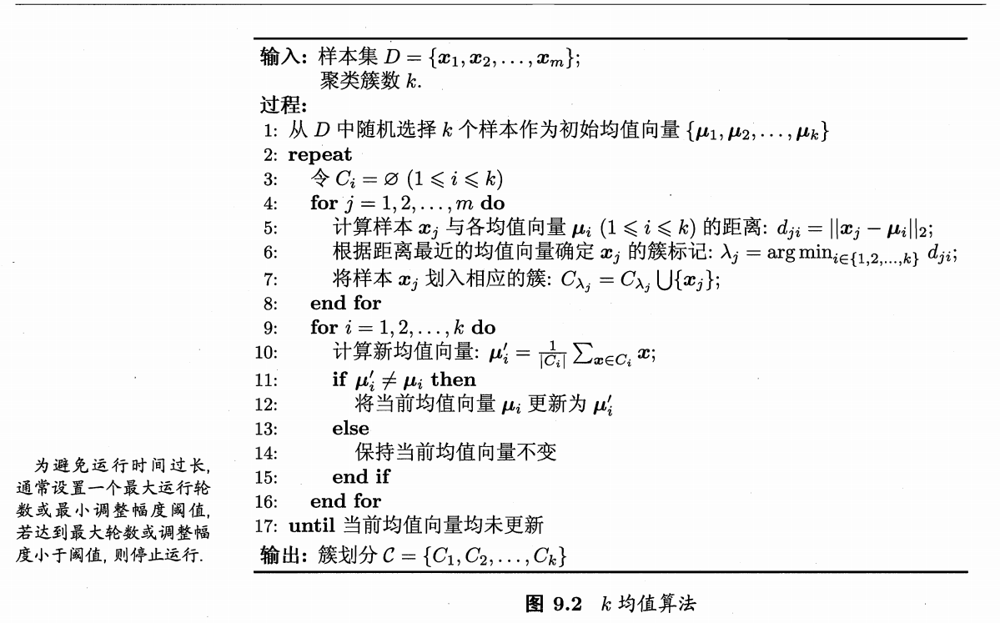
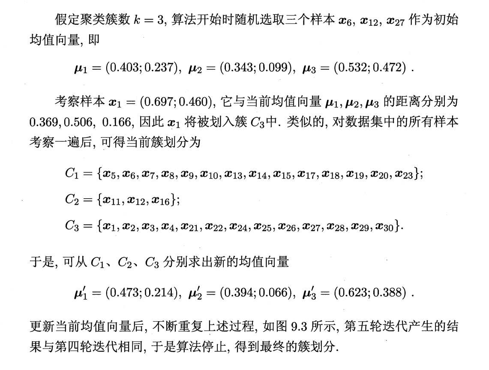
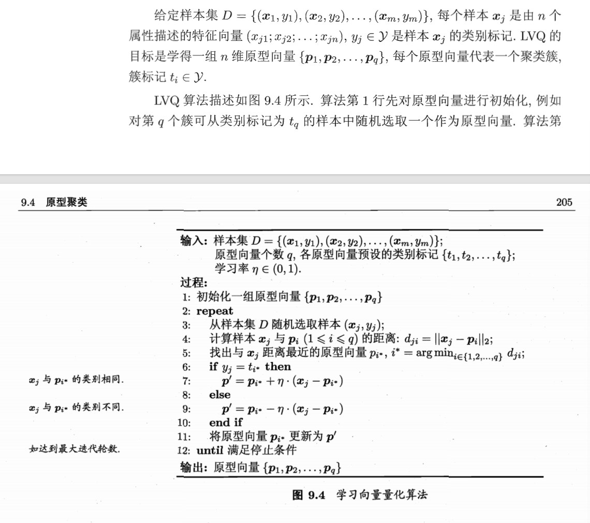
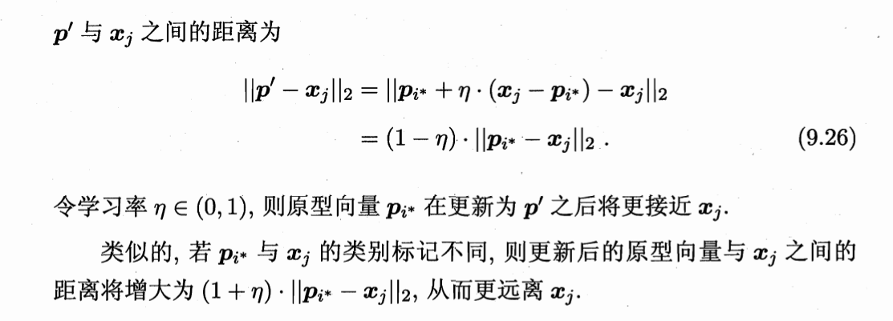
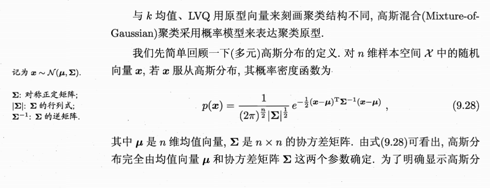
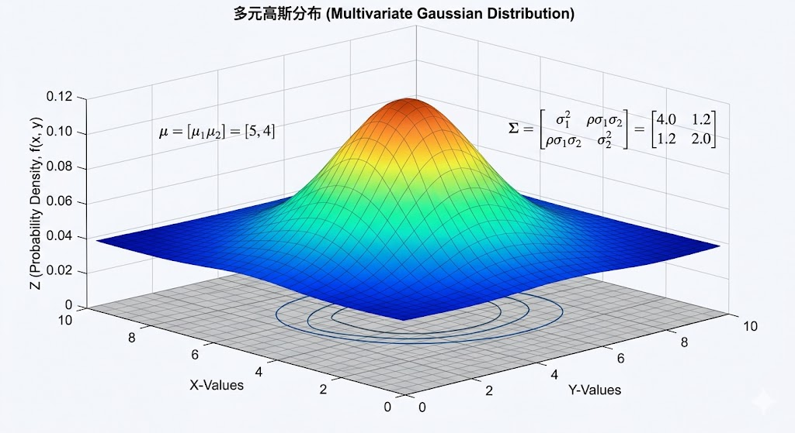
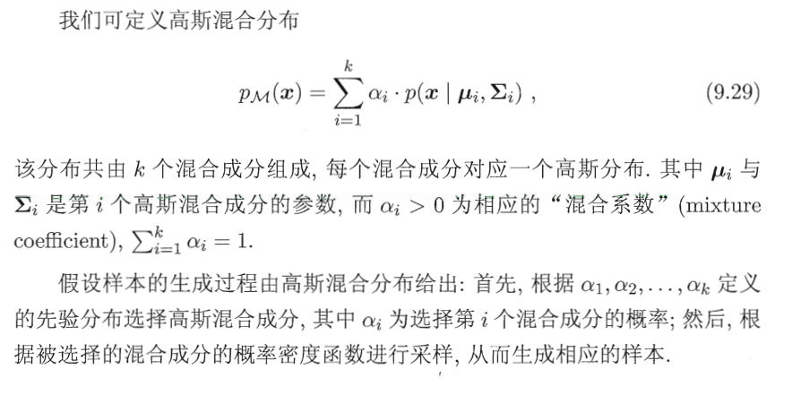
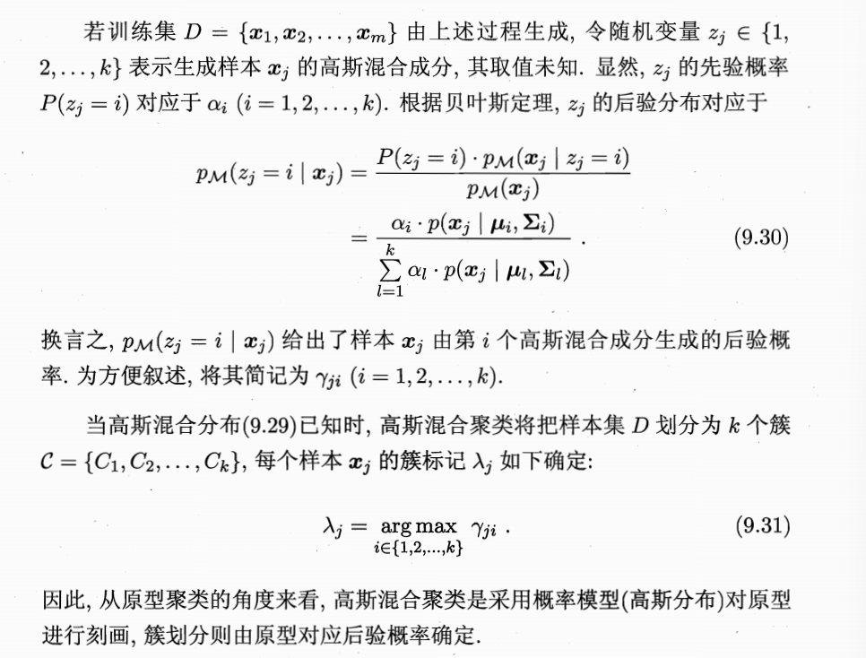
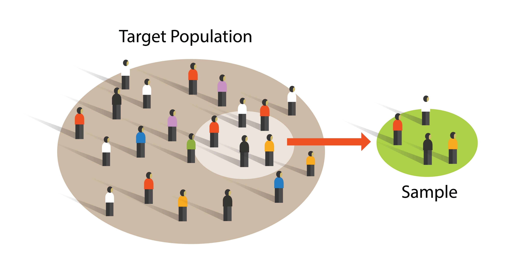
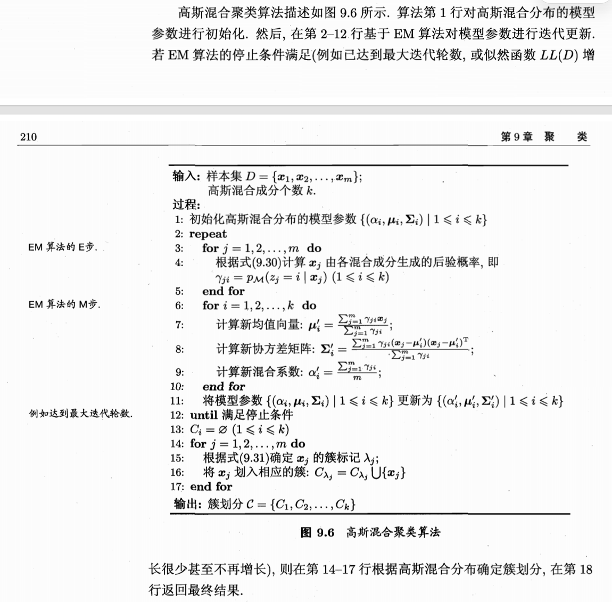

**相关笔记**: [[04.1-前置知识]] | [[04.2.2-密度聚类]] | [[04.2.3-层次聚类]] | [[05.2.2-主成分分析(PCA)]] | [[05.3.1-核化线性降维]] | [[06.2-模型驱动-生成式方法]] | [[06.1-基本概念]]

---

## 🏷️ 文档元数据
* **重要性**: ⭐⭐⭐⭐⭐ (最高优先级)
* **状态**: 基础必修

## 一、K-means — sklearn 实战

> K-means 是最经典的原型聚类算法：给定 k 值，如何把数据划分为 k 个紧凑的簇？




```python
import numpy as np
import matplotlib.pyplot as plt
from sklearn.cluster import KMeans
from sklearn.datasets import make_blobs

# ============================================
# 🌟 K-means 核心流程：四步循环
#    ① 随机选 k 个中心点
#    ② 每个样本归入最近的中心 → 形成 k 个簇
#    ③ 重新算每个簇的均值 → 更新中心点
#    ④ 重复 ②③ 直到中心点不再移动（或达到最大迭代次数）
# ============================================

# 造数据：3 个团簇 + 一点重叠
X, y_true = make_blobs(n_samples=300, n_features=2,
                       centers=3, cluster_std=0.8, random_state=42)

# 🚀 三步搞定 KMeans
kmeans = KMeans(n_clusters=3, random_state=42, n_init='auto')
labels = kmeans.fit_predict(X)      # 一步完成 fit + predict
centers = kmeans.cluster_centers_    # 最终的中心坐标

print("簇中心:\n", centers)
print(f"每个簇的样本数: {np.bincount(labels)}")
print(f"惯性 (inertia_ / SSE): {kmeans.inertia_:.2f}")
# inertia_ = Σ 每个样本到其所属中心的距离平方和，越小越好

# ============================================
# 📌 肘部法则 (Elbow Method) — 挑最佳 k 值
# ============================================
# 惯性随 k 增大单调递减，但会在"真正的 k"附近出现"拐点"（肘部）
inertias = []
ks = range(1, 10)
for k in ks:
    km = KMeans(n_clusters=k, random_state=42, n_init='auto')
    km.fit(X)
    inertias.append(km.inertia_)

# 💡 观察拐点：k 从 2 到 3 时惯性骤降，之后降幅变小 → k=3 是最佳选择
for k, inert in zip(ks, inertias):
    flag = " ← 拐点!" if k == 3 else ""
    print(f"k={k}, inertia={inert:.2f}{flag}")

# ============================================
# ⚠️  K-means 的三大坑：
#    1. 假设簇是球形——对长条形、月牙形数据效果差
#    2. 必须预设 k——不知道真实簇数时需要用肘部法则/轮廓系数猜
#    3. 初始点敏感——不同随机种子可能得到不同结果（用 n_init 多跑几次取最好）
# ============================================
```

## 二、LVQ (学习向量量化) — numpy 手动实现

> 如何利用标签信息来辅助聚类？LVQ 用"带标签"的数据去学一组"原型向量"，是监督与聚类的桥梁。




```python
import numpy as np

# ============================================
# 🚀 LVQ 核心思想：用"带标签"的数据去学一组"原型向量"
#    训练时利用标签信息（监督），但输出是原型向量（聚类形式）
#    本质是"利用监督信息辅助聚类"——用标签帮原型向量找对位置
#
# 🌟 更新逻辑 = 磁铁效应：
#    同标签 → 吸引：原型向量向样本靠近（巩固地盘）
#    异标签 → 排斥：原型向量远离样本（让出地盘）
# ============================================

class SimpleLVQ:
    """
    LVQ 学习向量量化 — numpy 手动实现

    📌 关键点：
    - 样本标签 y 是已知的（训练时使用监督信号）
    - 每个原型向量预设一个类别标签
    - 通过"拉近同类、推开异类"不断调整原型向量位置
    """
    def __init__(self, n_prototypes_per_class=2, learning_rate=0.1, max_epochs=50):
        self.n_per_class = n_prototypes_per_class  # 每个类别分配几个原型向量
        self.lr = learning_rate
        self.max_epochs = max_epochs
        self.prototypes = None   # 原型向量坐标
        self.proto_labels = None # 每个原型向量的类别标签

    def fit(self, X, y):
        """
        🌟 训练过程：
        1. 初始化：从每个类别的样本中随机挑几个当原型向量
        2. 每次随机抽一个样本，找到离它最近的原型向量
        3. 标签相同 → 吸引（原型向量靠近样本）
        4. 标签不同 → 排斥（原型向量远离样本）
        """
        X = np.array(X)
        y = np.array(y)
        classes = np.unique(y)
        n_features = X.shape[1]

        # --- 初始化原型向量 ---
        self.prototypes = np.zeros((len(classes) * self.n_per_class, n_features))
        self.proto_labels = np.zeros(len(classes) * self.n_per_class, dtype=int)

        for i, c in enumerate(classes):
            # 挑出该类别的所有样本
            class_samples = X[y == c]
            for j in range(self.n_per_class):
                idx = i * self.n_per_class + j
                # 从该类别中随机选一个作为原型向量初始值
                pick = np.random.choice(len(class_samples))
                self.prototypes[idx] = class_samples[pick]
                self.proto_labels[idx] = c  # 记录该原型的类别

        # --- 迭代更新 ---
        for epoch in range(self.max_epochs):
            # 🔄 随机打乱样本顺序（在线学习，避免顺序偏见）
            perm = np.random.permutation(len(X))
            for idx in perm:
                x_j = X[idx]
                y_j = y[idx]

                # 找离 x_j 最近的原型向量（胜者为王）
                dists = np.sum((self.prototypes - x_j) ** 2, axis=1)
                winner_idx = np.argmin(dists)

                # 🧲 磁铁效应：同标签吸引，异标签排斥
                if self.proto_labels[winner_idx] == y_j:
                    # 吸引：原型向量向样本移动一步
                    self.prototypes[winner_idx] += self.lr * (x_j - self.prototypes[winner_idx])
                else:
                    # 排斥：原型向量远离样本
                    self.prototypes[winner_idx] -= self.lr * (x_j - self.prototypes[winner_idx])

        return self

    def predict(self, X):
        """预测：找最近的原型向量的标签"""
        X = np.array(X)
        labels = []
        for x in X:
            dists = np.sum((self.prototypes - x) ** 2, axis=1)
            labels.append(self.proto_labels[np.argmin(dists)])
        return np.array(labels)

# ============================================
# 在玩具数据上测试 LVQ
# ============================================
X_demo, y_demo = make_blobs(n_samples=200, n_features=2,
                            centers=3, cluster_std=0.6, random_state=42)

lvq = SimpleLVQ(n_prototypes_per_class=2, learning_rate=0.05, max_epochs=100)
lvq.fit(X_demo, y_demo)
pred = lvq.predict(X_demo)
acc = np.mean(pred == y_demo)
print(f"LVQ 训练集准确率: {acc:.4f}")
print(f"最终原型向量坐标:\n{lvq.prototypes}")
print(f"原型向量标签: {lvq.proto_labels}")

# 💡 为什么"随机"选取样本？
#   1. 打破数据顺序偏见——如果数据按类别排序（前100个都是猫，后100个都是狗），
#      原型向量会被先疯狂拉向猫再拉向狗，震荡难收敛
#   2. 在线学习——小步快跑，每一步更新成本低
#   3. 随机噪声有时能帮原型向量跳出局部最优

# ⚠️  LVQ 在训练阶段是监督学习（用到了 y），
#     但输出形式是聚类式的——空间被划分为 Voronoi 单元，每个单元由一个原型向量统治
```

## 三、高斯混合模型 (GMM) — sklearn 实战

> 当数据由多个高斯分布混合生成时，如何用概率模型进行"软聚类"？




```python
from sklearn.mixture import GaussianMixture
import numpy as np
from scipy.stats import multivariate_normal

# ============================================
# 🚀 GMM 核心思想：数据由 k 个高斯分布混合生成
#     软聚类：不只是"你属于我"，而是"你有 80% 概率属于 A，20% 概率属于 B"
#     每个簇 = 一个高斯"烟囱"，有自己的均值 μ（中心）和协方差 Σ（形状）
# ============================================

# 造一些重叠的数据（GMM 擅长的场景）
X, _ = make_blobs(n_samples=300, n_features=2,
                  centers=3, cluster_std=[0.5, 1.2, 0.8], random_state=42)

gmm = GaussianMixture(n_components=3, covariance_type='full',
                      random_state=42, max_iter=200)
gmm.fit(X)
labels_gmm = gmm.predict(X)        # 硬分配（取概率最大的簇）
probs = gmm.predict_proba(X)        # 软分配（每个样本属于各簇的概率）

print("=== GMM 学到的参数 ===")
print(f"混合系数 (α/权重):\n{gmm.weights_}")
print(f"各成分均值 (μ):\n{gmm.means_}")
print(f"各成分协方差 (Σ):\n{gmm.covariances_}")

# 💡 GMM vs K-means：
#    K-means：每个样本硬性地属于最近的中心
#    GMM：每个样本以一定概率属于各个高斯成分（软聚类）
#    当 GMM 中所有 Σ → 等方差 + 协方差为 0 时，GMM 退化为 K-means

# ============================================
# 📌 概率密度函数的直觉
# ============================================
# p(x) = 归一化常数 × exp(-0.5 * 马氏距离²)
#
# 🌟 马氏距离 = sqrt((x-μ)^T Σ^(-1) (x-μ))
#    不是普通的欧氏距离！它先用 Σ^(-1) 把空间"格式化"（白化），
#    消除方差不均和维度相关性，再量欧氏距离
#
# 💡 形象比喻：
#    数据分布像一个被压扁拉长的椭圆
#    欧氏距离 → 拿直尺量，不管椭圆形状
#    马氏距离 → 把椭圆揉成正圆后再量
#     在长轴方向走 10 米 vs 短轴方向走 1 米，马氏距离认为"一样远"
# ============================================

# 演示：同一组点，欧氏距离 vs 马氏距离的差异
mu = np.array([0, 0])
sigma = np.array([[4, 1.5],   # x 方向方差大，还有正相关 → 椭球形
                  [1.5, 1]])  # y 方向方差小

points = np.array([[2, 0],    # 沿 x 轴远
                   [0, 2]])   # 沿 y 轴近

for p in points:
    euclidean_dist = np.sqrt(np.sum((p - mu)**2))
    mahalanobis_dist = np.sqrt((p - mu) @ np.linalg.inv(sigma) @ (p - mu).T)
    print(f"点 {p}: 欧氏距离={euclidean_dist:.3f}, 马氏距离={mahalanobis_dist:.3f}")
# 结论：在方差大的方向（x轴），马氏距离会"打折"；在方差小的方向（y轴），会"放大"
```




### 1. 协方差矩阵 Σ — 高斯分布的"身材描述"

```python
# ============================================
# 📌 协方差矩阵 Σ 的本质
# ============================================
# Σ = E[(x-μ)(x-μ)^T]  或离散版: Σ = (1/(m-1)) X_c^T X_c   (X_c 是中心化后的数据)
#
# 🌟 矩阵每个位置的含义：
#     对角线 (i=j)  → 方差：第 i 个特征自己的"胖瘦"
#     非对角线 (i≠j) → 协方差：特征 i 和 j 的"同步程度"
#        正 → 你大我也大（正相关）  负 → 你大我就小（负相关）  零 → 各玩各的（独立）
#
# 💡 形象比喻：
#    把每个样本看作高维空间的一个向量
#    协方差 = 两个向量中心化后的内积
#    内积 > 0 → 夹角 < 90° → 指向大致相同 → 正相关
#    内积 < 0 → 夹角 > 90° → 指向相反 → 负相关
#    内积 = 0 → 夹角 = 90° → 正交 → 不相关
# ============================================

# 手动算协方差矩阵 vs numpy 自动算
X_demo = np.random.randn(100, 3)  # 100个样本，3个特征
X_centered = X_demo - X_demo.mean(axis=0)
sigma_manual = (X_centered.T @ X_centered) / (len(X_demo) - 1)  # (m-1) 无偏估计
sigma_np = np.cov(X_demo, rowvar=False)  # numpy 的写法

print("手动 Σ 的前两列:\n", sigma_manual[:2, :2])
print("numpy Σ 的前两列:\n", sigma_np[:2, :2])
print("误差:", np.max(np.abs(sigma_manual - sigma_np)))  # 应该接近 0
```

### 2. 马氏距离的白化解释

```python
# ============================================
# 🌟 马氏距离的"白化"过程 — 用 Σ^(-1) 把椭圆揉成正圆
# ============================================
# Σ = Q Λ Q^T  (谱分解：Q 是特征向量矩阵=旋转，Λ 是特征值=伸缩)
# Σ^(-1) = Q Λ^(-1) Q^T
#
# 白化步骤：
#   ① Q^T：旋转坐标系，对齐分布的主轴
#   ② Λ^(-1/2)：方差大的轴压缩，方差小的轴拉伸 → 所有方向方差统一为 1
#   ③ Q：旋转回原方向（在距离计算中会被抵消）
#
# 最终效果：把椭球分布变成标准单位球，然后在这个球里量欧氏距离！

mu = np.array([3, 5])
sigma = np.array([[4, 2], [2, 1]])  # 一个歪斜的椭球

# 谱分解
eigenvalues, eigenvectors = np.linalg.eigh(sigma)
print(f"特征值(各轴方差): {eigenvalues}")
print(f"特征向量(各轴方向):\n{eigenvectors}")

# 白化变换矩阵
whitening = eigenvectors @ np.diag(1.0 / np.sqrt(eigenvalues)) @ eigenvectors.T

# 验证：变换后的协方差应该是单位矩阵
sigma_whitened = whitening @ sigma @ whitening.T
print(f"白化后的 Σ (应接近 I):\n{np.round(sigma_whitened, 6)}")

# 📌 结论：马氏距离就是在白化后的空间里算欧氏距离
#     这就是 Σ^(-1) 必须出现在公式里的原因！
```

### 3. EM 算法的数据生成过程




```python
# ============================================
# 🚀 GMM 的生成逻辑：先抽签决定簇，再按簇的参数采样
# ============================================
# 因果链：底层分布(因) → 随机采样 → 观测样本(果)
# 学习链：观测样本(果) → EM算法 → 推断分布参数(因)

# --- 模拟"从 GMM 采样"的过程 ---
def sample_from_gmm(weights, means, covs, n_samples=500):
    """
    🌟 两步生成：
    1. 按权重 α 抽签 → 决定每个样本属于哪个成分
    2. 在该成分的高斯分布中采样 → 生成具体坐标
    """
    np.random.seed(42)
    samples = []
    labels = []
    for _ in range(n_samples):
        # 第一步：按权重抽签（multinomial 实现轮盘赌）
        comp = np.random.choice(len(weights), p=weights)
        # 第二步：从该高斯分布中采样
        x = np.random.multivariate_normal(means[comp], covs[comp])
        samples.append(x)
        labels.append(comp)
    return np.array(samples), np.array(labels)

# 用 GMM 学到的参数来生成新数据
# 这体现了"生成式模型"的本质——不仅会分类，还能"创造"数据
weights = gmm.weights_
means = gmm.means_
covs = gmm.covariances_
gen_X, gen_labels = sample_from_gmm(weights, means, covs, n_samples=500)
print(f"从 GMM 生成了 {len(gen_X)} 个样本")
```

### 4. 补充：分布已知时，我们到底在训练什么？

在统计机器学习中，要区分"**分布的形式**"和"**分布的参数**"。公式 $p(\boldsymbol{x})$ 里的字母在训练前全是变量，训练就是估这些变量的值。

```python
# ============================================
# 📌 训练 = 参数估计 = 最大似然估计 (MLE)
# ============================================
# 假设分布形式是高斯（已知），但 μ、Σ、α 是未知的（要学的）
#
# 训练前的状态 → 训练后的状态：
#   均值 μ：空间任意点 → 数据最密集的中心
#   协方差 Σ：任意形状 → 完美包裹数据的椭球形状
#   混合系数 α：均等 → 反映真实样本比例
#
# 🚀 EM 算法的两步走：
#   E 步 (Expectation)：用当前参数算每个样本属于各簇的"软标签"（责任度）
#   M 步 (Maximization)：根据软标签重新算更准的 μ、Σ、α
#   反复交替直到收敛

# 模拟 EM 的 E 步：计算后验概率（责任度）
def compute_responsibilities(X, weights, means, covs):
    """
    E 步：p(z_j=i | x_j) = α_i * p(x_j|μ_i,Σ_i) / Σ_l α_l * p(x_j|μ_l,Σ_l)

    分子 = 先验权重 × 样本在该高斯下的密度（似然）
    分母 = 所有成分贡献的总和（全概率，做归一化）
    """
    n_samples = len(X)
    n_components = len(weights)
    resp = np.zeros((n_samples, n_components))

    for i in range(n_components):
        # 第 i 个高斯成分对每个样本的概率密度
        resp[:, i] = weights[i] * multivariate_normal.pdf(X, mean=means[i], cov=covs[i])

    # 归一化：每行加起来 = 1
    resp /= resp.sum(axis=1, keepdims=True)
    return resp

resp = compute_responsibilities(X, weights, means, covs)
print(f"\n前3个样本的责任度 (每行=一个样本在各簇的归属概率):")
print(resp[:3])
# 每行加起来应该 ≈ 1.0
print(f"每行之和: {resp[:3].sum(axis=1)}")

# 💡 这个公式是贝叶斯定理在聚类上的直接应用
#    左边 = 看到样本 x 后反推它属于簇 i 的概率（后验，我们想要的）
#    右边 = 利用"分布产生样本"的逻辑做正向推理
```

## 四、三剑客对比总结

> K-means、LVQ、GMM 三种原型聚类方法，各有什么特点？在同一数据上表现如何？

```python
# ============================================
# 🌟 K-means vs LVQ vs GMM — 在同一个数据上跑一遍
# ============================================
X_large, y_large = make_blobs(n_samples=500, n_features=2,
                               centers=4, cluster_std=[0.4, 0.8, 1.2, 0.6],
                               random_state=42)

# K-means
km = KMeans(n_clusters=4, random_state=42, n_init='auto')
km_labels = km.fit_predict(X_large)

# LVQ（监督式原型聚类）
lvq2 = SimpleLVQ(n_prototypes_per_class=1, learning_rate=0.05, max_epochs=100)
lvq2.fit(X_large, y_large)
lvq_labels = lvq2.predict(X_large)

# GMM（软聚类）
gmm2 = GaussianMixture(n_components=4, covariance_type='full', random_state=42)
gmm_labels = gmm2.fit_predict(X_large)

# 📌 比较硬分配的一致性
from sklearn.metrics import adjusted_rand_score
print("=== 三种原型聚类的一致性 (ARI vs KMeans) ===")
print(f"KMeans vs LVQ:  {adjusted_rand_score(km_labels, lvq_labels):.4f}")
print(f"KMeans vs GMM:  {adjusted_rand_score(km_labels, gmm_labels):.4f}")
print(f"LVQ vs GMM:     {adjusted_rand_score(lvq_labels, gmm_labels):.4f}")
# 三条路，同一个目标——找到数据中的"原型"来代表簇
```

---

## 🏷️ 文档元数据
* **当前状态**：已完成 (Completed)
* **安全策略**：`.gitignore` 严格阻断 Key 泄露风险
