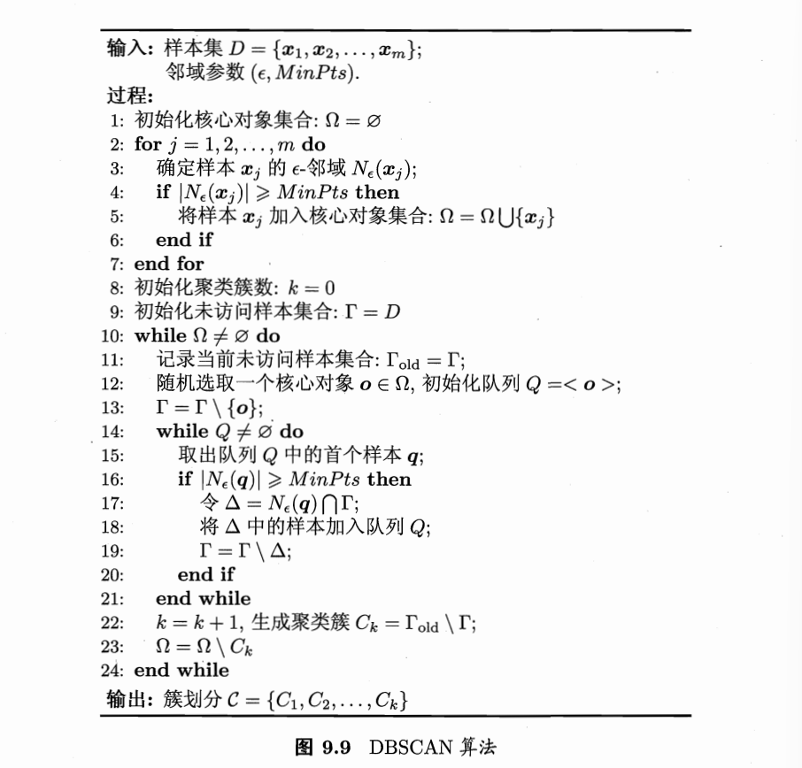

**相关笔记**: [[04.1-前置知识]] | [[04.2.1-原型聚类]] | [[04.2.3-层次聚类]] | [[05.3.2-流形学习]]

---

## 🏷️ 文档元数据
* **重要性**: ⭐⭐⭐⭐⭐ (最高优先级)
* **状态**: 基础必修

## 一、DBSCAN — sklearn 密度聚类实战

> 假设聚类结构可以通过样本的紧密程度确定，如何基于密度发现任意形状的簇？



```python
import numpy as np
from sklearn.cluster import DBSCAN
from sklearn.datasets import make_moons, make_blobs
from sklearn.metrics import silhouette_score

# ============================================
# 🌟 DBSCAN 核心思想 — 三个角色 + 一条关系链
# ============================================
# 每个样本点有三种身份：
#   ① 核心对象 (Core Point): 半径 ε 内至少有 MinPts 个邻居（包括自己）→ 高密度区
#   ② 边界点 (Border Point): 邻居不够 MinPts，但落在某个核心对象的 ε 邻域内 → 边缘人
#   ③ 噪声点 (Noise Point)：邻居不够 MinPts，也没有核心对象罩着 → 被抛弃的离群点
#
# 关系链：密度直达 → 密度可达 → 密度相连
#   像一个"朋友的朋友也是朋友"的传递过程

# ============================================
# 🚀 DBSCAN 的两阶段流程：
#   阶段一：扫描全场 → 找出所有核心对象（高密度区居民）
#   阶段二：从每个核心对象出发 BFS 扩散 → 把所有密度可达的点"滚雪球"成一个簇
# ============================================

# 造一个月牙形数据（这种非球形数据 K-means 根本搞不定）
X_moons, _ = make_moons(n_samples=300, noise=0.08, random_state=42)

# 🚀 DBSCAN 三步走
db = DBSCAN(eps=0.2, min_samples=5)  # ε=0.2, MinPts=5
labels = db.fit_predict(X_moons)

# 统计结果
n_clusters = len(set(labels)) - (1 if -1 in labels else 0)
n_noise = list(labels).count(-1)
print(f"DBSCAN (eps=0.2, min_samples=5)")
print(f"  发现簇数: {n_clusters}")
print(f"  噪声点数: {n_noise} (标签为 -1)")
print(f"  每簇样本数: {np.bincount(labels + 1)[1:]}")  # 跳过 -1

# ============================================
# 📌 对比：同样的数据用 K-means —— 球形假设的局限
# ============================================
from sklearn.cluster import KMeans
km_labels = KMeans(n_clusters=2, random_state=42, n_init='auto').fit_predict(X_moons)
sil_km = silhouette_score(X_moons, km_labels)
# DBSCAN 对噪声点设为 -1，轮廓系数计算需排除噪声
valid = labels != -1
sil_db = silhouette_score(X_moons[valid], labels[valid]) if valid.sum() > 1 else -1
print(f"\n轮廓系数对比: K-means={sil_km:.4f}, DBSCAN={sil_db:.4f}")
# 🌟 DBSCAN 对这种弯月形数据完胜 K-means，因为不假设簇是球形

# ============================================
# ⚠️  ε 和 MinPts 的调参 — 两个核心超参数
# ============================================
# ε (eps): 半径 —— 太大 → 全连通成一个簇；太小 → 大量噪声点
# MinPts: 密度阈值 —— 太小 → 太多核心对象，容易过分割；太大 → 太少核心对象，全是噪声
#
# 💡 经验法则：
#   MinPts ≥ D+1 (D = 特征维数)，通常设 MinPts = 2*D
#   ε 用 k-distance 图找：对每个点算到第 k 近邻的距离，画排序图，拐点处即为候选 ε

print("\n=== 不同 ε 值的效果对比 ===")
for eps_val in [0.1, 0.15, 0.2, 0.25, 0.3]:
    d = DBSCAN(eps=eps_val, min_samples=5)
    labs = d.fit_predict(X_moons)
    n_clust = len(set(labs)) - (1 if -1 in labs else 0)
    n_noise = list(labs).count(-1)
    marker = " ← 最佳" if eps_val == 0.2 else ""
    print(f"eps={eps_val:.2f}: {n_clust}簇, {n_noise}噪声点{marker}")
```

## 二、DBSCAN 算法细节 — numpy 手动模拟

> DBSCAN 的 BFS 扩展过程是如何工作的？"密度可达"的传播机制是什么？

```python
# ============================================
# 📌 手动模拟 DBSCAN 的 BFS 扩展过程
#    感受"密度可达"的传播机制
# ============================================

def simple_dbscan(X, eps, min_pts):
    """
    手动实现 DBSCAN 的核心逻辑，帮助理解算法流程

    🌟 流程分解：
    1. 扫描所有点 → 标记核心对象集合 Ω
    2. 初始化未访问集合 Γ = 全体样本
    3. while Ω 非空:
       a. 从 Ω 中随机取一个种子 o
       b. BFS 扩散：从 o 出发，把所有密度可达的点收集进队列 Q
       c. Q 清空后，本轮新增的点构成一个簇
       d. 从 Ω 中移除已聚类的核心对象
    4. Γ 中剩下的点 = 噪声点
    """
    n = len(X)
    labels = np.full(n, -1, dtype=int)  # -1 = 噪声

    # --- 第一阶段：找核心对象 ---
    core_mask = np.zeros(n, dtype=bool)
    for i in range(n):
        # 算到所有点的距离，找 ε 邻域内的邻居
        dists = np.sqrt(np.sum((X - X[i]) ** 2, axis=1))
        neighbors = np.where(dists <= eps)[0]
        if len(neighbors) >= min_pts:
            core_mask[i] = True  # 标记为核心对象

    if not core_mask.any():
        return labels  # 没有核心对象，全是噪声

    # --- 第二阶段：BFS 扩展 ---
    visited = np.zeros(n, dtype=bool)
    cluster_id = 0

    for i in range(n):
        if visited[i] or not core_mask[i]:
            continue  # 跳过已访问的点和非核心对象

        # 🌟 BFS 从核心对象 i 开始扩散
        cluster_id += 1
        queue = [i]
        visited[i] = True

        while queue:
            q = queue.pop(0)  # 队首出队（这就是伪代码第 15 行）

            if core_mask[q]:  # 只有核心对象有权"招募"新人
                # 找 q 的 ε 邻域中还没被访问的点
                dists = np.sqrt(np.sum((X - X[q]) ** 2, axis=1))
                neighbors = np.where(dists <= eps)[0]

                for nb in neighbors:
                    if not visited[nb]:
                        visited[nb] = True
                        queue.append(nb)  # 加入队列，等待进一步扩散

        # 所有被 visited 标记且标签仍为 -1 的点 → 分给当前簇
        labels[visited & (labels == -1)] = cluster_id

    return labels

# 测试手动实现
manual_labels = simple_dbscan(X_moons, eps=0.2, min_pts=5)
print(f"手动 DBSCAN: {len(set(manual_labels))-1} 簇, {list(manual_labels).count(-1)} 噪声点")

# 💡 关键：理解 density-reachable（密度可达）
#   核心对象 A 的邻域里有 B，B 也是核心对象，B 的邻域里有 C
#   → C 通过 A→B→C 这条链"密度可达"于 A → 它们会在同一个簇里
#   这就像传销——你直接发展的人是"密度直达"，下线再发展的人是"密度可达"
```

## 三、DBSCAN 在不同形状数据上的表现

> DBSCAN 相比 K-means 的核心优势是什么？它的优缺点分别是什么？

```python
# ============================================
# 🌟 DBSCAN 的优势：不假设簇形状，能发现任意形状的簇
# ============================================

# 实验1：嵌套圆环数据 —— K-means 的噩梦
from sklearn.datasets import make_circles

X_circles, _ = make_circles(n_samples=500, noise=0.05, factor=0.5, random_state=42)
# 两个同心圆环，K-means 完全没办法（因为它按"离中心最近"分，会把圆切成两半）

db_circles = DBSCAN(eps=0.2, min_samples=5).fit_predict(X_circles)
km_circles = KMeans(n_clusters=2, random_state=42, n_init='auto').fit_predict(X_circles)

print("\n=== 同心圆环数据 ===")
print(f"DBSCAN: {len(set(db_circles))-1} 簇, 噪声点: {list(db_circles).count(-1)}")
print(f"KMeans: {len(set(km_circles))} 簇 (被迫切成半圆)")
# DBSCAN 正确地把内外环分开，K-means 把每个环都切成了两半

# 实验2：常规团簇数据 —— DBSCAN 同样胜任
X_blobs, _ = make_blobs(n_samples=300, n_features=2,
                         centers=3, cluster_std=0.6, random_state=42)
db_blobs = DBSCAN(eps=1.0, min_samples=5).fit_predict(X_blobs)
km_blobs = KMeans(n_clusters=3, random_state=42, n_init='auto').fit_predict(X_blobs)

print("\n=== 常规团簇数据 ===")
print(f"DBSCAN: {len(set(db_blobs))} 簇")
print(f"KMeans: {len(set(km_blobs))} 簇")

# ============================================
# 📌 DBSCAN 的优缺点总结
# ============================================
# ✅ 优点：
#   1. 不需要预设簇数 k（自动从密度中"长"出来）
#   2. 能发现任意形状的簇（月牙形、环形、S形都行）
#   3. 天然识别噪声点（标签 -1），对异常值鲁棒
#
# ⚠️  缺点：
#   1. ε 和 MinPts 参数敏感，需要仔细调参
#   2. 密度差异大的数据效果差（因为只有一个全局 ε）
#      → 改进方案：OPTICS（自动适应不同密度的 DBSCAN 变体）
#   3. 高维数据中距离度量失效（维度灾难）→ 考虑先降维再用 DBSCAN
#   4. 时间复杂度 O(n^2)（暴力搜邻域），大数据用空间索引（如 KD-Tree）可优化
# ============================================
```

---

## 🏷️ 文档元数据
* **当前状态**：已完成 (Completed)
* **安全策略**：`.gitignore` 严格阻断 Key 泄露风险
