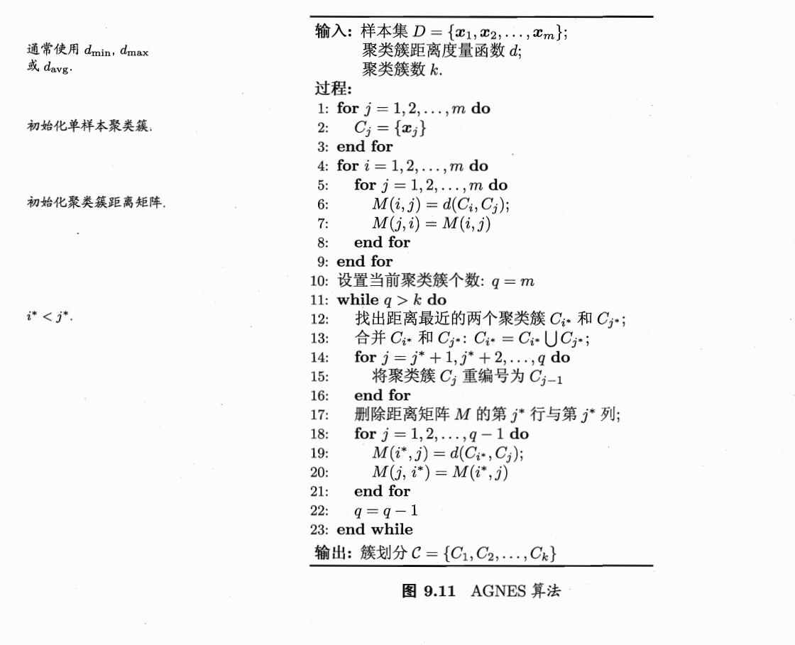

> AGNES : 一种自底向上的聚合策略

**AGNES (Agglomerative Nesting)** 是一种典型的自底向上（Bottom-up）的层次聚类算法。它的核心逻辑非常直观：先让每个样本“自成一派”，然后不断把离得最近的两个派系合并，直到达到你要求的簇数量为止。

### 第一阶段：初始化（第 1-3 行）

* **1-3 行**：为每一个样本 $\boldsymbol{x}_j$ 创建一个仅包含它自己的聚类簇 $C_j$。
* **逻辑**：如果你的数据集有 $m$ 个样本，那么开始时就有 $m$ 个簇。这体现了“自底向上”的起点：从最细碎的单位开始。

### 第二阶段：计算初始距离矩阵（第 4-9 行）

* **4-9 行**：计算所有簇两两之间的距离，并存入矩阵 $M$。
* **逻辑**：$M(i, j)$ 存储的是簇 $C_i$ 和 $C_j$ 之间的距离。
* **注意**：图片左侧注释提到了 $d_{min}, d_{max}, d_{avg}$。这决定了你如何定义“两个集合之间的距离”：
    * **单链接（Single-Linkage）**：取两个集合中距离最近的两个点。
    * **全链接（Complete-Linkage）**：取两个集合中距离最远的两个点。
    * **均链接（Average-Linkage）**：取两个集合中所有点对距离的平均值。

### 第三阶段：迭代合并（第 10-23 行）

这是算法的主循环，它会像“滚雪球”一样减少簇的数量。
> 星号（如 $i^*$ 和 $j^*$）通常表示“满足某种特定条件的特定索引值”。
* **10-11 行**：设置当前簇个数 $q=m$，只要 $q$ 还大于你预设的目标 $k$，就继续合并。
* **12 行**：在距离矩阵 $M$ 中寻找数值最小的项 $M(i^*, j^*)$。
    * **逻辑**：找出目前全场“离得最近”的两个簇 $C_{i^*}$ 和 $C_{j^*}$。
> 这里 $i^*$ 和 $j^*$：特指在那一时刻，使得距离 $M(i, j)$ 达到最小值的那一组特定的下标。
* **13 行**：合并这两个簇：$C_{i^*} = C_{i^*} \cup C_{j^*}$。
    * **逻辑**：把 $C_{j^*}$ 里的所有成员并入 $C_{i^*}$。
> 这里的 $i^*$ 变成了一个固定的常数，指代我们要操作的那个目标簇的编号。
* **14-16 行**：**重编号**。
    * **逻辑**：因为 $C_{j^*}$ 已经消失了，为了保持索引连续，把 $j^*$ 之后的簇全部往前挪一位（比如原本的 $C_{j^*+1}$ 变成现在的 $C_{j^*}$）。

* **17 行**：从距离矩阵 $M$ 中删除第 $j^*$ 行和第 $j^*$ 列。
    * **逻辑**：因为该簇已经合并进去了，旧的距离信息作废。

* **18-21 行**：**更新距离矩阵**。
    * **逻辑**：合并产生了一个新的大簇 $C_{i^*}$。这个新“派系”和剩下的其他所有簇 $C_j$ 之间的距离需要重新计算。

* **22 行**：$q = q - 1$。
    * **逻辑**：每合并一次，总簇数就减少一个。

### 总结：AGNES 的精髓

1. **贪心策略**：每一步都只找最近的两个合并，不考虑全局长远影响。
2. **矩阵维护**：算法大部分的计算开销都花在维护和更新那个 $m \times m$ 的距离矩阵 $M$ 上。
3. **结果形式**：它最终会生成一个类似树状图（Dendrogram）的结构。

**对研究的启发**：
AGNES 这种层次化的思想在**多模态学习**中很有用。例如，你可以先分别对视频特征和音频特征进行局部的层次聚类，再观察不同模态在哪个层级上开始出现语义对齐。

---
### 补充：三种距离的适用区别

在层次聚类中，选择不同的距离度量函数，会直接导致聚类结果（树状图的形态）发生翻天覆地的变化。

### 1. 三种距离定义的本质区别

我们可以把每个聚类簇想象成一个“部落”。要计算两个部落之间的距离，有三种不同的视角：

| 定义名称 | 数学含义 | 形象比喻（两个部落的距离） | 产生的效果 |
| --- | --- | --- | --- |
| **$d_{\text{min}}$ (单链接)** | 两个集合中**最近**的一对点之间的距离。 | 两个部落边界之间**最近的两间房**的距离。 | 容易产生“链式效应”，能发现细长的簇。 |
| **$d_{\text{max}}$ (全链接)** | 两个集合中**最远**的一对点之间的距离。 | 两个部落中**离得最远的两间房**的距离。 | 倾向于产生大小均匀、紧凑且圆形的簇。 |
| **$d_{\text{avg}}$ (均链接)** | 两个集合中**所有点对**距离的平均值。 | 两个部落**所有人两两见面**的平均距离。 | 性能最稳健，不容易受噪声点干扰。 |

### 2. 实际用途

既然伪代码里只写了一个 $d$，那么剩下的两个定义就是给你提供的“算法插件”，根据你的数据特征来替换：

* **应对不同形状的数据**：
    * 如果你知道你的多模态数据分布是长条形的（比如一段连续的语音特征），使用 $d_{\text{min}}$ 会更有效。
    * 如果你的数据分布比较聚拢（比如不同类别的图像特征），$d_{\text{max}}$ 效果通常更好。

* **抗噪能力（鲁棒性）**：
    * $d_{\text{min}}$ 非常怕噪声。哪怕两个簇离得很远，只要中间有一个孤立的噪声点作为“桥梁”，$d_{\text{min}}$ 就会错误地把它们合并。
    * $d_{\text{avg}}$ 考虑了所有点的贡献，个别噪声点不会显著拉低平均距离，因此在现实研究中用得最广。

### 总结
这些定义的用处在于：**它们赋予了算法不同的“性格”**。

作为一个大一就开始接触**多模态研究**的学生，你可能会发现多模态特征空间非常复杂。这时候，$d_{\text{avg}}$ 通常是你的首选，因为它能通过平均化操作抵消不同模态数据对齐时的微小偏差。