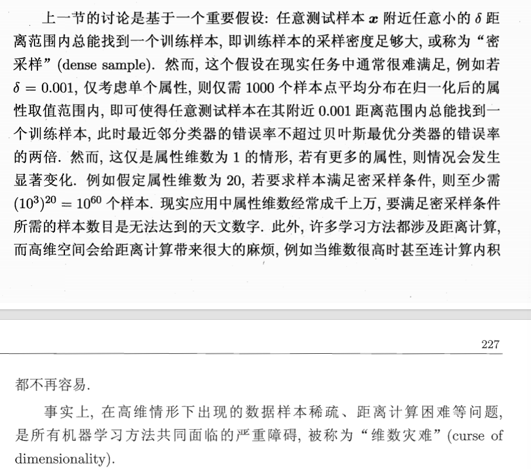
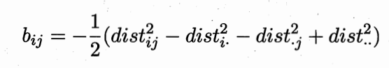
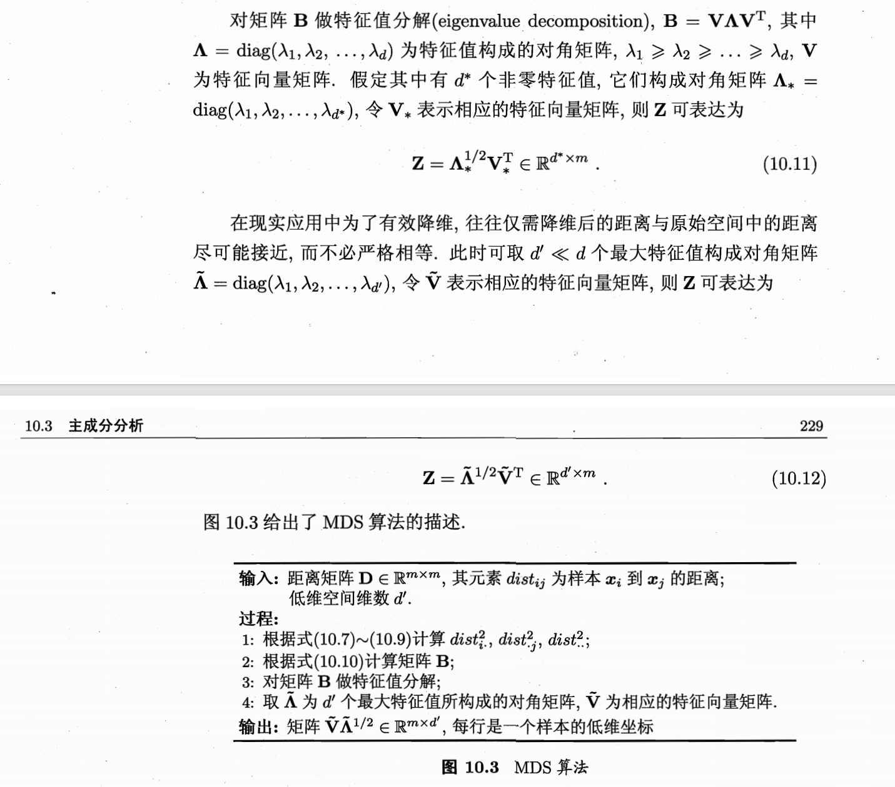
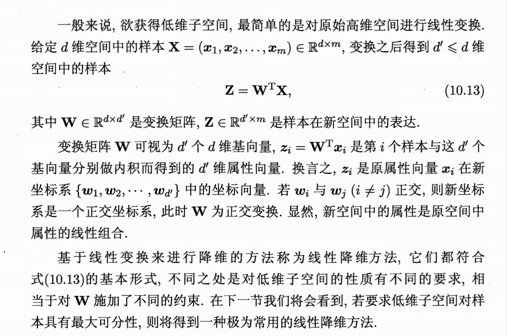

## 1. 问题引入

> 维度灾难的问题，归一化后范围在[0,1],在此基础上要满足密采样，则相当于每个维度上都要隔 $0.001$ 放一个点，假设所需的样本量会难以想象，实际的样本量无法满足于是就出现了高维样本稀疏的问题

---
## 2. 下面我们介绍"多维缩放"(MDS)这种经典降维方法
(使原始空间样本之间的距离在低维空间中得以保持)

### 2.1 概念辨析
* **$\mathbf{Z}$**：表示我们要寻找的**目标矩阵**。它包含了所有样本在降维后的新空间中的坐标表示。
这个矩阵的每一列其实代表了一个样本：

$$\mathbf{Z} = \begin{pmatrix} 
| & | & & | \\
\mathbf{z}_1 & \mathbf{z}_2 & \dots & \mathbf{z}_m \\
| & | & & | 
\end{pmatrix}$$

* **每一列**：是一个 $d'$ 维的向量，代表第 $i$ 个样本在低维空间里的新坐标。
* **每一行**：代表所有样本在某一个新特征维度上的取值。

> **总结**：$\mathbf{Z} \in \mathbb{R}^{d' \times m}$ 表示 $\mathbf{Z}$ 是一个由实数组成的矩阵，它有 $d'$ 行（新维度）和 $m$ 列（样本数）。

### 2.2 核心目标 (Core Objective)

在原始高维空间中，样本间的距离反映了其相似度。MDS 的目标是寻找一个低维空间 $d'$（$d' \le d$），使得样本在新空间中的欧氏距离 $\mathbf{||z_i - z_j||}$ 尽可能等于原始空间中的距离 $dist_{ij}$。

### 2.3 核心工作：从“距离”到“坐标”的推导

直接求解坐标矩阵 $\mathbf{Z}$ 非常困难，因此算法通过引入**降维后的内积矩阵 $\mathbf{B}$** 作为桥梁。其推导逻辑如下：

* **建立距离与内积的关系**：
利用向量内积展开式，将距离平方 $dist_{ij}^2$ 表示为内积矩阵元素 $b_{ii}$、$b_{jj}$ 和 $b_{ij}$ 的组合：

$$dist_{ij}^2 = b_{ii} + b_{jj} - 2b_{ij}$$

* **中心化约束**：
为了简化计算并固定坐标系，令降维后的样本 $\mathbf{Z}$ 被中心化，即所有样本坐标之和为 0 ($\sum_{i=1}^m \mathbf{z}_i = 0$)。
* **双中心化 (Double Centering)**：
利用中心化性质，计算距离矩阵的行平均、列平均和全局平均（即带有“点” $\cdot$ 的符号，如 $dist_{i\cdot}^2$），从而消除掉多余的未知数。
* **求解内积矩阵**：
它允许我们**仅通过原始距离**就计算出内积矩阵 $\mathbf{B}$ 的每一个元素 $b_{ij}$。

### 2.4 降维工作的现实意义

#### A. 缓解维数灾难 (Curse of Dimensionality)

* **样本稀疏性**：在高维空间下，要维持足够的采样密度所需的样本量呈指数级增长（如 20 维空间需要 $10^{60}$ 个样本），这在现实中无法实现。
* **距离失效**：维度过高会导致基于距离的算法（如 KNN）失效。MDS 通过将数据压缩到低维流形上，使距离度量重新变得有意义。

#### B. 提升模型泛化能力

* **控制模型复杂度**：过高的维度会导致模型容易捕捉到噪声，从而产生**过拟合**。
* **特征降噪**：降维过程本质上是提取主要特征、剔除冗余和噪声的过程，有助于使模型在测试集上表现更稳健。

#### C. 数据可视化与压缩

* **直观分析**：通过将数据降至 2 维或 3 维，研究者可以直接观察数据的分布特征（如聚类趋势、离群点）。
* **计算效率**：在降维后的低维表示 $\mathbf{Z} \in \mathbb{R}^{d' \times m}$ 上进行后续运算，可以极大地节省内存和计算时间。

### 总结

MDS 的精妙之处在于它证明了：**只要我们拥有样本间的相对距离，就能通过线性代数手段（中心化与特征值分解）还原出它们在低维空间中的绝对坐标。** 这是理解许多非线性降维方法（如流形学习）的数学基石。

---

## 相关笔记

- [[5.1-K近邻学习(问题引入)]] — MDS解决KNN面临的维数灾难
- [[5.2.2-主成分分析(PCA)]] — 两者都用特征分解；PCA最大化方差，MDS保持距离
- [[5.3.1-核化线性降维]] — KPCA扩展PCA的线性框架
- [[5.3.2-流形学习]] — Isomap在计算测地线距离后使用MDS作为最后一步
- [[5.4-几种降维方法的对比]] — MDS与PCA/KPCA的对比

---
## 3. 选取非零特征值与最大特征值的区别

这二者之间的区别主要在于 **“数学上的精确还原”** 与 **“工程上的近似降维”** 之间的权衡。

以下是详细的对比分析：

### 1. 定义与范畴的区别

* **非零特征值对角矩阵 ($\Lambda_*$)**：
    * **范畴**：包含所有 $d^*$ 个非零特征值。
    * **物理意义**：这是对原始内积矩阵 $\mathbf{B}$ 的**等价转换**。只要特征值为非零，就说明该维度包含了原始数据的空间信息。
    * **目标**：实现**严格相等**的距离还原，即降维前后的距离完全一致。

* **最大特征值对角矩阵 ($\tilde{\Lambda}$)**：
    * **范畴**：仅选取前 $d' < d^*$ 个最大的特征值。
    * **物理意义**：这是一种**信息过滤**。它主动丢弃了那些特征值较小（贡献度低）的维度，认为它们可能是噪声或次要信息。
    * **目标**：实现**有效降维**，允许距离存在一定误差，以换取更低的计算维度和更好的泛化能力。

### 2. 核心区别对比表

| 特性 | 非零特征值矩阵 $\Lambda_*$ | 最大特征值矩阵 $\tilde{\Lambda}$ |
| --- | --- | --- |
| **维度数量** | $d^*$ (所有含信息的维度) | $d'$ (人工指定的低维度，如 2 或 3) |
| **还原程度** | **严格相等**：距离完全保留 | **尽可能接近**：允许部分距离误差 |
| **计算逻辑** | 理论上的完整表示  | 现实应用中的有损压缩 |
| **应用场景** | 寻找数据的固有秩（Rank） | 数据可视化、去噪、特征提取 |

### 3. 为什么要区分这两个概念？

在数学推导中，我们首先需要证明通过 $\Lambda_*$ 可以完美还原原始距离。但在**现实应用**中，如果原始空间有 1000 维，非零特征值可能就有 1000 个，此时 $d^*=1000$ 并没有达到“降维”的目的。

因此，我们需要从 $\Lambda_*$ 中进一步筛选，只挑出能量最强的 $d'$ 个特征值构成 $\tilde{\Lambda}$，这才是我们真正用于**有效降维**的操作。

