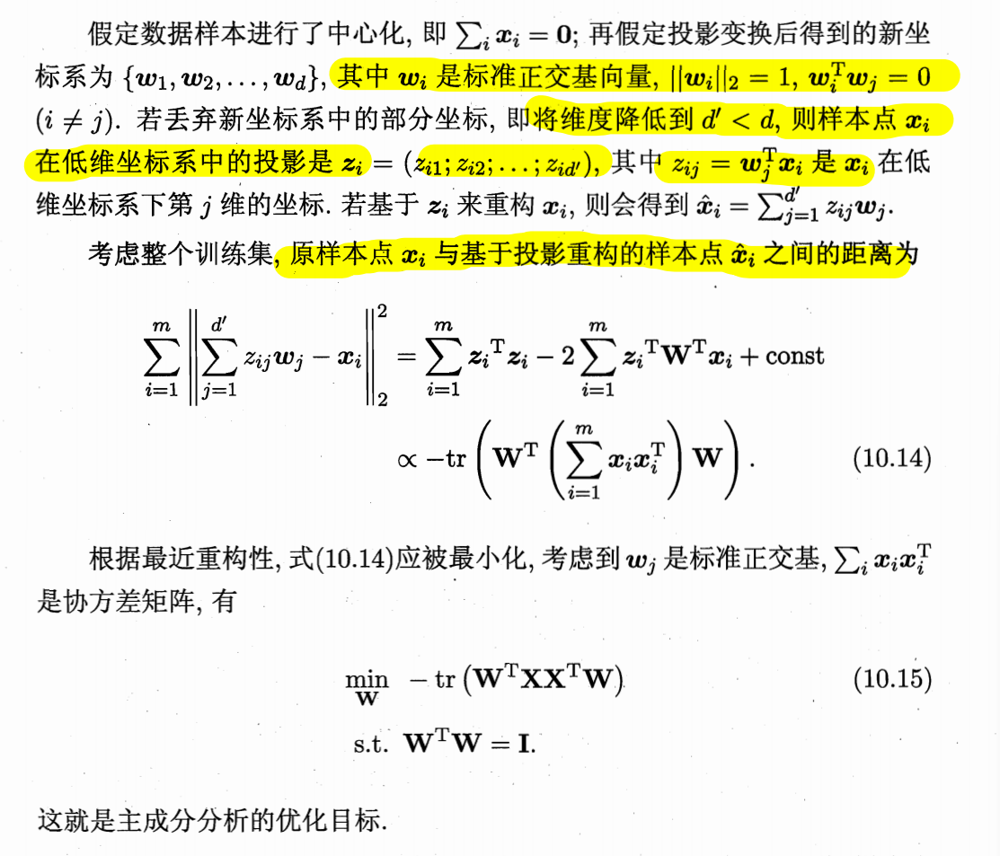
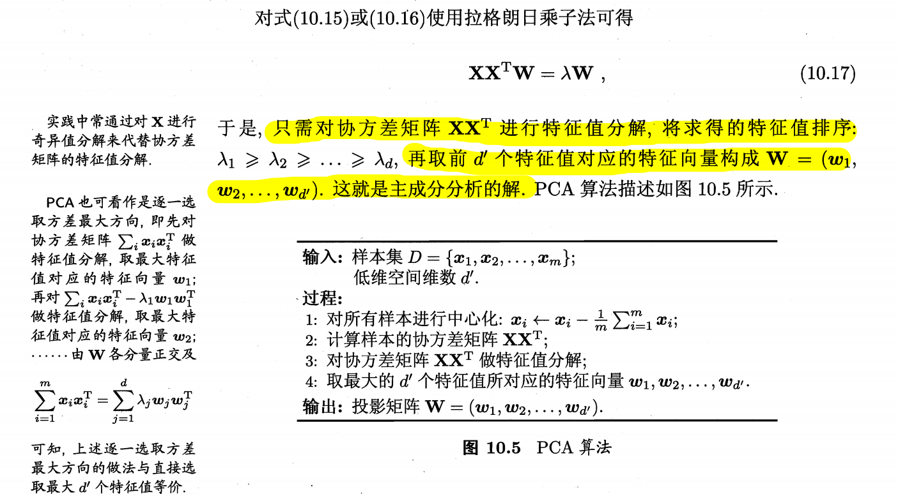
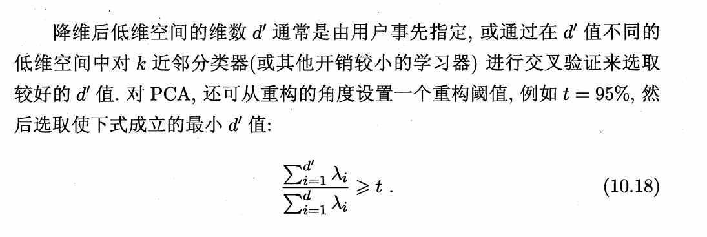

**主成分分析 (PCA)** 的一种直观解释：**最小重构误差**。其核心目标是找到一个低维子空间，使得原始样本点在投影回高维空间后，与原点之间的损失最小。

### 1. 核心概念解释

* **原样本点 $x_i$**：处于原始 $d$ 维空间中的数据点，假定已进行中心化处理（$\sum_i x_i = 0$）。
* **低维坐标 $z_i$**：样本 $x_i$ 投影到由 $d'$ 个标准正交基 $\{w_1, w_2, \dots, w_{d'}\}$ 构成的子空间后的坐标。其中第 $j$ 维坐标计算为 $z_{ij} = w_j^T x_i$。
* **基于投影重构的样本点 $\hat{x}_i$**：利用低维坐标 $z_i$ 和对应的基向量重新恢复出的高维点，公式为 $\hat{x}_i = \sum_{j=1}^{d'} z_{ij} w_j$。
* **注意**：由于舍弃了部分维度（$d' < d$），$\hat{x}_i$ 通常无法完全等于 $x_i$，二者之差即为**重构误差**。

#### 形状说明

* **$w_j$ 的属性**：每一个 $w_j$ 都是原始 $d$ 维空间中的一个**基向量**，因此它的形状始终是 **$d \times 1$**。
* **投影矩阵 $\mathbf{W}$ 的形状**：当你把这些基向量组合成投影矩阵 $\mathbf{W}$ 时，它的形状是 **$d \times d'$**。这意味着它确实只有 **$d'$ 列**，每一列代表低维空间的一个轴。
* **$z_{ij}$ 的本质**：它是样本 $x_i$ 在第 $j$ 个基向量 $w_j$ 上的投影长度，是一个**标量**。
* **低维表示 $z_i$ 的形状**：将 $d'$ 个标量 $z_{ij}$ 组合起来，就得到了样本在低维空间中的坐标向量 $z_i$，其形状为 **$d' \times 1$**。
* **重构点 $\hat{x}_i$ 的计算**：虽然我们只保留了 $d'$ 个坐标，但重构时是用这 $d'$ 个标量去加权对应的 $d$ 维基向量。公式 $\hat{x}_i = \sum_{j=1}^{d'} z_{ij}w_j$ 说明重构点是 $d'$ 个 $d$ 维向量的线性组合，因此重构后的点依然是在 **$d$ 维空间**中。

### 2. 公式详细推导

公式的目标是最小化整个训练集的重构误差平方和：$\sum_{i=1}^m \|\hat{x}_i - x_i\|_2^2$。

#### 第一步：展开范数平方

利用向量模长的性质 $\|a-b\|^2 = a^T a - 2a^T b + b^T b$，对每一项进行展开：

1. **重构项平方**：$\hat{x}_i^T \hat{x}_i$。由于 $w_j$ 是标准正交基，不同基向量内积为 0，同基内积为 1。因此 $\hat{x}_i^T \hat{x}_i = \sum_j z_{ij}^2 = z_i^T z_i$。
2. **交叉项**：$-2\hat{x}_i^T x_i = -2 (\sum z_{ij} w_j)^T x_i = -2 \sum z_{ij} (w_j^T x_i)$。因为 $w_j^T x_i = z_{ij}$，所以此项等于 $-2 \sum z_{ij}^2 = -2 z_i^T z_i$。
3. **常数项**：$x_i^T x_i$。这与我们要寻找的投影方向 $W$ 无关，记为 `const`。

合并后得到图像中的第一行等式：$\sum_{i=1}^m z_i^T z_i - 2 \sum_{i=1}^m z_i^T W^T x_i + \text{const}$。

#### 第二步：化简与矩阵化

继续代入 $z_i = W^T x_i$（其中 $W = (w_1, w_2, \dots, w_{d'})$）：

* 前两项合并为：$\sum z_i^T z_i - 2 \sum z_i^T z_i = -\sum z_i^T z_i$。
* 利用迹 (trace) 的性质 $a^T a = \text{tr}(aa^T)$，将求和项写成矩阵形式：

$$-\sum_{i=1}^m z_i^T z_i = -\sum_{i=1}^m \text{tr}(z_i z_i^T) = -\text{tr}\left( \sum_{i=1}^m (W^T x_i)(W^T x_i)^T \right)$$

#### 第三步：得出最终正比关系

通过矩阵分配律提公因子 $W^T$ 和 $W$：

$$-\text{tr}\left( W^T \left( \sum_{i=1}^m x_i x_i^T \right) W \right)$$

### 3. 结论与意义

* **最小化误差等价于最大化投影能量**：公式前面带有一个负号，因此**最小化**重构误差等价于**最大化** $\text{tr}(W^T (\sum x_i x_i^T) W)$。
* **协方差矩阵**：中间的 $\sum x_i x_i^T$ 实际上正比于数据的协方差矩阵。
* **PCA 的本质**：PCA 的求解过程就是寻找能使上述迹最大的矩阵 $W$，这正好对应于协方差矩阵的前 $d'$ 个最大特征值所对应的特征向量。

---
### 补充

### 1. 为什么协方差矩阵描述了“伸展程度”？

协方差矩阵 $\sum x_i x_i^T$（在数据已中心化的前提下）本质上是一个**空间变换算子**。

* **对角线元素**：矩阵对角线上的值是每个单一维度的方差。方差越大，说明数据在该坐标轴方向上“拉得越长”。
* **非对角线元素**：这些值是维度间的协方差，反映了维度的相关性。如果两个维度相关，数据会沿着某种倾斜的方向伸展，形成一个椭球状的分布。
* **几何压缩**：我们可以把协方差矩阵想象成一个“力场”，它记录了数据在原始空间中是如何向四周扩散的。矩阵里的数值大小，直接刻画了这种扩散在各个方向上的强度。

### 2. 为什么最大特征值对应方差最大的方向？

这是 PCA 最核心的数学巧妙之处，可以通过以下逻辑链条理解：

#### A. 投影方差的数学表达

当我们把数据 $x_i$ 投影到一个方向 $w$ 上时，投影后的点坐标是 $w^T x_i$。
投影后的**方差**（即能量总和）可以表示为：

$$\text{Variance} = \sum (w^T x_i)^2 = w^T (\sum x_i x_i^T) w$$

#### B.  Rayleigh 商与特征向量

在数学上，上述式子 $w^T \mathbf{S} w$（其中 $\mathbf{S}$ 是协方差矩阵）在限制 $\|w\|=1$ 的条件下，其**最大值**正好等于矩阵 $\mathbf{S}$ 的**最大特征值** $\lambda_{max}$。

* **特征向量的方向**：取得这个最大值时的向量 $w$，恰好就是该特征值对应的**特征向量**。
* **物理含义**：特征向量 $w$ 定义了一个新的轴，而特征值 $\lambda$ 的大小告诉了我们：如果把数据投影到这个轴上，我们能保留多少“伸展长度”（方差）。

**总结：**
协方差矩阵定义了数据的椭球形状，而特征值分解则是找出了这个椭球的**长轴**（最大特征值方向）和**短轴**。PCA 的本质就是保留长轴，舍弃短轴，从而实现“丢弃次要信息，保留核心特征”的降维目的。

### 3. d'值的选取
