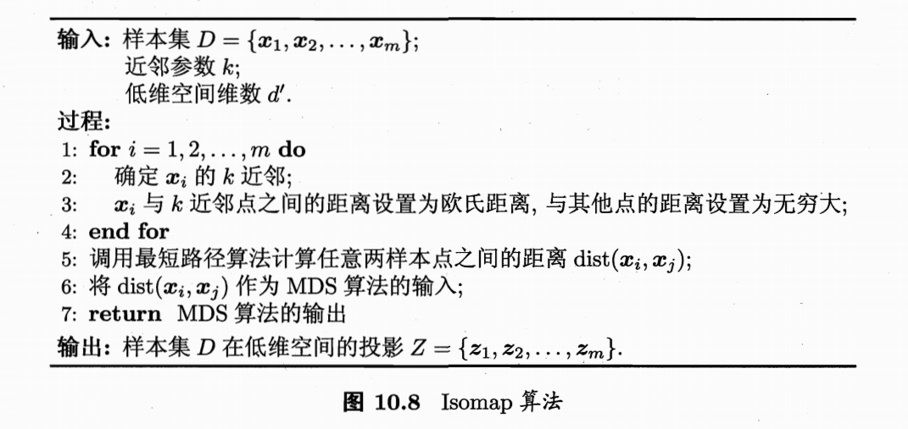
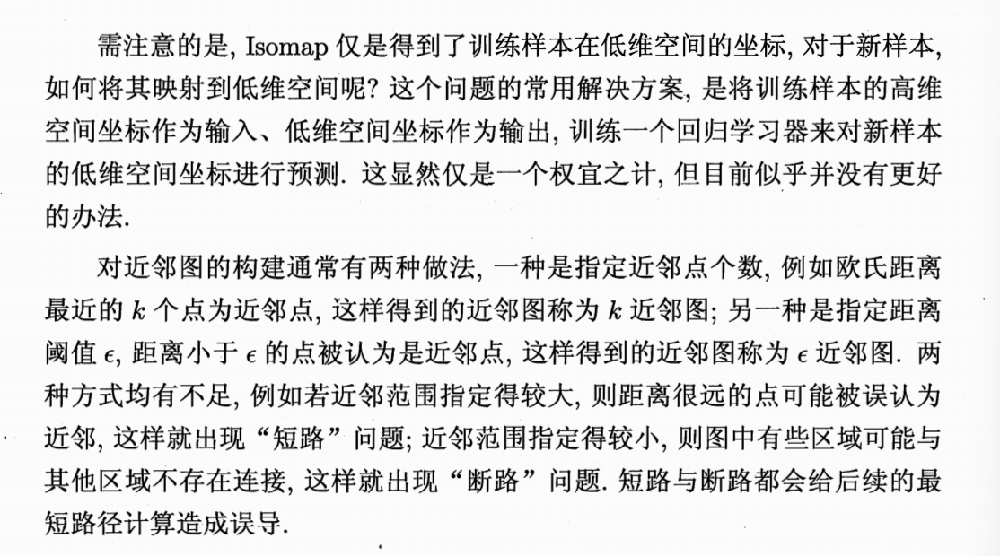
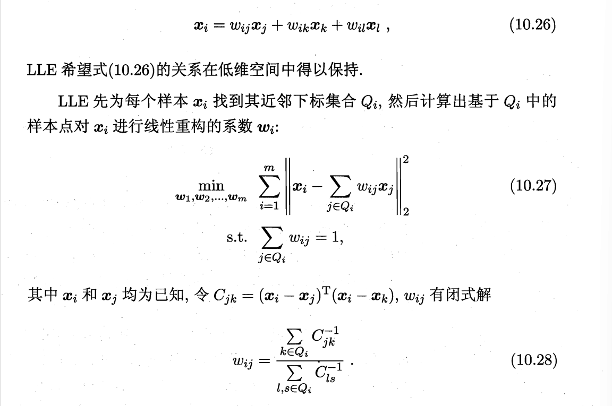
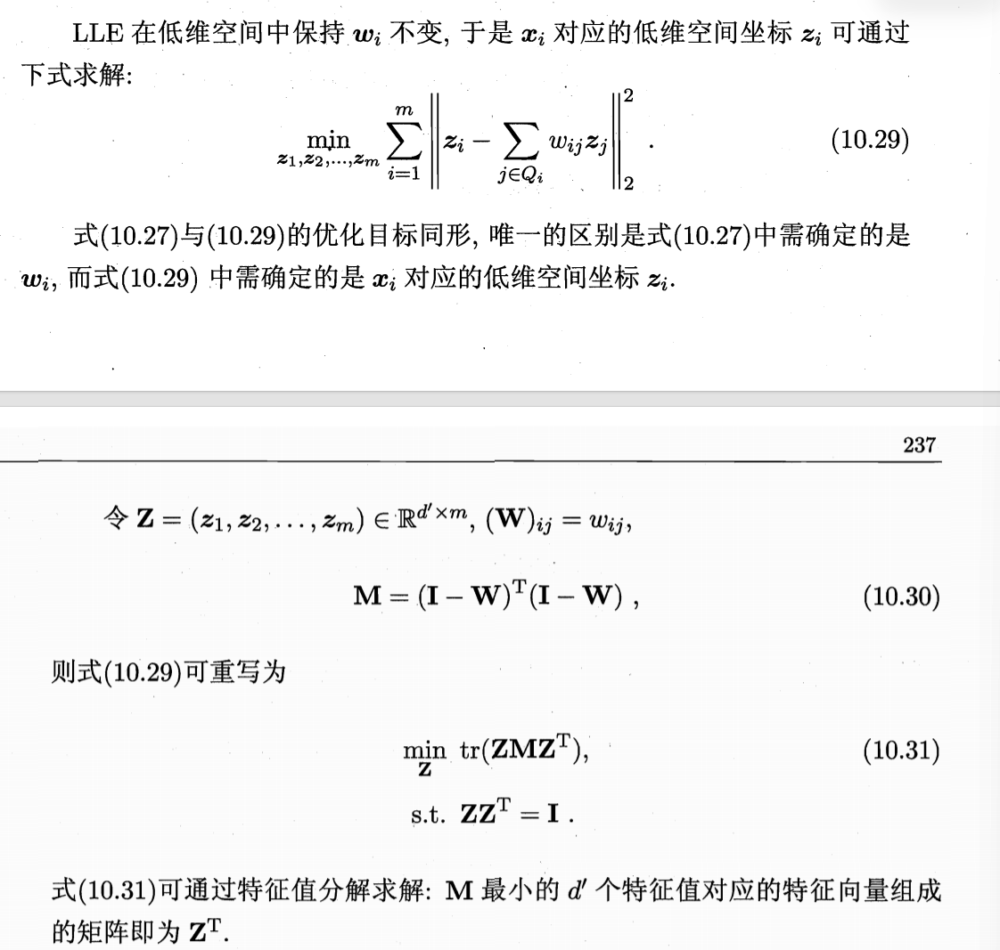
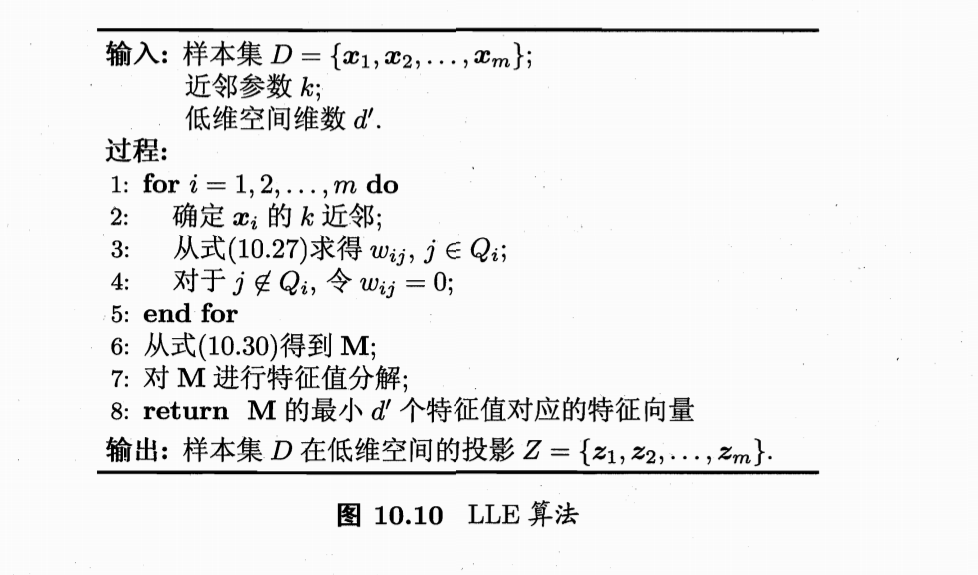

**相关笔记**: [[00.补充-最短路径算法]] | [[05.2.1-低维嵌入]] | [[05.2.2-主成分分析(PCA)]] | [[05.3.1-核化线性降维]] | [[04.2.2-密度聚类]] | [[04.2.3-层次聚类]] | [[06.1-基本概念]]

---

## 🏷️ 文档元数据
* **重要性**: ⭐⭐⭐⭐⭐ (最高优先级)
* **状态**: 基础必修

---

## 一、低维流形概念：低维骨架嵌入高维外壳

**流形（Manifold）**：局部和欧氏空间同胚的几何结构。放大看是平的（像纸张），远看是弯曲的（像揉皱的纸团）。流形学习的目标就是把这张"揉皱的纸"在不撕裂的前提下平整铺开。

```python
# ============================================
# 📌 流形的直观理解
# ============================================
# 观测维度（高维外壳）= 数据表现出的坐标维度
#   例：一张 100x100 的图像有 10000 个像素 → 住在 10000 维空间
# 内在维度（低维骨架）= 数据真正的自由度
#   例：同一球体在不同光照角度下的 10000 张照片，本质上只有"光照角度" 1 个变量在变
# "嵌入"的含义：这 10000 维的数据点实际落在高维空间中一条 1 维细长曲线上

# 经典模型：瑞士卷 (Swiss Roll)
# 状态          空间表现                      距离度量
# ──────────────────────────────────────────────────────────
# 卷缩（高维嵌入） 二维面蜷在三维空间         直线距离穿过卷层 = 错误
# 局部性质         每一小块是平的             小块内欧氏距离有效
# 展开（降维映射） 摊平在桌面上               恢复了真实二维结构
```

## 二、Isomap 代码演示：测地线距离 + MDS



```python
import numpy as np
from sklearn.manifold import Isomap
from sklearn.datasets import make_swiss_roll
from sklearn.neighbors import kneighbors_graph
from scipy.sparse.csgraph import shortest_path

# ============================================
# 📌 Step 1: 构造瑞士卷数据
# ============================================
X, color = make_swiss_roll(n_samples=500, noise=0.05, random_state=42)
# X 是三维坐标，color 是沿卷轴的位置（真实的内在坐标）

# ============================================
# 📌 Step 2: 手动实现 Isomap 核心流程
# ============================================
def manual_isomap(X, n_neighbors=5, n_components=2):
    """
    🌟 Isomap 三步走：
    1. 构建近邻连接图（"搭脚手架"）
    2. 用最短路径逼近测地线距离（"化曲为直"）
    3. 对距离矩阵执行 MDS（"铺平展开"）

    💡 比喻：就像用一根绳子沿着弯曲的表面测量距离（测地线），
    而不是直接穿过空间量直线距离（欧氏距离）
    """
    m = X.shape[0]

    # --- Step 1: 构建 k 近邻图 ---
    # 每个点只连接最近的 k 个邻居，非近邻距离设为 ∞
    # 🌟 为什么可以这样做？因为在足够小的局部，流形是平坦的
    # 局部欧氏距离 ≈ 局部测地线距离
    A = kneighbors_graph(X, n_neighbors=n_neighbors, mode='distance')

    # --- Step 2: 最短路径 = 测地线距离的近似 ---
    # 把图上的边看成"公路网"，用 Dijkstra 算任意两点最短路径
    # 当数据点足够密时，这些最短路径拼接起来 ≈ 真实的测地线距离
    # 就像用很多小段直尺沿着弯尺子量长度
    D_geodesic = shortest_path(A, method='D', directed=False)

    # 处理不可达节点（不连通的图）
    D_geodesic[np.isinf(D_geodesic)] = D_geodesic[~np.isinf(D_geodesic)].max()

    # --- Step 3: MDS 降维 ---
    # 对测地线距离矩阵做 MDS，得到低维坐标
    from sklearn.manifold import MDS
    mds = MDS(n_components=n_components, dissimilarity='precomputed', random_state=42)
    Z = mds.fit_transform(D_geodesic)

    return Z, D_geodesic

Z_manual, D_geo = manual_isomap(X, n_neighbors=10, n_components=2)

# ============================================
# 📌 Step 3: 对比 sklearn 的 Isomap
# ============================================
isomap = Isomap(n_neighbors=10, n_components=2)
Z_sklearn = isomap.fit_transform(X)

print("手动 Isomap 前5个样本:")
print(Z_manual[:5])
print("\nsklearn Isomap 前5个样本:")
print(Z_sklearn[:5])

# 验证：降维后的坐标与真实的卷轴位置（color）是否相关
from scipy.stats import pearsonr
corr, _ = pearsonr(Z_sklearn[:, 0], color)
print(f"\n降维后第一主成分与真实位置的相关系数: {corr:.3f}")
# 💡 高相关性说明 Isomap 成功"展开"了瑞士卷
```

## 三、Isomap 半圆环示例：理解近邻图的作用

```python
# 🌟 手动演示：三个点在半圆弧上，展示测地线距离 vs 欧氏距离的区别
# x1=(1,0), x2=(0,1), x3=(-1,0) —— 分布在半圆弧上
x1, x2, x3 = np.array([1.0, 0.0]), np.array([0.0, 1.0]), np.array([-1.0, 0.0])

# 欧氏距离（直线穿过空气）
euclidean_13 = np.linalg.norm(x1 - x3)  # = 2.0

# 测地线距离（沿着圆弧走，k=1 时通过 x2 中转）
# d12 = √2 ≈ 1.41, d23 = √2 ≈ 1.41
# 测地线距离 d13 = d12 + d23 = 2.82
d12 = np.linalg.norm(x1 - x2)
d23 = np.linalg.norm(x2 - x3)
geodesic_13 = d12 + d23

print(f"欧氏距离(x1→x3):      {euclidean_13:.4f}")   # 2.0000
print(f"测地线距离(x1→x3):    {geodesic_13:.4f}")    # 2.8284
print(f"差值（被\"绕过\"的弧长）:  {geodesic_13 - euclidean_13:.4f}")  # 0.8284

# 距离矩阵（MDS 的输入）—— 用测地线距离填充
D = np.array([
    [0.0,    d12,   geodesic_13],
    [d12,    0.0,   d23],
    [geodesic_13, d23, 0.0]
])
print(f"\nMDS 输入形状: {D.shape}")  # (3, 3)
# 💡 MDS 拿到这个矩阵后，会尝试在 1 维空间找到三个点 z1,z2,z3，
# 使得 |z1-z2|≈1.41, |z2-z3|≈1.41, |z1-z3|≈2.82
# 最终输出: z1=0, z2=1.41, z3=2.82
# 成功把半圆弧"拉直"成了一段长度为 2.82 的线段！

# ============================================
# ⚠️ Isomap 的关键参数：n_neighbors
# ============================================
# n_neighbors 太小 → 图不连通 → 测地线距离失效（出现 ∞）
# n_neighbors 太大 → 图太密 → 捷径穿过流形 → 测地线近似退化为欧氏距离
# 💡 实践建议：通过交叉验证或可视化"残差方差"来选择
for k in [3, 5, 7, 10, 15, 20]:
    iso = Isomap(n_neighbors=k, n_components=2)
    Z = iso.fit_transform(X)
    # 残差方差：越小越好，说明降维保留了距离信息
    residual = iso.reconstruction_error()
    print(f"k={k:2d}, 重构误差={residual:.4f}")
```



## 四、LLE（局部线性嵌入）代码演示

Isomap 试图保持近邻样本之间的**距离**，而 LLE 试图保持邻域内样本之间的**线性关系**。比喻：Isomap 是"保持朋友间的远近排序"，LLE 是"保持朋友间的相对座位布局"。



```python
from sklearn.manifold import LocallyLinearEmbedding

# ============================================
# 📌 Step 1: LLE 两步走：先算权重，再解坐标
# ============================================
# LLE 的核心直觉：
# Step 1（权重）：在原始高维空间，每个样本用其 k 个邻居的线性组合表示
#    x_i ≈ ∑ w_ij x_j，权重 w_ij 反映了"第 j 个邻居在我的小团体中占比多少"
#    约束: ∑ w_ij = 1（保证平移不变性——整个朋友圈一起平移不改变关系）
#
# Step 2（坐标）：在低维空间，保持同样的权重关系
#    min ∑ ||z_i - ∑ w_ij z_j||²
#    寻找坐标 Z，使得邻居间的线性关系被完整保存

lle = LocallyLinearEmbedding(n_neighbors=10, n_components=2, method='standard')
Z_lle = lle.fit_transform(X)  # 瑞士卷数据

print(f"LLE 降维后形状: {Z_lle.shape}")
print(f"LLE 重构误差: {lle.reconstruction_error_:.4f}")

# ============================================
# 📌 Step 2: 手动计算 LLE 的权重（理解闭式解）
# ============================================
from sklearn.neighbors import NearestNeighbors

def lle_weights_manual(X, n_neighbors=10):
    """
    🌟 LLE 第一步：计算每个样本被其邻居重构的权重

    核心推导：
    1. 误差 = ||x_i - ∑ w_ij x_j||², 约束 ∑w_ij = 1
    2. 利用约束消去 x_i: x_i - ∑w_ij x_j = ∑w_ij (x_i - x_j)
    3. 误差变成 ∑ w_ij w_ik C_jk，其中 C_jk = (x_i - x_j)^T (x_i - x_k)
    4. 拉格朗日乘子法 → 闭式解: w_j = (∑ C^{-1}_jk) / (∑ C^{-1}_ls)

    💡 比喻：每个点是它邻居的"加权平均"，权重反映了"邻里关系亲密度"
    """
    m = X.shape[0]
    nn = NearestNeighbors(n_neighbors=n_neighbors + 1)  # +1 因为包含自己
    nn.fit(X)
    distances, indices = nn.kneighbors(X)

    weights = np.zeros((m, m))

    for i in range(m):
        # 去掉自己（第一个邻居是自己，距离=0）
        neighbors_idx = indices[i, 1:]  # k 个邻居的索引

        # 协方差矩阵 C: k x k
        Xi = X[neighbors_idx]  # 邻居的坐标
        diff = Xi - X[i]       # 每个邻居与 x_i 的差向量
        C = diff @ diff.T      # C_jk = (x_i - x_j)^T (x_i - x_k)

        # 📌 加一个小的正则化项防止奇异性
        C += np.eye(n_neighbors) * 1e-3 * np.trace(C)

        # 闭式解: w = C^{-1} 1，再归一化使 ∑w = 1
        C_inv = np.linalg.inv(C)
        w = C_inv.sum(axis=1)  # 每行的行和 → C^{-1}1
        w = w / w.sum()         # 归一化

        weights[i, neighbors_idx] = w

    return weights

W_manual = lle_weights_manual(X, n_neighbors=10)
print(f"\n手动计算权重矩阵形状: {W_manual.shape}")  # (500, 500)
print(f"每行权重和（应≈1）: {W_manual.sum(axis=1)[:5]}")
# 💡 每行只有 k 个非零值（k 近邻之外权重为 0），是一个稀疏矩阵
```



## 五、LLE 第二步：从权重解出低维坐标

```python
def lle_embedding_manual(weights, n_components=2):
    """
    🌟 LLE 第二步：保持权重关系，求解低维坐标

    目标: min tr(Z M Z^T)，s.t. ZZ^T = I
    其中 M = (I-W)^T (I-W) 是 m x m 的代价矩阵

    解: 取 M 最小的 d'+1 个特征值对应的特征向量（去掉最小的那个 = 全1向量）

    💡 关键区别 LLE vs PCA:
      - PCA 分解的是 d x d 的协方差矩阵 → 特征向量是"投影方向"
      - LLE 分解的是 m x m 的代价矩阵 → 特征向量就是"样本坐标"
    """
    m = weights.shape[0]

    # 代价矩阵 M
    I = np.eye(m)
    M = (I - weights).T @ (I - weights)  # m x m

    # 特征分解
    eigenvalues, eigenvectors = np.linalg.eigh(M)

    # 从小到大排序（我们要最小化，所以找小特征值）
    idx = np.argsort(eigenvalues)
    eigenvalues = eigenvalues[idx]
    eigenvectors = eigenvectors[:, idx]

    # 🌟 丢弃最小特征值（≈0，对应全1向量，反映平移不变性）
    # 取次小的 d' 个特征向量作为低维坐标
    Z = eigenvectors[:, 1:n_components+1]  # (m, d')

    return Z

Z_lle_manual = lle_embedding_manual(W_manual, n_components=2)
print(f"手动 LLE 坐标形状: {Z_lle_manual.shape}")  # (500, 2)
print(f"手动 LLE 前3个样本:\n{Z_lle_manual[:3]}")
```



## 六、PCA vs LLE：找"方向" vs 排"座位"

```python
# ============================================
# 📌 核心区别：两者分解的根本不是同一个东西
# ============================================
#
# PCA:
#   分解矩阵: 协方差矩阵 Σ (d x d)  ← 特征维度级
#   特征向量: 原始空间中的投影方向（"指南针"）
#   含义: "沿着哪个方向投影，方差最大？"
#   降维操作: 把样本沿特征向量方向投影
#
# LLE:
#   分解矩阵: 代价矩阵 M (m x m)    ← 样本数量级
#   特征向量: 样本在低维空间的坐标（"座位号"）
#   含义: "每个样本坐在低维空间的哪个位置，邻里关系最和谐？"
#   降维操作: 直接拿特征向量作为输出坐标
#
# 💡 形象比喻：
#   100个样本，每个有3个特征（长、宽、高）
#   PCA: 协方差矩阵 3x3，特征向量长度=3，如 [1,0,0] → 告诉你往"长"的方向投影
#   LLE: 代价矩阵 100x100，特征向量长度=100 → 100个数字就是100个样本的坐标！
#   这长度为100的向量根本无法表示原来3维空间的方向
#   —— 它是专门为这100个样本一对一准备的"座位安排表"

# 可视化这个区别
n_samples, n_features = 100, 3
X_demo = np.random.randn(n_samples, n_features)

# PCA 的协方差矩阵
cov_pca = (X_demo.T @ X_demo) / n_samples
print(f"PCA 协方差矩阵形状: {cov_pca.shape}")  # (3, 3)

# LLE 的代价矩阵（用随机权重模拟）
W_dummy = np.random.rand(n_samples, n_samples)
W_dummy = W_dummy / W_dummy.sum(axis=1, keepdims=True)
M_lle = (np.eye(n_samples) - W_dummy).T @ (np.eye(n_samples) - W_dummy)
print(f"LLE 代价矩阵形状: {M_lle.shape}")     # (100, 100)

# 💡 一目了然：PCA 分解的是特征级矩阵，LLE 分解的是样本级矩阵
```

## 七、Isomap vs LLE vs PCA 实战对比

```python
from sklearn.manifold import Isomap, LocallyLinearEmbedding
from sklearn.decomposition import PCA

methods = {
    'PCA':    PCA(n_components=2),
    'Isomap': Isomap(n_neighbors=10, n_components=2),
    'LLE':    LocallyLinearEmbedding(n_neighbors=10, n_components=2, method='standard'),
}

print("=== 降维方法在瑞士卷上的对比 ===")
for name, method in methods.items():
    Z = method.fit_transform(X)
    # 评估：降维后的坐标与真实卷轴位置（color）的相关性
    corr, _ = pearsonr(Z[:, 0], color)
    print(f"{name:8s}: |corr| = {abs(corr):.4f}")

# 💡 PCA 的相关系数通常很低（它只会"直着切"，把卷层混在一起）
# Isomap 和 LLE 的相关系数较高（它们识别了非线性结构，成功"展开"）
```

## 八、总结

Isomap: 保持全局测地线距离 → 适合"等距"的流形展开
  - 核心: 近邻图 + 最短路径 + MDS
  - 比喻: 用绳子沿表面量距离，然后铺平

LLE: 保持局部线性关系 → 适合"局部平坦"的流形
  - 核心: 邻居权重 + 代价矩阵特征分解
  - 比喻: 保持朋友间座位关系不变的前提下重新排位

两者都不产生投影矩阵（转导式），新样本无法直接降维
→ 需要"度量学习"来获得可泛化的映射函数

---

## 🏷️ 文档元数据
* **当前状态**：已完成 (Completed)
* **安全策略**：`.gitignore` 严格阻断 Key 泄露风险
