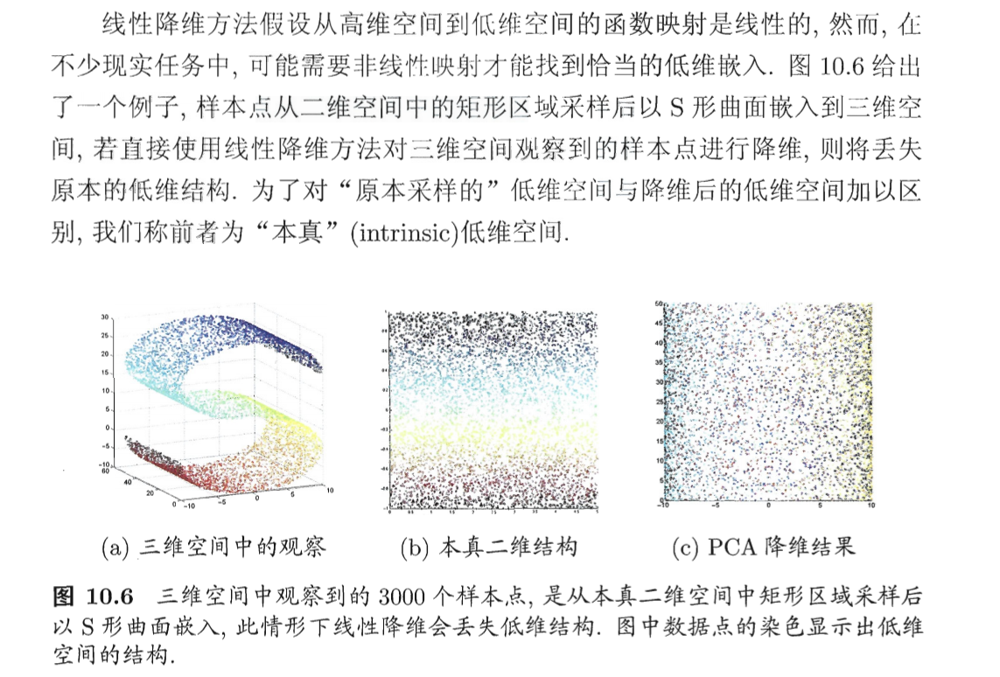
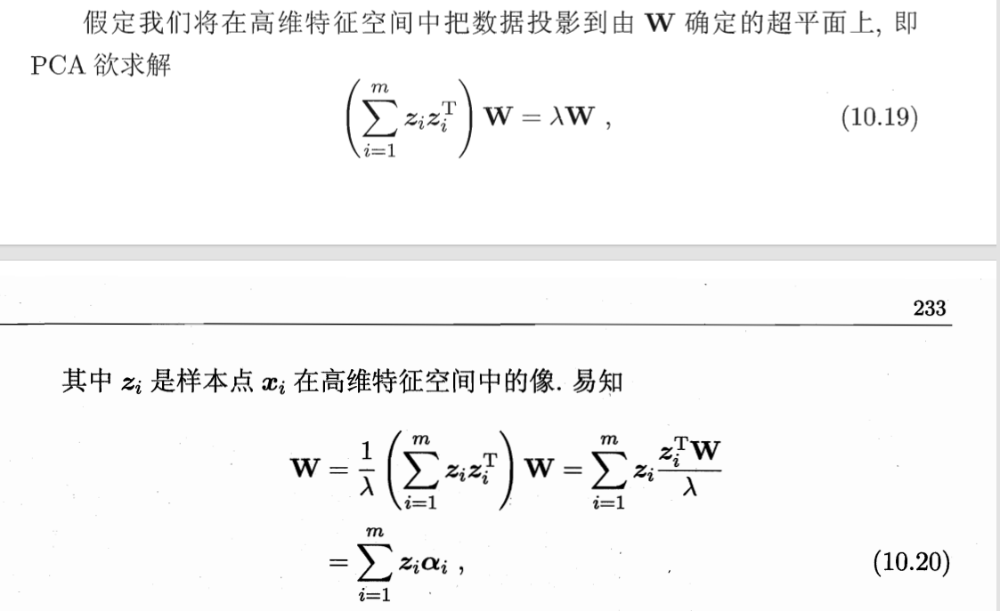

## 1. 问题引入

### 1.1 二维空间采样 (Sampling in 2D)

* **过程**：首先在一个平面（二维空间）上划定一个简单的区域，比如一个矩形。
* **本质**：在这个矩形内随机生成或均匀选取样本点。此时每个点只有两个坐标 $(u, v)$，这就是该数据的“本真” (intrinsic) 低维结构。

### 1.2 嵌入到三维空间 (Embedding into 3D)

* **过程**：通过一个**非线性函数**，将这块平面的矩形“卷起来”或“弯曲”。
* **示例**：在图中，这块二维矩形被扭曲成了一个 **S 形曲面** 放入三维空间中。
* **结果**：在三维空间观察时，这些点看起来分布得很复杂，拥有 $(x, y, z)$ 三个坐标。

### 为什么要讨论这个过程？

这个例子揭示了线性降维（如 PCA）的局限性：

* **线性方法的失败**：如果直接使用 PCA 对三维空间中的 S 形曲面降维，它会试图通过投影来找主成分。如图 (c) 所示，PCA 得到的结果是一团乱麻，丢失了原本平面的结构信息。
* **非线性的必要性**：数据的真正结构其实是那个二维矩形，只是它在三维空间里被“弄弯”了。
* **流形学习的目标**：流形学习的目的是识别出这种非线性的“卷曲”，将其“展开”还原回原本采样时的二维平铺状态（即图 b 的本真结构），从而实现完美的降维。

简单来说，这就像是在一张平整的纸（二维采样）上画画，然后把纸揉皱或卷成筒（嵌入三维）。降维的任务就是如何把这张纸**在不撕裂的前提下平整地铺开**。

---
## 2. KPCA 的解析

### 2.1 KPCA 的核心推导逻辑

* **高维映射的引入**：假定样本 $x_i$ 通过映射 $\phi$ 进入高维特征空间，变为 $z_i = \phi(x_i)$。
* $\alpha_i^j$：这是系数向量 $\boldsymbol{\alpha}_i$ 的第 $j$ 个分量。它决定了每个原始样本对构造第 $j$ 个高维主成分轴的贡献权重。
* **特征向量的表示**：在高维空间中，主成分向量 $\mathbf{W}$ 可以表示为所有映射后样本的线性组合，即 $\mathbf{W} = \sum_{i=1}^{m} \phi(x_i)\alpha_i$。
* **引入核函数**：由于 $\phi$ 的具体形式往往不可知或维度极高，引入核函数 $\kappa(x_i, x_j) = \phi(x_i)^T \phi(x_j)$ 来计算高维空间中的内积。
* **转化为矩阵运算**：通过代入化简，原本高维空间的复杂问题简化为关于核矩阵 $\mathbf{K}$ 的特征值分解问题：$\mathbf{KA} = \lambda \mathbf{A}$。
* **新样本投影**：对于新样本 $x$，投影后的第 $j$ 维坐标不再需要显式计算 $\phi(x)$，而是通过对所有已知样本的核函数求和获得：$z_j = \sum_{i=1}^{m} \alpha_i^j \kappa(x_i, x)$。

要理解为什么 KPCA 的求解会转化为核矩阵的特征值分解方程 $\mathbf{K}\mathbf{A} = \lambda\mathbf{A}$，我们需要从高维特征空间中的线性 PCA 出发进行推导。

以下是严谨的数学推导步骤：

#### 1. 高维特征空间中的特征值分解

在 KPCA 中，我们假定数据映射到高维空间后的像为 $z_i = \phi(x_i)$。在该空间中，我们欲求解的特征值分解方程为：

$$\left( \sum_{i=1}^{m} \phi(x_i)\phi(x_i)^{\mathrm{T}} \right) \mathbf{W} = \lambda \mathbf{W} \quad \text{—— 公式 (10.21)}$$

#### 2. 特征向量的表示

正如之前推导所证，特征向量 $\mathbf{W}$ 必定可以由高维映射后的样本点线性展成：

$$\mathbf{W} = \sum_{j=1}^{m} \phi(x_j)\alpha_j \quad \text{—— 公式 (10.22)}$$

#### 3. 将表示式代入原方程

将公式 (10.22) 代入公式 (10.21) 的右侧和左侧：

$$\left( \sum_{i=1}^{m} \phi(x_i)\phi(x_i)^{\mathrm{T}} \right) \left( \sum_{j=1}^{m} \phi(x_j)\alpha_j \right) = \lambda \left( \sum_{j=1}^{m} \phi(x_j)\alpha_j \right)$$

调整左侧求和顺序，我们可以得到：

$$\sum_{i=1}^{m} \phi(x_i) \left( \sum_{j=1}^{m} \phi(x_i)^{\mathrm{T}} \phi(x_j)\alpha_j \right) = \lambda \sum_{j=1}^{m} \phi(x_j)\alpha_j$$

#### 4. 引入核函数与核矩阵

利用核函数的定义 $\kappa(x_i, x_j) = \phi(x_i)^{\mathrm{T}}\phi(x_j)$，上述方程中的括号部分可以改写：

$$\sum_{i=1}^{m} \phi(x_i) \left( \sum_{j=1}^{m} \kappa(x_i, x_j)\alpha_j \right) = \lambda \sum_{j=1}^{m} \phi(x_j)\alpha_j$$

为了消去 $\phi$，我们在等式两边同时左乘 $\phi(x_k)^{\mathrm{T}}$（其中 $k=1, \dots, m$）：

$$\sum_{i=1}^{m} \phi(x_k)^{\mathrm{T}}\phi(x_i) \left( \sum_{j=1}^{m} \kappa(x_i, x_j)\alpha_j \right) = \lambda \sum_{j=1}^{m} \phi(x_k)^{\mathrm{T}}\phi(x_j)\alpha_j$$

再次利用核函数替换内积：

$$\sum_{i=1}^{m} \kappa(x_k, x_i) \left( \sum_{j=1}^{m} \kappa(x_i, x_j)\alpha_j \right) = \lambda \sum_{j=1}^{m} \kappa(x_k, x_j)\alpha_j$$

#### 5. 转化为矩阵形式

对于所有的 $k=1, \dots, m$，上述一系列等式可以用矩阵符号简洁地表达。
令 $\mathbf{K}$ 为核矩阵，其元素为 $K_{ij} = \kappa(x_i, x_j)$；令 $\mathbf{A}$ 为列向量 $(\alpha_1; \alpha_2; \dots; \alpha_m)$。
上述方程组即变为：

$$\mathbf{K}^2 \mathbf{A} = \lambda \mathbf{K} \mathbf{A} \quad \text{[等式两边都有 } \mathbf{K} \text{]}$$

在去除了一个 $\mathbf{K}$（由于我们寻找的是非零特征值对应的解）之后，化简可得：

$$\mathbf{K}\mathbf{A} = \lambda\mathbf{A} \quad \text{—— 公式 (10.24)}$$

### 总结

这就是为什么原本在**无穷维特征空间**中进行的投影问题，能够转化为对一个 **$m \times m$ 维核矩阵**进行特征值分解的原因。通过这种代入，我们彻底摆脱了对映射函数 $\phi$ 显式表达的依赖。

---
### 2.2 转化为核矩阵的特征值分解问题后如何求得投影向量（主成分）

#### 1. 求解系数向量 $\boldsymbol{\alpha}$

投影向量 $\mathbf{W}$ 本身位于高维特征空间中，我们无法直接用数值表示它。但通过求解核矩阵 $\mathbf{K}$ 的特征值分解，我们可以得到一系列特征向量 $\mathbf{A} = (\alpha_1; \alpha_2; \dots; \alpha_m)$。

* **筛选主成分**：我们需要取 $\mathbf{K}$ 最大的 $d'$ 个特征值。
* **对应关系**：这前 $d'$ 个最大特征值所对应的特征向量，就是我们需要的系数向量 $\boldsymbol{\alpha}^1, \boldsymbol{\alpha}^2, \dots, \boldsymbol{\alpha}^{d'}$。
* **规范化**：这些系数向量 $\boldsymbol{\alpha}_i$ 通常需要经过规范化处理，以确保投影向量 $\mathbf{W}$ 在高维空间中的模长为 1。

#### 2 通过线性组合构建投影向量 $\mathbf{W}$

在 KPCA 中，投影向量 $\mathbf{W}$ 的“真面目”是样本点在高维空间映射后的线性组合：

$$\mathbf{W} = \sum_{i=1}^{m} \phi(x_i)\alpha_i \quad \text{}$$

虽然我们依然不知道 $\phi(x_i)$ 具体长什么样，但通过刚才求得的系数 $\alpha_i$，$\mathbf{W}$ 的方向已经被唯一确定了。

#### 3 如何计算新样本的投影结果（实际应用）

在降维任务中，我们最终需要的不是 $\mathbf{W}$ 的数值，而是样本在 $\mathbf{W}$ 方向上的投影坐标。对于新样本 $x$，其投影后的第 $j$ 维坐标 $z_j$ 计算如下：

* **内积表达**：$z_j = \mathbf{w}_j^{\mathrm{T}}\phi(x)$。
* **核函数代换**：利用已求得的第 $j$ 个系数向量 $\alpha^j$ 的分量 $\alpha_i^j$，公式转化为 $z_j = \sum_{i=1}^{m} \alpha_i^j \kappa(x_i, x)$。
* **结论**：只要有了系数 $\alpha_i$ 和核函数 $\kappa$，我们就能算出样本投影到低维空间后的具体坐标，这在效果上等同于求得了投影向量。

### 2.3 KPCA 与传统 PCA 的对比

| 对比维度 | 传统线性 PCA | 核主成分分析 (KPCA) |
| --- | --- | --- |
| **映射方式** | 直接在原始属性空间进行线性投影。 | 将样本映射到高维特征空间，在特征空间进行投影。 |
| **处理能力** | 仅能提取数据中的线性结构。 | 能够提取数据中的非线性结构（如 S 形曲面）。 |
| **计算对象** | 对样本的协方差矩阵 $\mathbf{XX}^T$ 进行分解。 | 对核矩阵 $\mathbf{K}$（样本间的核函数值）进行分解。 |
| **投影计算** | 仅需计算新样本与投影矩阵的乘积。 | 需计算新样本与所有训练样本的核函数并求和，计算开销较大。 |
| **参数选择** | 只需确定降维后的维度 $d'$。 | 除了确定 $d'$，还需选择合适的核函数及其参数。 |

### 2.4 下面具体解释 **计算逻辑**和**复杂度**这两个维度上的差异
#### 1. 投影计算的逻辑差异

* **线性 PCA (轻量化)**：投影时只需计算新样本与投影矩阵的乘积。这意味着只要训练结束，投影矩阵 $\mathbf{W}$ 就被固定下来，计算量只取决于特征的维度。
* **KPCA (重载化)**：由于投影方向 $\mathbf{W}$ 隐藏在高维空间，无法直接写出，必须通过所有训练样本的核函数加权求和来间接计算。
* **公式体现**：$z_j = \sum_{i=1}^m \alpha_i^j \kappa(\boldsymbol{x}_i, \boldsymbol{x})$。
* 这意味着，每投影一个新样本，都要和库里**所有的训练样本**算一遍核函数。

#### 2. 计算开销的体量

* **线性 PCA**：一旦模型训练好，就不再需要原始训练数据了，计算极快。
* **KPCA**：它的计算开销与训练样本数 $m$ 成正比。
* 如果训练集有 100 万个点，每投影一个新样本都要进行 100 万次核函数运算。
* 因此，KPCA 在处理**大规模数据集**时，投影速度会变得非常慢。

#### 3. 参数选择的复杂度

* **线性 PCA**：只需决定降多少维（$d'$）即可。
* **KPCA**：不仅要定 $d'$，还必须选择核函数（如高斯核、多项式核）并调优其内部参数。
* **“体现在哪”**：体现在你需要更多的先验知识或交叉验证来寻找那个能让数据在高维空间线性化的“魔法映射”。

---
## 3. KPCA 为什么能够提取非线性结构？

### 1. 从原始空间到特征空间的映射

* **非线性映射 $\phi$**：KPCA 假设原始输入空间中的数据分布是非线性的，无法用线性超平面有效分割或降维。
* **像 $z_i$ 的作用**：通过映射函数 $\phi$，将原始样本 $x_i$ 转化为高维特征空间中的像 $z_i$。
* **线性化本质**：根据“盖尔范德-奈马克定理”相关的直觉，在足够高的维度下，原本弯曲、交织的非线性数据分布往往会变得线性可分或呈现线性结构。

> 因此，KPCA 实际上是在映射后的高维特征空间中执行标准的线性 PCA。

### 2. 核技巧（Kernel Trick）的桥梁作用

* **避开显式计算**：虽然理论上是在高维空间操作，但通过核函数 $\kappa(x_i, x_j) = \phi(x_i)^{\mathrm{T}}\phi(x_j)$，我们无需知道 $\phi$ 的具体形式。
* **捕捉相似性**：核函数度量了样本间的某种非线性相似度，这种相似度构成的核矩阵 $\mathbf{K}$ 包含了数据的全局非线性几何信息。正是因为 $\mathbf{K}$ 里包含了这些几何信息，我们才能通过分解它，找到数据分布的主轴（特征向量 $\boldsymbol{\alpha}$）以及这些轴上的能量分布（特征值 $\lambda$）。

---

## 相关笔记

- [[1-支持向量机]] — KPCA使用相同的核技巧、Mercer定理和核函数
- [[5.2.2-主成分分析(PCA)]] — KPCA是PCA的非线性扩展
- [[5.4-几种降维方法的对比]] — KPCA与MDS/PCA的对比
- [[5.3.2-流形学习]] — 两者都处理非线性结构；KPCA用核映射，流形学习用局部几何
- [[4.2.1-原型聚类]] — 马氏距离和协方差概念与KPCA的特征空间相关