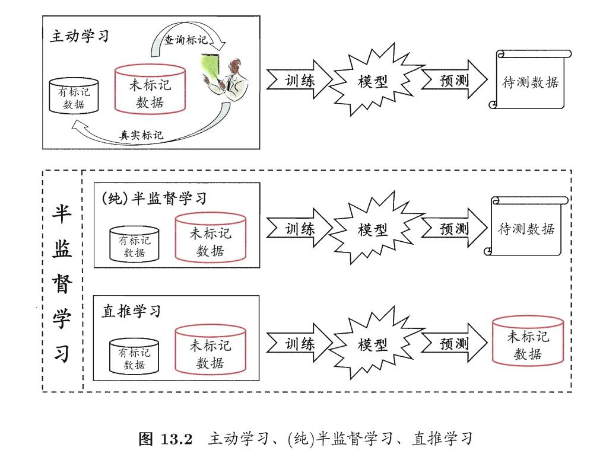

> 半监督学习：让学习器不依赖外界交互、自动利用未标记样本来提升学习性能

### 1. 如何将未标记样本所揭示的数据分布信息与类别标记相联系
#### 1.1 聚类假设 (Cluster Assumption)

* **核心思想**：**“物以类聚”**。假设数据存在簇结构，同一个簇（Cluster）里的样本极大概率属于同一个类别。
* **局限性**：它假设类别的形状是比较规整的“团块”。如果数据的分布非常复杂（比如交织在一起），聚类假设可能就会失效。

#### 1.2 流形假设 (Manifold Assumption)

* **核心思想**：**“近朱者赤”**。假设高维数据实际上分布在一个低维的流形结构上，且在这个流形上距离相近的样本拥有相似的输出值。
* **物理表现**：标签是沿着流形的表面“平滑变化”的。
* **直观理解**：
    * 在三维空间里，两个点可能靠得很近，但如果沿着卷轴表面走，它们其实离得很远。
    * 流形假设认为，我们不应该看三维的直线距离，而应该沿着“卷轴表面”这个低维结构来看邻近程度。

> **为什么它更广？** 聚类假设要求数据成“团”，而流形假设只要求数据在局部是连续和相似的，它能处理 **更扭曲、更复杂** 的数据分布。

### 💡 多模态视角下的意义

1. **流形假设**：不同模态（如视频和文本）映射到高维空间后，它们可能都在一个复杂的流形上。你可以通过寻找模态间的“邻居”关系，让标签在流形上流动。
2. **聚类假设**：你可以利用大量没标签的视频，通过对比学习（Contrastive Learning）把相似的视频聚在一起，从而让模型即使在只有极少量标注的情况下，也能通过“数据云”的分布找准分类边界。

### 2.几种学习方式的区别

---

## 相关笔记

- [[4.1-前置知识]] — 聚类假设根植于聚类理论
- [[4.2.1-原型聚类]] — GMM的软聚类为聚类假设提供概率基础
- [[5.3.2-流形学习]] — 流形假设直接关联流形学习概念
- [[6.2-模型驱动-生成式方法]] — 生成式方法使用聚类假设(通过GMM)
- [[6.3-分界面驱动-半监督SVM]] — S3VM使用聚类假设(决策边界穿过低密度区)
- [[6.4.1-图半监督学习]] — 图方法使用流形假设
- [[5.4-几种降维方法的对比]] — 转导式 vs 归纳式的区分
