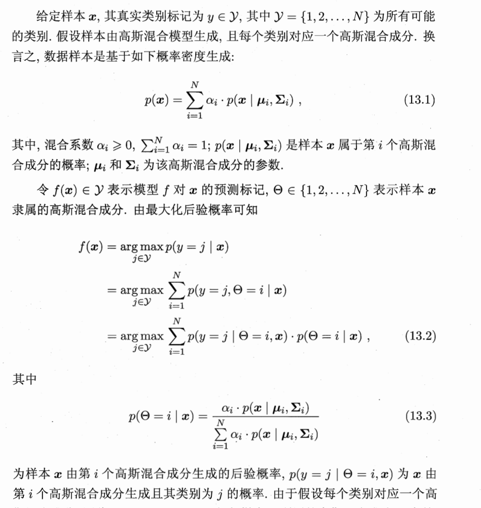
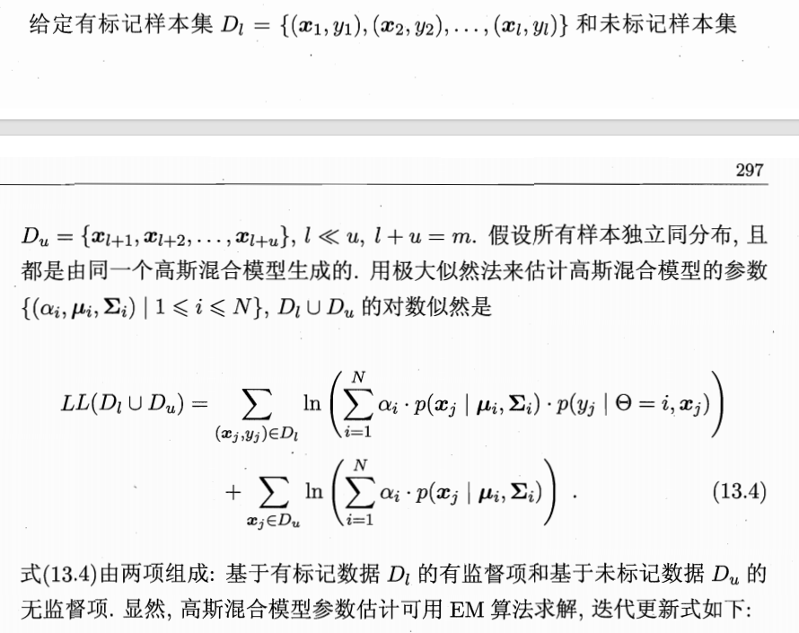
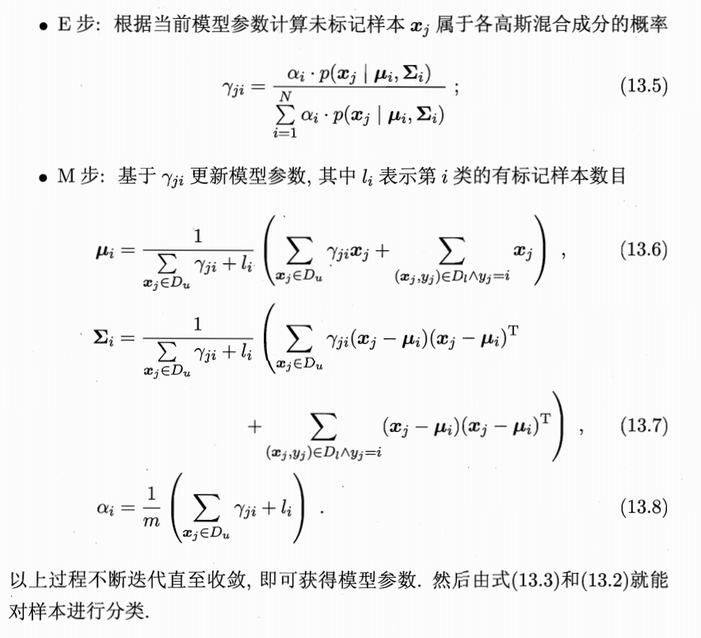

> 生成式方法: 假设所有数据(无论是否有标记)都是由同一个潜在的模型"生成"的,未标记数据的标记可以视为模型缺失的参数,一般可基于EM算法进行极大似然估计求解(假设的生成模型必须与真实的数据分布相互吻合)

### 1. 模型假设与基础

推导的起点是假设数据是由一个高斯混合模型生成的。

* **高斯混合模型 (式 13.1)：**

$$p(x) = \sum_{i=1}^N \alpha_i \cdot p(x \mid \mu_i, \Sigma_i)$$

这里 $p(x)$ 是样本的概率密度，由 $N$ 个高斯成分（Components）加权组合而成。$\alpha_i$ 是混合系数（权重），$p(x \mid \mu_i, \Sigma_i)$ 是第 $i$ 个高斯分布的密度函数。
* **核心假设：** 每一个类别 $y$ 对应模型中的一个高斯成分 $\Theta$。也就是说，如果你知道了样本属于哪个高斯成分，你就基本知道了它的类别。

### 2. 贝叶斯最优分类决策

当我们需要预测一个新样本 $x$ 的类别时，目标是找到使**后验概率** $p(y=j \mid x)$ 最大的类别 $j$。

* **推导式 13.2：**
为了计算 $p(y=j \mid x)$，引入了一个隐含变量 $\Theta$（表示样本属于哪个高斯成分）：
1. **全概率公式：** 将类别概率展开为对所有高斯成分的求和：$\sum_{i=1}^N p(y=j, \Theta=i \mid x)$。
2. **乘法公式：** 将联合概率展开为 $p(y=j \mid \Theta=i, x) \cdot p(\Theta=i \mid x)$。

这个公式将预测分成了两部分：
* **第一部分 $p(y=j \mid \Theta=i, x)$：** 给定样本所属成分，它是某个类别的概率。
* **第二部分 $p(\Theta=i \mid x)$：** 样本属于第 $i$ 个高斯成分的后验概率。

* **成分后验概率 (式 13.3)：**

$$p(\Theta=i \mid x) = \frac{\alpha_i \cdot p(x \mid \mu_i, \Sigma_i)}{\sum_{l=1}^N \alpha_l \cdot p(x \mid \mu_l, \Sigma_l)}$$

这实际上是 GMM 中的“响应度”（Responsibility），表示样本 $x$ 有多大概率是由第 $i$ 个高斯分布生成的。

### 3. 成分与类别的映射关系

* **简化：** 在这种情况下，如果 $\Theta=i$ 且 $i=j$，那么 $p(y=j \mid \Theta=i)$ 就是 $1$；如果 $i \neq j$，则概率为 $0$。
* **意义：** 这样我们就把复杂的分类问题转化为了：**“计算样本 $x$ 最属于哪一个高斯成分”** 的问题。

### 4. 为什么无标记数据有用？

1. **有标记数据的局限：** 为了确定 $p(y=j \mid \Theta=i, x)$（即哪个成分对应哪个类），我们需要有标记的数据（知道 $y$ 的值）。
2. **无标记数据的威力：** 计算 $p(\Theta=i \mid x)$ **不需要知道标签 $y$**。它只取决于 $x$ 的分布。
    * 当我们有海量的无标记数据时，我们可以非常精确地拟合高斯混合模型的参数（$\alpha, \mu, \Sigma$）。
    * 随着 $x$ 的数据量增加，我们对数据聚类结构（即高斯成分）的刻画就越准确。

3. **结论：** 因为式 13.2 的整体准确性依赖于 $p(\Theta=i \mid x)$ 的准确性，而无标记数据能大幅提升后者的精度，所以**引入无标记数据能辅助提高分类模型的性能**。

### 总结

其上展示了**生成式半监督学习**的标准流程：

* **Step 1:** 用所有数据（有标+无标）通过 EM 算法等手段训练一个强大的 GMM，搞清楚数据的分布形状。
* **Step 2:** 用有标记的数据来“点名”，确认每个高斯簇（Cluster）到底对应哪个业务类别。
* **Step 3:** 对新样本进行预测时，看它落入了哪个已经“起好名字”的高斯簇里。

这种方法在标注成本高昂、但原始数据易于获取的场景（如医学影像诊断、文本分类）中非常有效。

### 一、 为什么公式是这种“两段式”结构？

 (13.6) 和 (13.7) 的分子都是 **“左边一个 $\sum$ + 右边一个 $\sum$”**。这种结构反映了数据的两种贡献方式：

1. **右边的 $\sum$（硬贡献）：来自有标记数据 $D_l$**
    * 这些数据的身份是确定的。如果标签说它是第 $i$ 类，那它对第 $i$ 类的中心（$\mu_i$）贡献就是 **$1 \times x_j$**。

2. **左边的 $\sum$（软贡献）：来自无标记数据 $D_u$**
    * 这些数据身份不明，所以我们按概率给它们分配分量。
    * 如果一个样本 $x_j$ 只有 0.3 的概率属于第 $i$ 类，那它对第 $i$ 类中心的影响力就是 **$0.3 \times x_j$**。

3. **分母：总的“有效样本数”**
    * 分母 $\sum \gamma_{ji} + l_i$ 是为了归一化。它代表了第 $i$ 类一共“招募”了多少影响力。

### 二、 逐个公式拆解

#### 1. 均值更新 (13.6)：找中心

$$\mu_i = \frac{\text{无标数据的期望位置} + \text{有标数据的实际位置}}{\text{总有效样本数}}$$

它的逻辑是：我想知道第 $i$ 类的中心在哪，就把所有“像”这一类的数据点按“像的程度”加起来求平均。

#### 2. 协方差更新 (13.7)：看分布

$$\Sigma_i = \frac{\sum \text{无标偏离度} + \sum \text{有标偏离度}}{\text{总有效样本数}}$$

这里的 $(x_j - \mu_i)(x_j - \mu_i)^T$ 是在计算每个点偏离中心多远。同样地，无标记数据要乘上它的“身份概率” $\gamma_{ji}$。

#### 3. 混合系数更新 (13.8)：算占比

$$\alpha_i = \frac{\text{无标中分给第 } i \text{ 类的总概率} + \text{有标中第 } i \text{ 类的总个数}}{\text{全校总人数 } m}$$

这代表了模型预测的第 $i$ 类在全校（全数据集）里的“人口普查”占比。

### 总结

这种结构其实非常公平：

* 如果你有大量的**有标记数据**，$l_i$ 很大，公式就会倾向于听从标签的指挥。
* 如果你只有极少标签，但有海量**无标记数据**，$\sum \gamma_{ji}$ 就会占据主导，模型会更多地去挖掘数据本身的分布规律。
