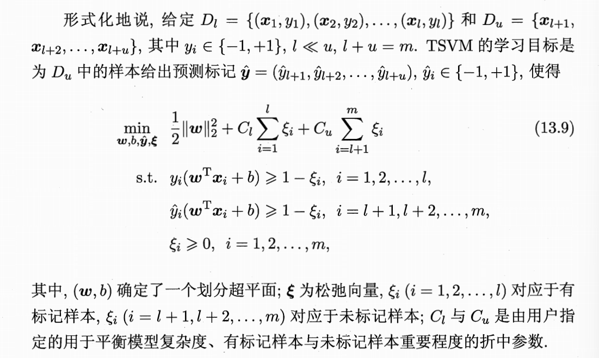
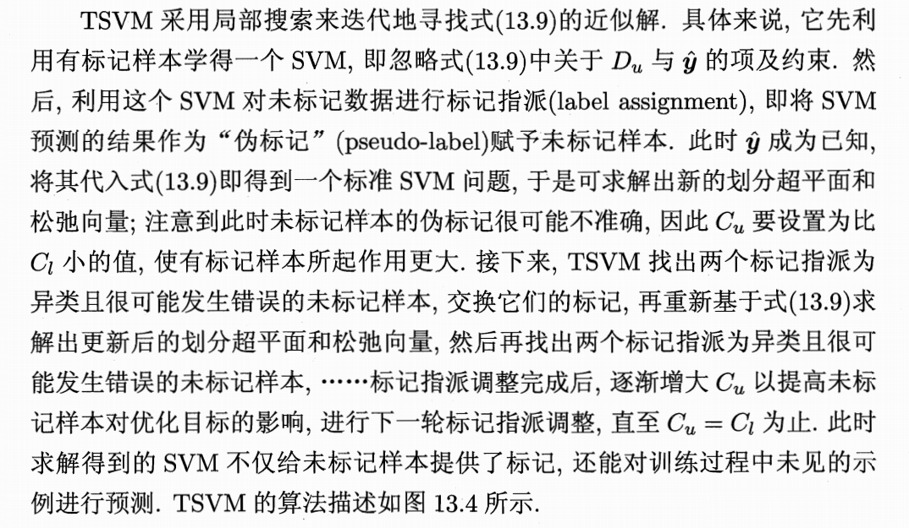
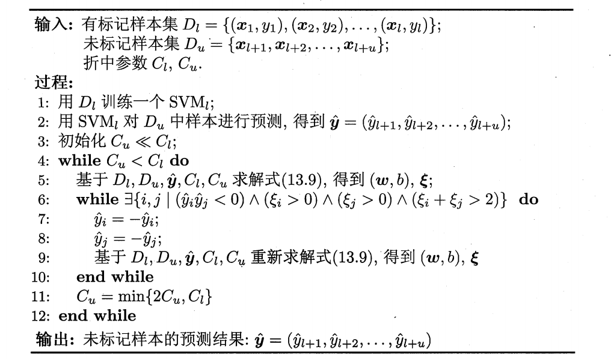

> 不考虑未标记样本时，SVM试图找到最大间隔划分的超平面；
> 
> 考虑后，S3VM试图找到能将两类标记样本有效分开，**且穿过数据低密度区域** 的划分超平面

## TSVM半监督支持向量机

### 1.基本概念

- 其对未标记样本“进行各种可能的标记指派” ，即把未标记样本分别假设成正类或反类，看看哪种假设能让分类器画出的分界线最宽、最稳。同时根据聚类假设，未标记样本天然形成簇，因此其两簇之间的分界线一般是最宽的

- 虽然理论上要穷举所有组合，但实际上 TSVM 会用一种类似“局部搜索”的策略来不断交换标签，直到找到那个让分类间隔最大的最优方案。

### 2. 优化目标

### 3. 局部搜索求解目标(替代穷举)

#### 3.1 为什么 $C_u < C_l$ 会让标记样本作用更大？

先介绍松弛向量：
* 如果一个样本点呆在隔离带自己那一侧，它的 $\xi = 0$。
* 如果它越界了，掉进了隔离带，甚至跑到了对面，它的 $\xi > 0$。**$\xi$ 越大，说明这个点“违规”越严重。**

当 $C_u$ 设置得很小时，会发生以下情况：

* **对标记样本“零容忍”**：
因为 $C_l$ 很大，哪怕标记样本只越界了一点点（$\xi_i$ 很小），乘上巨大的 $C_l$ 后，总损失也会爆炸。所以模型会**不惜一切代价移动分界线**，确保这些“高贵”的有标记样本 $\xi_i$ 趋近于 0。
* **对未标记样本“极度宽容”**：
因为 $C_u$ 很小，即使未标记样本的伪标签指派错了，或者它跨过了分界线（$\xi_i$ 很大），乘上微小的 $C_u$ 后，对总损失的影响也微乎其微。

#### 3.2 类别不平衡问题(某类样本远多于另一类)
我们引入公式：
$$u_+ \cdot C_u^+ = u_- \cdot C_u^-$$
这里：
- $C_u^+$表示正类未标记样本的惩罚权重
- $C_u^-$表示反类未标记样本的惩罚权重

这样的约束可以使分界线的“拉力”在总量上是平衡的，防止分界线因为某类样本多而被带跑，从而减轻了类别不平衡对 SVM 训练造成的困扰。

#### 3.3 伪代码示例

- 最后训练得到可以用来划分超平面的参数w,b，即分类函数 $f(x) = \text{sign}(w^Tx + b)$
- 为了寻找被指派为异类且很可能发生错误的未标记样本，一般会使用 $$\xi_i + \xi_j > 2$$进行检查。这表示两个样本的违规程度加起来很大并判定它们是”高度可疑对象”，最后通过交换标记（Label Swap）来尝试优化

---

## 相关笔记

- [[1-支持向量机]] — 直接扩展SVM的软间隔框架：相同的松弛变量、惩罚系数C和hinge损失
- [[6.1-基本概念]] — 实现聚类假设(决策边界穿过低密度区)
- [[3.4.3-多样性增强]] — SVM是稳定学习器；半监督变体可视为利用无标记数据增强多样性