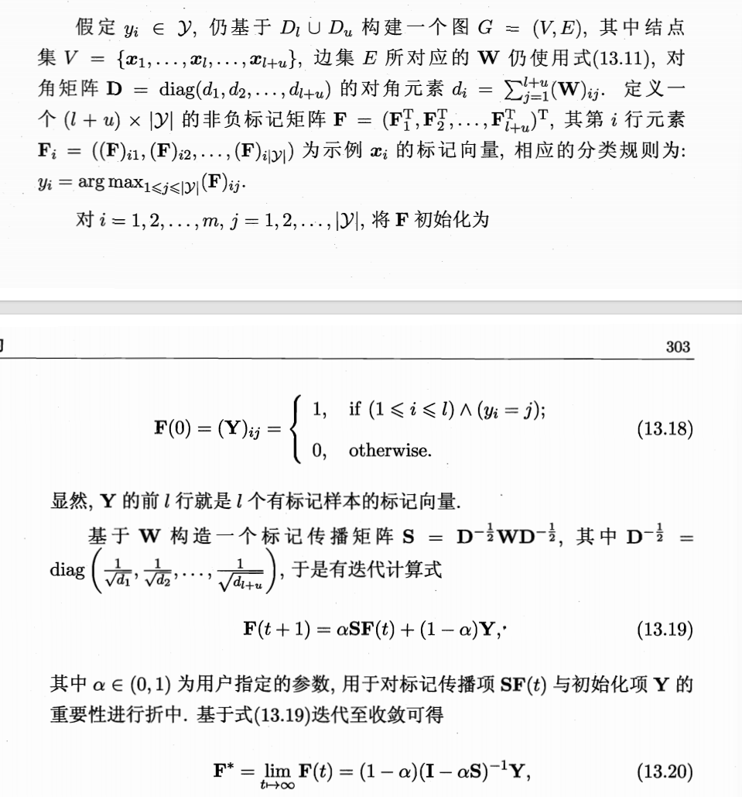
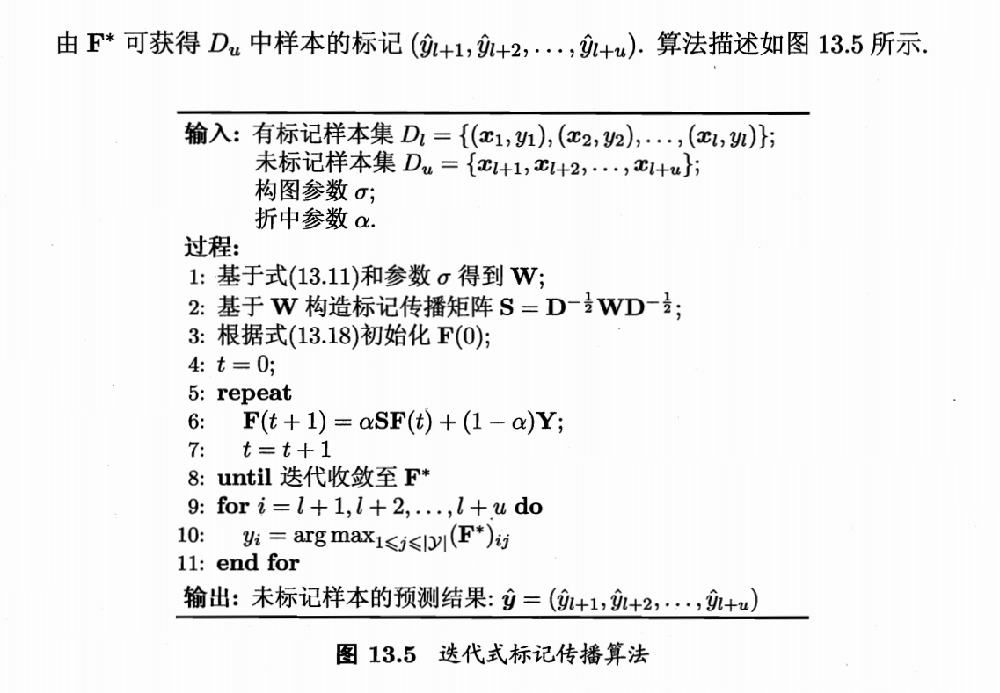

**相关笔记**: [[06.1-基本概念]] | [[04.2.2-密度聚类]] | [[05.3.2-流形学习]] | [[00.补充-最短路径算法]]

---

## 🏷️ 文档元数据
* **重要性**: ⭐⭐⭐⭐⭐ (最高优先级)
* **状态**: 基础必修

---

## 一、基本概念

> 将一个给定数据集映射为图，每个样本对应图中的结点，边的强度正比于样本之间的相似度。有标记样本视为"染过色"的结点，标签信息就像墨水滴在纸上，沿着图结构向周围扩散。

```python
# 🌟 图半监督学习的直观比喻：
# 你有一个社交网络（图），每个人是一个节点，相似的人之间有一条边
# 已知少数人的政治倾向（有标签），其余人的倾向未知（无标签）
# 图半监督学习的任务：根据"朋友的朋友倾向于有相似观点"的假设
# 推断出所有人的政治倾向
# — 这就是标签在图上的"扩散"（Label Propagation）

import numpy as np
from sklearn.semi_supervised import LabelPropagation, LabelSpreading
from sklearn.datasets import make_classification
from sklearn.metrics import accuracy_score

np.random.seed(42)

# ---- 生成数据并设置半监督场景 ----
X, y = make_classification(n_samples=300, n_features=2, n_redundant=0,
                           n_clusters_per_class=1, random_state=42)

n_labeled = 20
rng = np.random.RandomState(42)
mask_unlabeled = rng.rand(len(y)) > (n_labeled / len(y))
y_semi = y.copy()
y_semi[mask_unlabeled] = -1

# ---- 使用 sklearn 内置的 LabelPropagation ----
lp = LabelPropagation(kernel='knn', n_neighbors=7, max_iter=1000, tol=1e-3)
lp.fit(X, y_semi)
y_pred_lp = lp.transduction_
acc_lp = accuracy_score(y[mask_unlabeled], y_pred_lp[mask_unlabeled])

# ---- 使用 sklearn 内置的 LabelSpreading（改进版） ----
ls = LabelSpreading(kernel='knn', n_neighbors=7, alpha=0.2, max_iter=1000, tol=1e-3)
ls.fit(X, y_semi)
y_pred_ls = ls.transduction_
acc_ls = accuracy_score(y[mask_unlabeled], y_pred_ls[mask_unlabeled])

print(f"LabelPropagation (硬标签传播): {acc_lp:.4f}")
print(f"LabelSpreading   (软标签传播): {acc_ls:.4f}")
print(f"💡 只用了 {n_labeled}/300 ({n_labeled/300*100:.1f}%) 个标签")
```

---

## 二、从零实现图半监督学习的核心矩阵运算

```python
# ============================================
# 手写实现：标签传播的核心就是矩阵运算
# 理解这个才能看懂西瓜书里那一堆L、D、W、P矩阵
# ============================================

from scipy.sparse import csr_matrix
from scipy.sparse.linalg import spsolve
from sklearn.metrics.pairwise import rbf_kernel

class GraphLabelPropagation:
    """
    从零实现图半监督学习的核心矩阵推导

    整体流程（类比社交网络标签传播）：
    1. 构建相似度图 W — 谁和谁是"朋友"
    2. 计算度矩阵 D — 每个人的"朋友总数"
    3. 构建拉普拉斯矩阵 L = D - W — 图的"平滑度度量器"
    4. 解矩阵方程得出未标记节点的标签
    """

    def __init__(self, sigma=1.0, knn=None):
        self.sigma = sigma    # RBF核的带宽参数
        self.knn = knn        # 是否只连k近邻（流形假设）

    def _build_graph(self, X):
        """
        构建图的邻接矩阵 W（相似度矩阵）

        W[i][j] = 节点i和j之间的"亲密度"
        亲密度越高 → 它们的标签越应该一致
        """
        n = X.shape[0]

        # ---- 用RBF核（高斯核）计算成对相似度 ----
        # 🌟 W_ij = exp(-||x_i - x_j||^2 / 2σ²)
        # 距离越近 → 相似度越接近1；距离越远 → 相似度趋近0
        W = rbf_kernel(X, gamma=1.0 / (2 * self.sigma**2))

        # ⚠️ 对角线应该是0（节点不和自己是"朋友"）
        np.fill_diagonal(W, 0)

        # ---- 可选：只保留k近邻（流形假设的实现）----
        if self.knn is not None:
            # 每个节点只保留最近的k个邻居，其余边权重置0
            for i in range(n):
                # 找出第k大的相似度作为阈值
                threshold = np.sort(W[i])[-(self.knn + 1)]
                W[i, W[i] < threshold] = 0
            # 对称化：A -> (A + A^T) / 2
            W = (W + W.T) / 2  # 🌟 保持对称性（无向图的要求）

        return W

    def fit(self, X, y_semi):
        """
        X: 全部样本 (n, d)
        y_semi: 半监督标签，-1=未标记，0/1=类别

        核心推导链：
        E(f) = f^T L f           (能量函数：衡量标签平滑度)
        → 分块 L = [[Lll, Llu], [Lul, Luu]]
        → 求导得 Lul*fl + Luu*fu = 0
        → fu = (I - Puu)^(-1) Pul*fl
        """
        n = X.shape[0]
        y_semi = y_semi.astype(float)

        # ---- 1. 构建图 ----
        W = self._build_graph(X)

        # ---- 2. 计算度矩阵 D ----
        # D 是对角矩阵，D_ii = Σ_j W_ij
        # 物理含义：节点i与图中其他节点的"总亲密度"
        # 通俗理解：节点i在社交网络中的"好友总数权重"
        D = np.diag(W.sum(axis=1))

        # ---- 3. 构建图拉普拉斯矩阵 L = D - W ----
        L = D - W
        # 🌟 L 是图的"平滑度度量器"
        # 对于任意标签向量f：f^T L f 衡量了标签在相邻节点间的"不一致程度"

        # ---- 4. 分块求解 ----
        unlabeled_mask = y_semi == -1
        labeled_mask = ~unlabeled_mask

        # 拆出 L_uu, L_ul 等子矩阵
        L_uu = L[np.ix_(unlabeled_mask, unlabeled_mask)]
        L_ul = L[np.ix_(unlabeled_mask, labeled_mask)]

        # 已知的标签向量 f_l
        f_l = np.zeros((np.sum(labeled_mask), 1))
        f_l[y_semi[labeled_mask] == 1, 0] = 1  # 正类 = 1
        f_l[y_semi[labeled_mask] == 0, 0] = -1 # 负类 = -1（二分类时用）

        # ---- 5. 求解 f_u：L_uu * f_u = -L_ul * f_l ----
        # 🌟 这是整个推导的核心结果！
        # f_u = (I - P_uu)^(-1) * P_ul * f_l
        # 其中 P = D^(-1) W 是随机游走转移矩阵
        f_u = np.linalg.solve(L_uu, -L_ul @ f_l)

        # ---- 6. 重建完整预测 ----
        self.f_ = np.zeros(n)
        self.f_[labeled_mask] = f_l.ravel()
        self.f_[unlabeled_mask] = f_u.ravel()

    def predict(self):
        """返回对所有样本的预测（>0为正类，<0为负类）"""
        return (self.f_ > 0).astype(int)
```

```python
# ============================================
# 📌 验证手写图半监督学习
# ============================================

glp = GraphLabelPropagation(sigma=1.0, knn=7)
glp.fit(X, y_semi)
y_pred_hand = glp.predict()
acc_hand = accuracy_score(y, y_pred_hand)
print(f"\n手写图标签传播准确率: {acc_hand:.4f}")
print(f"sklearn LabelPropagation: {acc_lp:.4f}")
print("💡 手写实现验证了矩阵推导链 L → D-W → 分块求解的正确性")
```

---

## 三、能量函数与拉普拉斯矩阵的深入理解

```python
# ============================================
# 📌 能量函数 E(f) = f^T L f 的物理含义
# ============================================
# E(f) 衡量了标签在图上的"不和谐程度"
# 如果两个高相似度（W_ij 大）的节点标签差异大 → E(f) 飙升
# 优化目标就是最小化 E(f)，迫使"好朋友们"观点一致

# 🌟 用代码验证：相邻节点标签不一致 vs 一致的能量值
def demo_energy_function():
    """
    用一个简单的3节点图来直观理解能量函数
    节点1-2亲密度10（铁哥们），节点2-3亲密度1（点头之交）
    """
    # 构建小图
    W = np.array([[0, 10, 0],
                  [10, 0, 1],
                  [0,  1, 0]])  # 对称矩阵

    D = np.diag(W.sum(axis=1))
    L = D - W

    # 场景A：节点1和2标签一致 → 应该低能量
    f_consistent = np.array([1, 1, -1])      # 1和2都是正类
    E_consistent = f_consistent @ L @ f_consistent
    print(f"标签一致 [1, 1, -1] → 能量 = {E_consistent:.1f} (低)")

    # 场景B：节点1和2标签相反 → 应该高能量
    f_conflict = np.array([1, -1, 1])        # 1和2相反！
    E_conflict = f_conflict @ L @ f_conflict
    print(f"标签冲突 [1, -1, 1] → 能量 = {E_conflict:.1f} (高!)")
    # 💡 铁哥们(亲密度10)意见不合 → 能量暴增，模型会全力避免这种情况

demo_energy_function()
```

---

## 四、核心推导链（矩阵形式）

如何从能量函数推导到闭式解？

```python
# 📌 从能量函数到闭式解，完整推导链的代码注释版：
# 
# 1. 能量函数（衡量标签不平滑度）：
#    E(f) = 1/2 Σ_i Σ_j W_ij (f(x_i) - f(x_j))^2
#         = f^T (D - W) f
#         = f^T L f                          ← 拉普拉斯矩阵登场
# 
# 2. 分块（把已知和未知分开）：
#    f = [f_l, f_u]^T
#    L = [[L_ll, L_lu], [L_ul, L_uu]]
# 
# 3. 展开 E(f) 并对 f_u 求导 = 0：
#    2 L_ul f_l + 2 L_uu f_u = 0
#    → L_uu f_u = -L_ul f_l
# 
# 4. 代入 L = D - W：
#    (D_uu - W_uu) f_u = W_ul f_l
#    → (I - P_uu) f_u = P_ul f_l     (其中 P = D^(-1)W)
#    → f_u = (I - P_uu)^(-1) P_ul f_l
# 
# 🌟 这就是闭式解！未标记节点的标签 = 已知标签经过图传播后的结果

# ============================================
# 📌 理解 (I - P_uu)^(-1) 的几何级数展开
# (I - P_uu)^(-1) = I + P_uu + P_uu^2 + P_uu^3 + ...
# ============================================
# 每一项的含义（"标签在图上的多跳传播"）：
# I       → 第0步：自己不变
# P_uu    → 第1步：从直接邻居那里获得标签信息
# P_uu^2  → 第2步：从"邻居的邻居"那里获得
# P_uu^n  → 第n步：从n跳之外的节点获得
# 
# 🌟 通俗理解：标签信息的传播就像"传话游戏"
# 第1轮：直接好朋友告诉你他们倾向什么
# 第2轮：好朋友的好朋友间接影响你
# 第N轮：全图的认识链都对你产生微弱影响
# 最终稳态就是所有传播轮次的加权和 = (I-P)^(-1)
```

---

## 五、D^(-1)W 的行归一化意义

为什么要用 D^(-1)W 而不是直接用 W？

```python
# 📌 为什么要用 D^(-1)W 而不是直接用 W？
#
# 问题：不同节点的"社交能力"差异巨大
# 某人朋友圈500人 → 他的度 d_i = 500
# 某人朋友圈2人   → 他的度 d_i = 2
# 
# 如果不归一化，500人圈子的"舆论影响力"会是2人圈子的250倍
# 标签会完全被"社交达人"支配，孤立节点的声音被淹没
#
# D^(-1)W 的操作就是"行归一化"：
# 每个人从邻居那里收到的总影响权重 = 1
# 不管你朋友多还是朋友少，你收到的总"影响量"是一样的

# 🌟 代码演示：
W_demo = np.array([[0, 10, 2],
                    [10, 0, 1],
                    [2,  1, 0]])
D_demo = np.diag(W_demo.sum(axis=1))  # D = diag([12, 11, 3])
D_inv = np.linalg.inv(D_demo)         # D_inv = diag([1/12, 1/11, 1/3])

P = D_inv @ W_demo  # 行归一化后的转移矩阵
print("行归一化后的转移矩阵 P = D^(-1)W:")
print(P)
# 每行的和 ≈ 1 → 每个节点的"总接收影响力"被归一化了
print(f"行和: {P.sum(axis=1)}")
print("💡 每行和为1，保证标签传播时每个人接收的总影响是相等的")
```

---

## 六、多分类标记传播（LLGC算法）




```python
# ============================================
# 🌟 LLGC (Learning with Local and Global Consistency)
# 相比前面的硬标签传播，LLGC 引入了：
# 1. 正则化参数 α — 折中"信初始标签"和"信邻居标签"
# 2. 对称归一化 S = D^(-1/2) W D^(-1/2) — 数学性质更优雅
# 3. 软标签矩阵 F — 不再是0/1，而是每个类别的置信度
# ============================================

class LLGC:
    """
    多分类的图半监督学习（LLGC算法）
    F^(t+1) = α S F^(t) + (1-α) Y

    比喻：
    Y = 你最初的考试成绩（初始标签，可能只是部分科目）
    S = 你和同学们的社交关系网
    α = 你有多"主见"（0=完全听别人的，1=完全不听劝）

    每次迭代：你的成绩 = α × 邻居成绩平均值 + (1-α) × 你原来的成绩
    """

    def __init__(self, alpha=0.2, sigma=1.0, max_iter=1000, tol=1e-6):
        self.alpha = alpha      # 🌟 α∈(0,1)：信邻居 vs 信自己
        self.sigma = sigma      # RBF核带宽
        self.max_iter = max_iter
        self.tol = tol

    def fit(self, X, y_semi):
        n, d = X.shape
        y_semi = y_semi.astype(int)

        # ---- 1. 构建对称归一化的传播矩阵 S = D^(-1/2) W D^(-1/2) ----
        # 对称归一化比行归一化更好：保持对称性 → 特征值都是实数
        W = rbf_kernel(X, gamma=1.0 / (2 * self.sigma**2))
        np.fill_diagonal(W, 0)

        D_sqrt_inv = np.diag(1.0 / np.sqrt(W.sum(axis=1)))
        S = D_sqrt_inv @ W @ D_sqrt_inv  # 🌟 对称归一化

        # ---- 2. 构建初始标签矩阵 Y ----
        n_classes = len(set(y_semi[y_semi != -1]))
        self.classes_ = sorted(set(y_semi[y_semi != -1]))
        Y = np.zeros((n, n_classes))

        for i, label in enumerate(y_semi):
            if label != -1:
                # 找到这个标签在 classes_ 中的位置
                class_idx = self.classes_.index(label)
                Y[i, class_idx] = 1  # one-hot 编码

        # ---- 3. 迭代传播 F^(t+1) = α S F^(t) + (1-α) Y ----
        F = Y.copy()
        for it in range(self.max_iter):
            F_new = self.alpha * (S @ F) + (1 - self.alpha) * Y
            diff = np.abs(F_new - F).max()
            F = F_new
            if diff < self.tol:
                print(f"LLGC在第{it+1}轮收敛")
                break

        self.F_ = F  # 最终软标签矩阵

    def predict(self):
        """返回硬分类结果"""
        return np.array([self.classes_[np.argmax(row)] for row in self.F_])

    def predict_proba(self):
        """返回每个类别的概率（归一化后的软标签）"""
        exp_F = np.exp(self.F_)
        return exp_F / exp_F.sum(axis=1, keepdims=True)


# ---- 测试 LLGC ----
llgc = LLGC(alpha=0.2, sigma=1.0)
llgc.fit(X, y_semi)
y_pred_llgc = llgc.predict()
acc_llgc = accuracy_score(y, y_pred_llgc)
print(f"\nLLGC 准确率: {acc_llgc:.4f}")
```

```python
# ============================================
# 📌 闭式解与迭代公式的等价性验证
# F* = (1-α)(I - αS)^(-1) Y
# 和迭代 F^(t+1) = α S F^(t) + (1-α) Y 在 t→∞ 时等价
# ============================================

# 用代码验证：闭式解和迭代结果应该一致
n = X.shape[0]
# 构建S矩阵（和上面一样）
W = rbf_kernel(X, gamma=1.0 / (2 * 1.0**2))
np.fill_diagonal(W, 0)
D_sqrt_inv = np.diag(1.0 / np.sqrt(W.sum(axis=1)))
S = D_sqrt_inv @ W @ D_sqrt_inv

# 闭式解
alpha = 0.2
n_classes = len(set(y_semi[y_semi != -1]))
classes_ = sorted(set(y_semi[y_semi != -1]))
Y = np.zeros((n, n_classes))
for i, label in enumerate(y_semi):
    if label != -1:
        Y[i, classes_.index(label)] = 1

F_closed = (1 - alpha) * np.linalg.inv(np.eye(n) - alpha * S) @ Y

# 迭代法
F_iter = Y.copy()
for _ in range(1000):
    F_iter = alpha * (S @ F_iter) + (1 - alpha) * Y

diff = np.abs(F_closed - F_iter).max()
print(f"\n📌 闭式解 vs 迭代解的最大差异: {diff:.6e}")
print(f"💡 差异接近0，验证了两种形式的等价性")
```

---

## 七、总结与局限性

```python
# 🌟 图半监督学习的优缺点
# 
# 优点：
# 1. 容错性：即使初始标签有少量噪声，(1-α) 保证模型不会死记硬背
# 2. 全局一致性：通过 (I-αS)^(-1) 考虑了全图拓扑结构
# 3. 数学优美：整个推导就是一次矩阵求逆/一次迭代收敛
# 
# ⚠️ 局限性：
# 1. 矩阵规模限制：O(n²) 的存储和 O(n³) 的求逆，n>10万就很吃力
#    解决办法：用稀疏矩阵 + 迭代法（不用求逆）
# 2. 直推学习限制：只能预测"已知"样本（训练时见过的未标记数据）
#    解决办法：把图传播的输出作为训练集训练SVM等归纳学习器
# 3. 对图结构敏感：相似度度量（RBF的σ、knn的k）的选择影响很大
```

---

## 🏷️ 文档元数据
* **当前状态**：已完成 (Completed)
* **安全策略**：`.gitignore` 严格阻断 Key 泄露风险
