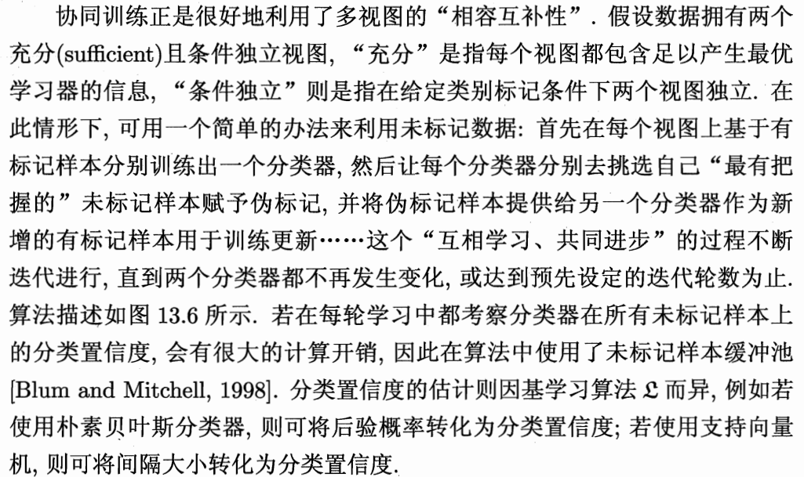
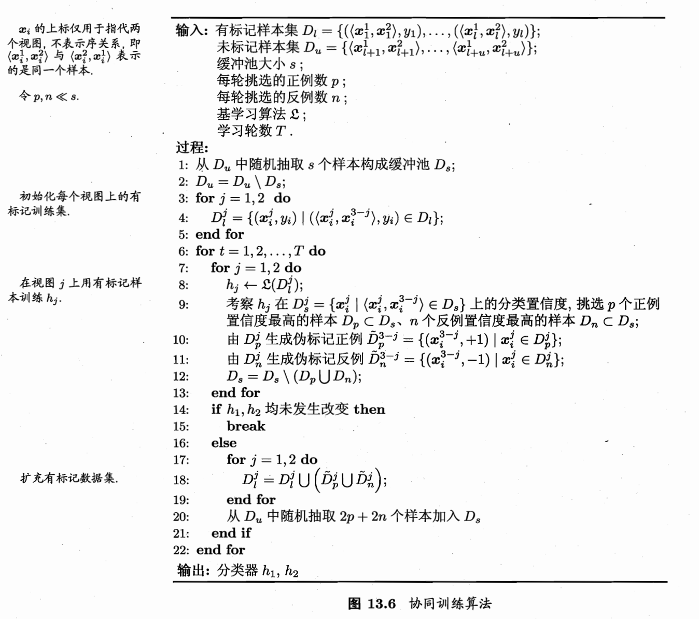

**相关笔记**: [[03.4.1-误差-分歧分解]] | [[03.4.2-多样性度量]] | [[03.4.3-多样性增强]] | [[06.1-基本概念]] | [[03.1-常见集成方法]]

---

## 🏷️ 文档元数据
* **重要性**: ⭐⭐⭐⭐⭐ (最高优先级)
* **状态**: 基础必修

---

## 一、基本概念 — 多视图与普通数据集之间的差异

多视图数据和普通多属性数据到底有什么本质区别？

### 1. 独立性 (Independence) 与 互补性

这是最核心的差异。

**普通属性（单视图）：** 一个数据集里的"身高"、"体重"、"年龄"虽然是不同属性，但它们在统计学上往往高度相关。如果你知道了身高和年龄，体重大致也能猜出来。它们只是在描述同一个维度的特征。

**多视图：** 视图之间应该是"充分且条件独立"的。
- 例如：**人脸图像**和**指纹图像**。它们是两套完全不同的物理产生机制。
- **差异点：** 如果某个属性受损（比如光线不好导致看不清脸），另一个视图（指纹）依然能提供完整且独立的信息。如果只是把"身高"分一堆，"体重"分一堆，这种"视图"太弱了，因为它们共享了太多的底层噪声。

### 2. 描述能力的完备性 (Sufficiency)

**普通属性：** 单个属性（比如"颜色"）通常不足以完成分类任务。你不能仅凭"红色"就判断这是一个苹果还是一个消火栓。

**多视图：** 每一个视图在理想状态下，都具备**独立完成任务**的能力。
- **例子：** 网页分类中，只看正文内容可以分类；只看入链的锚文本也可以分类。
- **差异点：** 真正的多视图学习要求每个视图都能"独当一面"，这样它们之间的分歧（Disagreement）才有意义。如果一个属性本身就是个弱特征，它提供的"分歧"可能只是随机噪声。

### 3. 总结：差异的本质

"普通数据集"之所以不叫多视图，是因为它们的属性往往是耦合（Coupled）在一起的。

| 特性 | 普通多属性 (Single-view) | 真正多视图 (Multi-view) |
| --- | --- | --- |
| **属性来源** | 通常是同一种传感器/同一来源 | 跨模态、跨领域、跨传感器 |
| **关联度** | 强相关（冗余度高） | 条件独立（互补性强） |
| **错误相关性** | 容易在同一类样本上集体犯错 | 很难在同一地点同时失灵 |
| **典型代表** | 表格数据（年龄、性别、收入） | 视频+音频、正文+链接、图像+雷达 |

---

## 二、协同训练 (Co-Training) — 从零实现

协同训练是如何利用多视图的"分歧"来提升泛化能力的？




```python
import numpy as np
from sklearn.tree import DecisionTreeClassifier
from sklearn.svm import SVC
from sklearn.datasets import make_classification
from sklearn.model_selection import train_test_split
from sklearn.metrics import accuracy_score

np.random.seed(42)

# ============================================
# 📌 协同训练的核心思想：
# 两个分类器用不同的"视角"（特征子集）看同一批数据
# 各自把最有把握的样本教给对方 → 互相教对方自己擅长的
# 就像两个人，一个从长相认人，一个从声音认人
# 你把你确定的人介绍给我，我也把我确定的人介绍给你
# 最终两个人都学会了从两个角度认人
# ============================================

class CoTraining:
    """
    协同训练的从零实现

    比喻：
    L1 = 靠"外貌"认人的专家（视图1的特征）
    L2 = 靠"声音"认人的专家（视图2的特征）

    每轮迭代：
    1. L1用外貌判断所有未标记人脸，挑最确定的人告诉L2
    2. L2用声音判断所有未标记人脸，挑最确定的人告诉L1
    3. 双方都获得了"新教材" → 下次判断更准
    4. 重复直到所有无标签样本都被"认领"
    """

    def __init__(self, base_learner=None, n_positive=3, n_negative=3, max_iter=50):
        """
        n_positive: 每轮每个视图挑出多少个"高置信正样本"
        n_negative: 每轮每个视图挑出多少个"高置信负样本"
        """
        self.base_learner = base_learner or DecisionTreeClassifier(random_state=42)
        self.n_positive = n_positive
        self.n_negative = n_negative
        self.max_iter = max_iter

    def fit(self, X1, X2, y_semi):
        """
        X1: 视图1的特征矩阵 (n, d1) — 比如图像特征
        X2: 视图2的特征矩阵 (n, d2) — 比如文本特征
        y_semi: 半监督标签，-1=未标记
        """
        n = X1.shape[0]
        y_semi = y_semi.copy().astype(int)

        # 初始化两个学习器
        L1 = DecisionTreeClassifier(random_state=42)
        L2 = DecisionTreeClassifier(random_state=42)

        # 记录每个无标签样本的"信任度"
        trust_score_L1 = np.zeros(n)
        trust_score_L2 = np.zeros(n)

        for iteration in range(self.max_iter):
            labeled_mask = y_semi != -1
            unlabeled_mask = y_semi == -1

            n_unlabeled = unlabeled_mask.sum()
            if n_unlabeled == 0:
                print(f"协同训练在第{iteration+1}轮：所有样本已被标注")
                break

            # ---- 在有标签数据上训练两个学习器 ----
            X1_labeled = X1[labeled_mask]
            X2_labeled = X2[labeled_mask]
            y_labeled = y_semi[labeled_mask]

            if len(set(y_labeled)) < 2:
                print(f"⚠️ 第{iteration+1}轮：有标签数据只有一类，停止")
                break

            L1.fit(X1_labeled, y_labeled)
            L2.fit(X2_labeled, y_labeled)

            # ---- 在无标签数据上预测 ----
            X1_unlabeled = X1[unlabeled_mask]
            X2_unlabeled = X2[unlabeled_mask]
            unlabeled_indices = np.where(unlabeled_mask)[0]

            # L1的预测（基于视图1）
            proba_L1 = L1.predict_proba(X1_unlabeled)  # shape: (n_unlabeled, n_classes)
            conf_L1 = np.max(proba_L1, axis=1)          # 最大概率 = 置信度
            pred_L1 = L1.predict(X1_unlabeled)

            # L2的预测（基于视图2）
            proba_L2 = L2.predict_proba(X2_unlabeled)
            conf_L2 = np.max(proba_L2, axis=1)
            pred_L2 = L2.predict(X2_unlabeled)

            # 🌟 核心操作：每个学习器挑出"最有把握"的样本，教给对方
            selected_this_round = 0

            # L1 → L2：L1把最确定的正类和负类样本教给L2
            for target_class in set(y_labeled):
                class_mask = pred_L1 == target_class
                if class_mask.sum() == 0:
                    continue
                conf_in_class = conf_L1[class_mask]
                n_select = min(self.n_positive if target_class == 1 else self.n_negative,
                               class_mask.sum())
                if n_select == 0:
                    continue
                # 挑出置信度最高的n_select个
                top_idx_in_class = np.argsort(conf_in_class)[-n_select:]
                top_original_idx = unlabeled_indices[class_mask][top_idx_in_class]
                y_semi[top_original_idx] = target_class
                trust_score_L1[top_original_idx] = conf_in_class[top_idx_in_class]
                selected_this_round += n_select

            # L2 → L1：L2把最确定的样本教给L1
            for target_class in set(y_labeled):
                class_mask = pred_L2 == target_class
                if class_mask.sum() == 0:
                    continue
                conf_in_class = conf_L2[class_mask]
                n_select = min(self.n_positive if target_class == 1 else self.n_negative,
                               class_mask.sum())
                if n_select == 0:
                    continue
                top_idx_in_class = np.argsort(conf_in_class)[-n_select:]
                top_original_idx = unlabeled_indices[class_mask][top_idx_in_class]
                y_semi[top_original_idx] = target_class
                trust_score_L2[top_original_idx] = conf_in_class[top_idx_in_class]
                selected_this_round += n_select

            # ---- 更新训练好的学习器 ----
            L1.fit(X1[y_semi != -1], y_semi[y_semi != -1])
            L2.fit(X2[y_semi != -1], y_semi[y_semi != -1])

        self.L1_ = L1
        self.L2_ = L2
        self.y_semi_ = y_semi

    def predict(self, X1, X2):
        """两个视图的预测取平均（集成）"""
        proba_L1 = self.L1_.predict_proba(X1)
        proba_L2 = self.L2_.predict_proba(X2)
        proba_ensemble = (proba_L1 + proba_L2) / 2
        return np.argmax(proba_ensemble, axis=1)
```

```python
# ============================================
# 📌 模拟多视图数据场景 — 测试协同训练
# ============================================

# 生成数据，人为拆分成两个"视图"
X, y = make_classification(n_samples=500, n_features=20, n_redundant=0,
                           n_informative=10, random_state=42)

# 🌟 将特征分成两个视图（模拟多视图数据）
# 视图1: 前10个特征（比如图像特征）
# 视图2: 后10个特征（比如文本特征）
# 在真实多视图场景中，这两个视图应该来自不同的传感器/模态
X1 = X[:, :10]   # 视图1 → "外貌专家"
X2 = X[:, 10:]   # 视图2 → "声音专家"

# 模拟半监督：只保留15个标签
n_labeled = 15
rng = np.random.RandomState(42)
mask_unlabeled = rng.rand(len(y)) > (n_labeled / len(y))
y_semi = y.copy()
y_semi[mask_unlabeled] = -1

# ---- 基线：单视图监督学习（只用视图1的15个有标签样本）----
X1_labeled = X1[~mask_unlabeled]
y_labeled = y[~mask_unlabeled]
baseline = DecisionTreeClassifier(random_state=42)
baseline.fit(X1_labeled, y_labeled)
acc_baseline = accuracy_score(y, baseline.predict(X1))

print(f"基线（单视图监督，仅{n_labeled}个标签）: {acc_baseline:.4f}")

# ---- 协同训练 ----
ct = CoTraining(n_positive=3, n_negative=3, max_iter=30)
ct.fit(X1, X2, y_semi)
y_pred_ct = ct.predict(X1, X2)
acc_ct = accuracy_score(y, y_pred_ct)
print(f"协同训练（双视图，{n_labeled}个初始标签）:   {acc_ct:.4f}")

# ⚠️ 注意：协同训练的效果依赖于两个视图的"条件独立性"
# 在真实多视图数据（视频+音频、正文+链接）上效果远好于人工拆分的视图
print(f"\n💡 协同训练通过两个视角互相教学，突破了单视角的瓶颈")
```

---

## 三、为什么"显著分歧"能提高泛化能力？

分歧为什么不是"吵架"而是"查漏补缺"？

```python
# ============================================
# 📌 三大原因的代码演示
# ============================================

# 原因1：错误互补 — 我不懂的时候你懂，避免集体翻车
# 比喻：L1看形状（近视），L2看颜色（色盲）
# 遇到"红色圆形但形状怪异的苹果"：
#   L1看形状→困惑（低的置信度）
#   L2看颜色→确定是苹果（高置信度）→ 教会L1
# 结果：通过互补，两人的知识都扩展了

# 原因2：版本空间收缩 — 排除片面假设
# 比喻：L1认为"所有红色的都是苹果"（片面）
#       L2认为"所有圆形的都是苹果"（片面）
# 在未标记数据中，红色的消防栓、圆形的橘子让双方产生分歧
# 通过互相教授，双方都意识到："只有既红又圆的才是苹果"
# → 放弃了片面的"伪规律"

# 原因3：自举效应 — 从分歧中提取增量信息
# 如果L1和L2完美契合→互相交换样本也学不到新东西
# 就像两个观点完全相同的人聊天→只会互相加强偏见
# 分歧带来的是"增量信息"→ 你不懂但我懂的，才是最有价值的知识

# 🌟 通俗总结：
# 显著分歧不是为了"吵架"，而是为了"查漏补缺"
# 1. 容错性：我不懂时你懂，避免了集体翻车
# 2. 鲁棒性：排除了单视角下的片面假设
# 3. 进化力：通过交换差异化信息，实现1+1>2的学习效果
```

```python
# ============================================
# 📌 实验：验证分歧程度对协同训练效果的影响
# ============================================

def co_training_with_diversity_test(X1, X2, y, y_semi_initial, diversity_levels):
    """
    对比不同基学习器组合（反映不同分歧程度）的协同训练效果
    """
    print("\n📌 基学习器组合对协同训练的影响:")
    print("-" * 60)

    for name, learner1, learner2 in diversity_levels:
        # 复制初始半监督标签
        y_semi = y_semi_initial.copy()

        n = X1.shape[0]
        for it in range(30):
            labeled_mask = y_semi != -1
            unlabeled_mask = y_semi == -1
            if unlabeled_mask.sum() == 0:
                break

            X1_l, y_l = X1[labeled_mask], y_semi[labeled_mask]
            X2_l = X2[labeled_mask]

            if len(set(y_l)) < 2:
                break

            learner1.fit(X1_l, y_l)
            learner2.fit(X2_l, y_l)

            # L1挑最确定样本 → 教给L2
            proba_1 = learner1.predict_proba(X1[unlabeled_mask])
            conf_1 = np.max(proba_1, axis=1)
            pred_1 = learner1.predict(X1[unlabeled_mask])
            unlabeled_idx = np.where(unlabeled_mask)[0]

            top_3_idx = np.argsort(conf_1)[-3:]
            y_semi[unlabeled_idx[top_3_idx]] = pred_1[top_3_idx]

            # 更新label mask
            labeled_mask = y_semi != -1
            unlabeled_mask = y_semi == -1
            X1_l, y_l = X1[labeled_mask], y_semi[labeled_mask]
            X2_l = X2[labeled_mask]

            # L2挑最确定样本 → 教给L1
            proba_2 = learner2.predict_proba(X2[unlabeled_mask])
            conf_2 = np.max(proba_2, axis=1)
            pred_2 = learner2.predict(X2[unlabeled_mask])
            unlabeled_idx = np.where(unlabeled_mask)[0]

            if len(conf_2) >= 3:
                top_3_idx = np.argsort(conf_2)[-3:]
                y_semi[unlabeled_idx[top_3_idx]] = pred_2[top_3_idx]

        # 集成预测
        final_prob = (learner1.predict_proba(X1) + learner2.predict_proba(X2)) / 2
        acc = accuracy_score(y, np.argmax(final_prob, axis=1))
        print(f"  {name:<35} → 准确率 {acc:.4f}")

# 测试不同组合
diversity_levels = [
    ("两个同质DT (分歧小)",
     DecisionTreeClassifier(random_state=42),
     DecisionTreeClassifier(random_state=42)),
    ("两个异质DT (分歧中)",
     DecisionTreeClassifier(max_depth=3, random_state=42),
     DecisionTreeClassifier(max_depth=10, random_state=42)),
    ("DT + SVM (分歧大)",
     DecisionTreeClassifier(random_state=42),
     SVC(kernel='rbf', probability=True, random_state=42)),
]

co_training_with_diversity_test(X1, X2, y, y_semi, diversity_levels)
# 💡 观察：分歧越大的组合，协同训练效果通常越好
# 因为互补的信息量更大 — 你会的恰好是我不会的
```

---

## 🏷️ 文档元数据
* **当前状态**：已完成 (Completed)
* **安全策略**：`.gitignore` 严格阻断 Key 泄露风险
