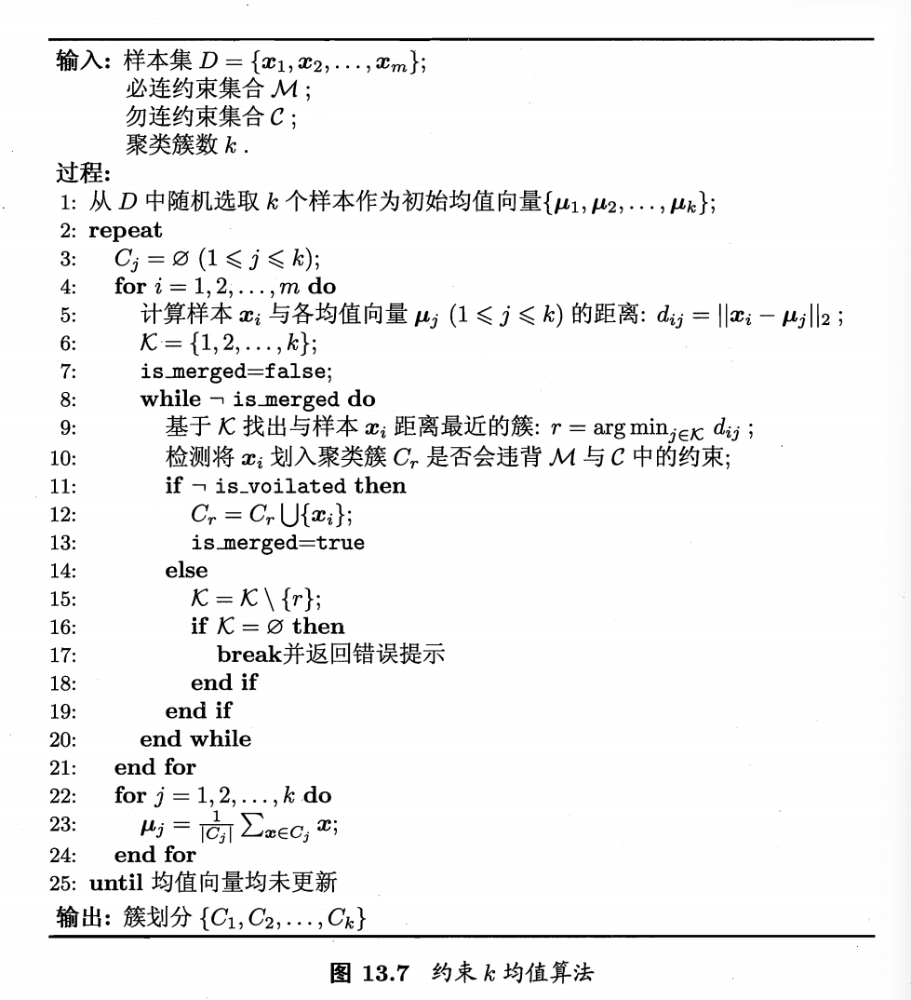
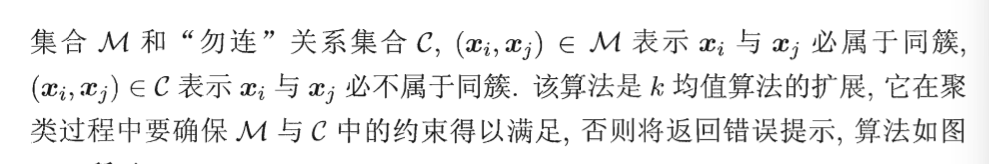
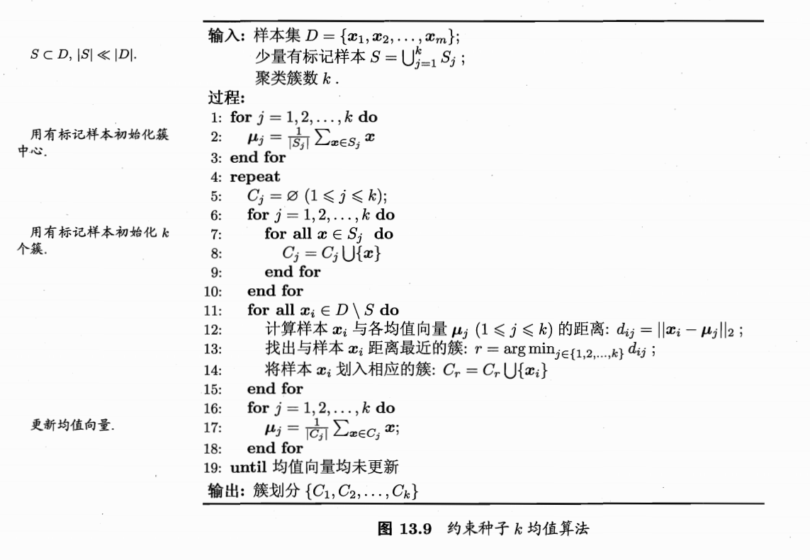

## 1.可以用的两种监督信息
- 第一种类型是 “必连”(must‑link) 与 “勿连”(cannot‑link) 约束，前者是指样本必属于同一个簇，后者是指样本必不属于同一个簇；

- 第二种类型的监督信息是少量的有标记样本.

## 2. 约束K均值算法(利用第一类监督信息)

## 3. 约束种子K均值算法(利用第二类监督信息)

---

## 相关笔记

- [[4.2.1-原型聚类]] — 直接扩展K-means，加入监督信号
- [[4.1-前置知识]] — 聚类评估和距离度量
- [[6.1-基本概念]] — 半监督学习框架；桥接聚类与分类