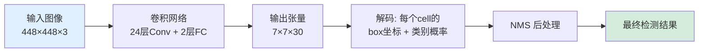
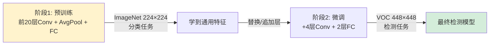
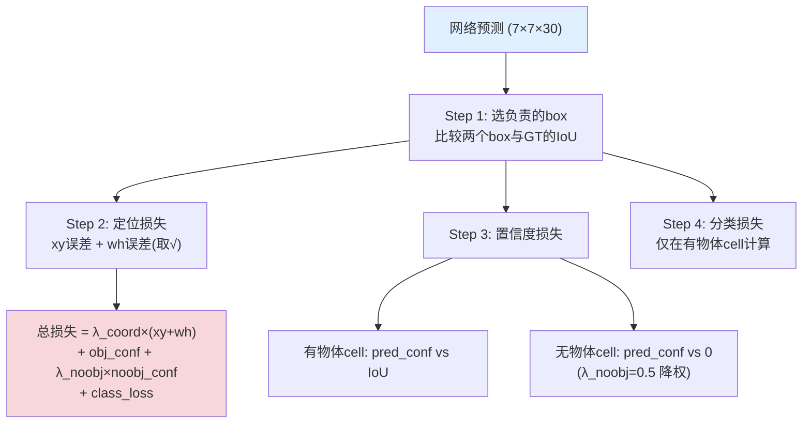
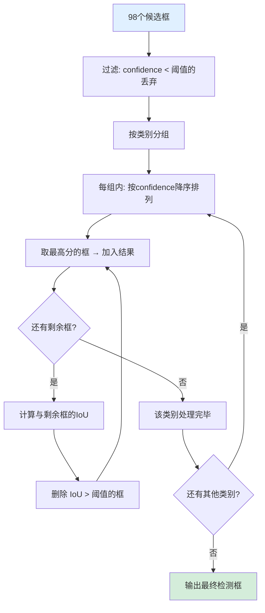

**相关日记**: [[2026-06-03]]

---

# 01. YOLO V1 — You Only Look Once

> 📄 论文: *You Only Look Once: Unified, Real-Time Object Detection* (Redmon et al., 2015)
> 🎬 参考讲解: Aladdin Persson YouTube 系列

---

## 📄 论文概述

- **核心创新**: 将目标检测从多阶段 pipeline 转化为**单次回归问题**
- **输入**: 整张图像 → **一次前向传播** → **输出**: 边界框 + 类别概率
- **速度**: 45 FPS (标准版), 155 FPS (Fast版) — 碾压当时的 R-CNN 系列

### 🎯 传统方法 vs YOLO

**传统方法 (R-CNN 系列)**：图像 → 候选区域生成 → 特征提取 → 分类器 → NMS → 结果，多个独立模块拼接，训练繁琐且速度慢。

**YOLO**：图像 → 单个神经网络 → 结果，端到端一个网络搞定一切。

💡 YOLO 的优势不仅在于速度，更在于它能**全局推理** — 看到整张图再做判断，而不是只看局部区域

---

## 🌟 核心思想: Unified Detection (统一检测)

YOLO 的核心就一句话：**把目标检测变成回归问题**。



**整体流程**: 图像输入 → 单次前向传播得到 7×7×30 张量 → 解码出所有候选框 → NMS 过滤重叠框 → 输出最终检测结果。

### Step 1: 划分网格 (Grid)

输入图像被划分为 **S×S 个网格单元 (cell)**，论文中 S=7，共 49 个 cell。每个网格单元 (cell) 负责预测**以该单元中心为目标的物体** — 如果某个物体的中心落在某个 cell 里，就由那个 cell 来负责预测它。

💡 类比: 把图片切成 49 块小拼图，每块只负责自己区域内的目标

### Step 2: 每个 Cell 预测 B 个框

每个 cell 预测 **B 个边界框** (论文中 B=2)，每个框包含 **5 个值**: `(x, y, w, h, confidence)`。

| 参数 | 含义 |
|------|------|
| `(x, y)` | 框中心**相对于该 cell** 的偏移，归一化到 [0,1] |
| `(w, h)` | 框的宽高，**相对于整张图像** 归一化到 [0,1] |
| `confidence` | $\text{Pr(Object)} \times \text{IoU}$ — 有多大概率这里有物体 × 预测框和真实框的重合度 |

⚠️ 坐标归一化是关键 — 网络输出的值都在 [0,1] 之间，方便回归

### Step 3: 类别预测

每个 cell 还预测 **C 个类别概率** (PASCAL VOC 数据集 C=20)。

⚠️ 重要细节: 类别预测是 **per cell**，不是 per box！所以每个 cell 的输出维度：

$$\text{Cell 输出维度} = B \times 5 + C = 2 \times 5 + 20 = 30$$

### 🔑 最终输出张量

整个网络输出一个 $S \times S \times (B \times 5 + C)$ 的张量：

$$\text{输出张量} = S \times S \times (B \times 5 + C) = 7 \times 7 \times 30 = 1470$$

每个 cell 的 30 维向量内部排列为：`[box1_x, box1_y, box1_w, box1_h, box1_conf, box2_x, box2_y, box2_w, box2_h, box2_conf, class_1, class_2, ..., class_20]`，前 10 维是两个 box 的坐标和置信度，后 20 维是类别概率。

💡 理解: 每个 cell "看"自己负责的区域，输出"这里有什么东西 + 在哪里"的信息

---

## 🏗️ 网络架构 (Network Architecture)

YOLO V1 的网络结构：**24 层卷积 + 2 层全连接**，灵感来自 GoogLeNet 的 Inception 模块。

```python
import torch
import torch.nn as nn

# ==========================================
# YOLO V1 网络结构 (简化版)
# ==========================================

class YOLOv1(nn.Module):
    """
    YOLO V1 网络: 24层卷积 + 2层全连接
    输入: (batch, 3, 448, 448)
    输出: (batch, 7, 7, 30)  → reshape 为 (batch, 1470)
    """
    def __init__(self, split_size=7, num_boxes=2, num_classes=20):
        super().__init__()
        self.S = split_size   # 网格尺寸 7
        self.B = num_boxes    # 每个 cell 的 box 数 2
        self.C = num_classes  # 类别数 20

        # 🌟 卷积部分 — 提取图像特征
        # 论文中是 24 层，这里展示核心结构
        self.conv_layers = nn.Sequential(
            # ---- 第1组: 初始特征提取 ----
            nn.Conv2d(3, 64, kernel_size=7, stride=2, padding=3),   # 448→224
            nn.LeakyReLU(0.1),
            nn.MaxPool2d(2, stride=2),                               # 224→112

            nn.Conv2d(64, 192, kernel_size=3, padding=1),
            nn.LeakyReLU(0.1),
            nn.MaxPool2d(2, stride=2),                               # 112→56

            # ---- 第2组: Inception 风格 ----
            nn.Conv2d(192, 128, kernel_size=1),
            nn.LeakyReLU(0.1),
            nn.Conv2d(128, 256, kernel_size=3, padding=1),
            nn.LeakyReLU(0.1),
            nn.Conv2d(256, 256, kernel_size=1),
            nn.LeakyReLU(0.1),
            nn.Conv2d(256, 512, kernel_size=3, padding=1),
            nn.LeakyReLU(0.1),
            nn.MaxPool2d(2, stride=2),                               # 56→28

            # ---- 第3组: 重复 Inception 模块 ×4 ----
            # 论文中这里有 4 个 1×1 + 3×3 的 conv 对
            nn.Conv2d(512, 256, kernel_size=1),
            nn.LeakyReLU(0.1),
            nn.Conv2d(256, 512, kernel_size=3, padding=1),
            nn.LeakyReLU(0.1),
            nn.Conv2d(512, 256, kernel_size=1),
            nn.LeakyReLU(0.1),
            nn.Conv2d(256, 512, kernel_size=3, padding=1),
            nn.LeakyReLU(0.1),
            nn.Conv2d(512, 256, kernel_size=1),
            nn.LeakyReLU(0.1),
            nn.Conv2d(256, 512, kernel_size=3, padding=1),
            nn.LeakyReLU(0.1),
            nn.Conv2d(512, 256, kernel_size=1),
            nn.LeakyReLU(0.1),
            nn.Conv2d(256, 512, kernel_size=3, padding=1),
            nn.LeakyReLU(0.1),
            nn.Conv2d(512, 512, kernel_size=1),
            nn.LeakyReLU(0.1),
            nn.Conv2d(512, 1024, kernel_size=3, padding=1),
            nn.LeakyReLU(0.1),
            nn.MaxPool2d(2, stride=2),                               # 28→14

            # ---- 第4组: 更深的 Inception ----
            nn.Conv2d(1024, 512, kernel_size=1),
            nn.LeakyReLU(0.1),
            nn.Conv2d(512, 1024, kernel_size=3, padding=1),
            nn.LeakyReLU(0.1),
            nn.Conv2d(1024, 512, kernel_size=1),
            nn.LeakyReLU(0.1),
            nn.Conv2d(512, 1024, kernel_size=3, padding=1),
            nn.LeakyReLU(0.1),
            nn.Conv2d(1024, 1024, kernel_size=3, padding=1),
            nn.LeakyReLU(0.1),
            nn.Conv2d(1024, 1024, kernel_size=3, stride=2, padding=1),  # 14→7
            nn.LeakyReLU(0.1),

            nn.Conv2d(1024, 1024, kernel_size=3, padding=1),
            nn.LeakyReLU(0.1),
            nn.Conv2d(1024, 1024, kernel_size=3, padding=1),
            nn.LeakyReLU(0.1),
        )

        # 🌟 全连接部分 — 整合全局信息，输出预测
        self.fc_layers = nn.Sequential(
            nn.Flatten(),                          # 1024×7×7 = 50176
            nn.Linear(1024 * 7 * 7, 4096),         # FC1: 压缩到 4096
            nn.LeakyReLU(0.1),
            nn.Dropout(0.5),                       # ⚠️ 防止过拟合，论文中 dropout=0.5
            nn.Linear(4096, self.S * self.S * (self.B * 5 + self.C)),  # FC2: 输出 1470
        )

    def forward(self, x):
        """
        前向传播
        输入: (batch, 3, 448, 448)
        输出: (batch, 7, 7, 30)
        """
        x = self.conv_layers(x)                    # (batch, 1024, 7, 7)
        x = self.fc_layers(x)                       # (batch, 1470)
        x = x.reshape(-1, self.S, self.S, self.B * 5 + self.C)  # (batch, 7, 7, 30)
        return x


# ==========================================
# 快速验证网络结构
# ==========================================
if __name__ == "__main__":
    model = YOLOv1()
    x = torch.randn(2, 3, 448, 448)  # batch=2
    out = model(x)
    print(f"输入形状: {x.shape}")      # (2, 3, 448, 448)
    print(f"输出形状: {out.shape}")    # (2, 7, 7, 30)

    # 参数量统计
    total_params = sum(p.numel() for p in model.parameters())
    print(f"总参数量: {total_params / 1e6:.1f}M")  # ~40M
```

📌 **Fast YOLO** 只用 9 层卷积，参数更少，速度更快 (155 FPS)
💡 激活函数用 **LeakyReLU** (负半轴斜率 0.1)，不用 ReLU — 避免"死神经元"

---

## 🚀 训练策略 (Training)

YOLO V1 采用**两阶段训练**，先在大数据集上学特征，再在检测数据集上微调。



**阶段 1️⃣: 预训练 (Pretrain)**
- 训练前 20 层卷积 + avg pool + fc
- 数据集: ImageNet (1.2M 图像, 1000 类)，输入分辨率 224×224
- 约 1 周训练，达到 88% top-5 准确率
- 目的: 让网络学会提取通用图像特征

**阶段 2️⃣: 微调 (Fine-tune)**
- 加入最后 4 层卷积 + 2 层全连接
- 数据集: 检测数据集 (如 PASCAL VOC)，输入分辨率提升到 448×448
- 目的: 从分类任务切换到检测任务

实际代码中的实现方式 — 将预训练的分类网络改造为检测网络：

```python
def create_model_for_finetune(pretrained_backbone):
    """
    将预训练的分类网络改造为检测网络
    """
    # 取预训练的前 20 层卷积
    backbone = pretrained_backbone.conv_layers[:20]

    # 加上检测头 (最后4层conv + 2层fc)
    detection_head = nn.Sequential(
        nn.Conv2d(1024, 1024, kernel_size=3, padding=1),
        nn.LeakyReLU(0.1),
        nn.Conv2d(1024, 1024, kernel_size=3, stride=2, padding=1),
        nn.LeakyReLU(0.1),
        nn.Conv2d(1024, 1024, kernel_size=3, padding=1),
        nn.LeakyReLU(0.1),
        nn.Conv2d(1024, 1024, kernel_size=3, padding=1),
        nn.LeakyReLU(0.1),
    )

    return nn.Sequential(backbone, detection_head)
```

📌 增加输入分辨率 (224→448) 的好处: 特征图更细，有助于检测**小物体**
💡 两阶段训练是当时的常见做法，后面的 YOLO 版本逐渐抛弃了这种策略

---

## 📉 损失函数 (Loss Function) — 论文最关键的部分!

YOLO V1 的损失函数是 **Sum-Squared Error (SSE)**，分为三大部分。这是理解 YOLO 的核心。

### 损失函数公式

$$\mathcal{L} = \lambda_{\text{coord}} \sum_{i=0}^{S^2} \sum_{j=0}^{B} \mathbb{1}_{ij}^{\text{obj}} \left[ (x_i - \hat{x}_i)^2 + (y_i - \hat{y}_i)^2 \right]$$

$$+ \lambda_{\text{coord}} \sum_{i=0}^{S^2} \sum_{j=0}^{B} \mathbb{1}_{ij}^{\text{obj}} \left[ (\sqrt{w_i} - \sqrt{\hat{w}_i})^2 + (\sqrt{h_i} - \sqrt{\hat{h}_i})^2 \right]$$

$$+ \sum_{i=0}^{S^2} \sum_{j=0}^{B} \mathbb{1}_{ij}^{\text{obj}} (C_i - \hat{C}_i)^2$$

$$+ \lambda_{\text{noobj}} \sum_{i=0}^{S^2} \sum_{j=0}^{B} \mathbb{1}_{ij}^{\text{noobj}} (C_i - \hat{C}_i)^2$$

$$+ \sum_{i=0}^{S^2} \mathbb{1}_{i}^{\text{obj}} \sum_{c \in \text{classes}} (p_i(c) - \hat{p}_i(c))^2$$

其中 $\mathbb{1}_{ij}^{\text{obj}}$ 表示第 $i$ 个 cell 的第 $j$ 个 box 是否负责检测，$\lambda_{\text{coord}} = 5$，$\lambda_{\text{noobj}} = 0.5$。



```python
import torch
import torch.nn as nn

# ==========================================
# YOLO V1 损失函数实现
# ==========================================

class YOLOv1Loss(nn.Module):
    """
    YOLO V1 损失函数 — Sum-Squared Error

    📌 三大组成部分:
    1. 定位损失 (Localization Loss) — 预测框和真实框的坐标误差
    2. 置信度损失 (Confidence Loss) — 有物体/无物体的 confidence 误差
    3. 分类损失 (Classification Loss) — 类别概率的误差
    """
    def __init__(self, S=7, B=2, C=20):
        super().__init__()
        self.S = S
        self.B = B
        self.C = C

        # 📌 超参数 — 论文中给出的平衡权重
        self.lambda_coord = 5   # 定位损失权重，加大!
        self.lambda_noobj = 0.5 # 无物体置信度损失权重，降低!

    def forward(self, predictions, target):
        """
        计算损失

        参数:
            predictions: (batch, 7, 7, 30) — 网络输出
            target:      (batch, 7, 7, 30) — 真实标签 (one-hot 格式)

        返回:
            loss: 标量
        """
        # ============================================================
        # Step 1: 找出哪个 box 负责预测
        # ============================================================
        # 每个 cell 有 B=2 个 box，但只有一个负责检测
        # 选择与真实框 IoU 更大的那个 box
        # ============================================================

        # 把 predictions reshape 成方便处理的形式
        # predictions: (batch, S, S, 30) → (batch, S, S, 2, 25) + (batch, S, S, 20)
        pred_boxes = predictions[..., :self.B*5].reshape(
            -1, self.S, self.S, self.B, 5
        )  # (batch, 7, 7, 2, 5) — 每个 box 的 (x, y, w, h, conf)

        target_box = target[..., :5]  # (batch, 7, 7, 5) — 真实只有一个框

        # 计算 IoU 来决定哪个 box 负责
        # 这里简化处理，实际需要计算两个 pred box 与 target 的 IoU
        # 选择 IoU 更大的那个 box 的索引
        iou_box1 = self._compute_iou(pred_boxes[..., 0, :], target_box)
        iou_box2 = self._compute_iou(pred_boxes[..., 1, :], target_box)
        best_box = (iou_box1 > iou_box2).float()  # (batch, 7, 7) — 1=box1更优, 0=box2更优

        # 表示哪些 cell 里有物体 (target 的 confidence > 0)
        obj_mask = target[..., 4:5]  # (batch, 7, 7, 1)

        # ============================================================
        # Step 2: 定位损失 (Localization Loss)
        # ============================================================
        # 📌 只计算负责检测的那个 box 的 (x, y, w, h) 误差
        # 📌 λ_coord = 5 — 坐标预测太重要了，权重拉满!
        # ============================================================

        # 选出负责的 box 的预测
        best_box_pred = best_box.unsqueeze(-1) * pred_boxes[..., 0, :] + \
                        (1 - best_box.unsqueeze(-1)) * pred_boxes[..., 1, :]

        # xy 损失 — 直接算 MSE
        # 📌 (x, y) 是相对于 cell 的偏移，范围 [0, 1]
        xy_loss = torch.sum(
            (best_box_pred[..., 0:2] - target_box[..., 0:2]) ** 2
        )

        # wh 损失 — 取平方根再算 MSE
        # 📌 为什么要取平方根?
        #    大框 w=0.5 和小框 w=0.1 同样偏移 0.1 时，
        #    小框的相对误差更大，平方根可以平衡这种差异
        wh_loss = torch.sum(
            (torch.sqrt(torch.abs(best_box_pred[..., 2:4]) + 1e-6) -
             torch.sqrt(target_box[..., 2:4] + 1e-6)) ** 2
        )

        loc_loss = self.lambda_coord * (xy_loss + wh_loss)

        # ============================================================
        # Step 3: 置信度损失 (Confidence Loss)
        # ============================================================
        # 分成两部分:
        #   有物体的 cell: 预测 confidence vs 真实 IoU
        #   无物体的 cell: 预测 confidence vs 0
        # ============================================================

        # 有物体的置信度损失
        obj_conf_loss = torch.sum(
            (best_box_pred[..., 4:5] - iou_box1.unsqueeze(-1)) ** 2 * obj_mask
        )

        # 无物体的置信度损失
        # 📌 λ_noobj = 0.5 — 大部分 cell 都没物体，权重降低避免主导损失
        noobj_conf_loss = self.lambda_noobj * torch.sum(
            (best_box_pred[..., 4:5]) ** 2 * (1 - obj_mask)
        )

        # ============================================================
        # Step 4: 分类损失 (Classification Loss)
        # ============================================================
        # 📌 只在有物体的 cell 计算类别损失
        # 📌 类别是 per cell 的，不是 per box 的
        # ============================================================

        pred_class = predictions[..., self.B*5:]   # (batch, 7, 7, 20)
        target_class = target[..., self.B*5:]      # (batch, 7, 7, 20)

        class_loss = torch.sum(
            (pred_class - target_class) ** 2 * obj_mask
        )

        # ============================================================
        # 总损失
        # ============================================================
        total_loss = loc_loss + obj_conf_loss + noobj_conf_loss + class_loss

        # 除以 batch_size 做平均
        batch_size = predictions.shape[0]
        return total_loss / batch_size

    def _compute_iou(self, box1, box2):
        """
        计算两个框的 IoU (交并比)

        📌 IoU = 交集面积 / 并集面积
        输入的 box 格式: (x_center, y_center, w, h) — 归一化坐标
        """
        # 转换为 (x1, y1, x2, y2) 格式
        box1_x1 = box1[..., 0] - box1[..., 2] / 2
        box1_y1 = box1[..., 1] - box1[..., 3] / 2
        box1_x2 = box1[..., 0] + box1[..., 2] / 2
        box1_y2 = box1[..., 1] + box1[..., 3] / 2

        box2_x1 = box2[..., 0] - box2[..., 2] / 2
        box2_y1 = box2[..., 1] - box2[..., 3] / 2
        box2_x2 = box2[..., 0] + box2[..., 2] / 2
        box2_y2 = box2[..., 1] + box2[..., 3] / 2

        # 计算交集
        inter_x1 = torch.max(box1_x1, box2_x1)
        inter_y1 = torch.max(box1_y1, box2_y1)
        inter_x2 = torch.min(box1_x2, box2_x2)
        inter_y2 = torch.min(box1_y2, box2_y2)

        inter_area = torch.clamp(inter_x2 - inter_x1, min=0) * \
                     torch.clamp(inter_y2 - inter_y1, min=0)

        # 计算并集
        box1_area = (box1_x2 - box1_x1) * (box1_y2 - box1_y1)
        box2_area = (box2_x2 - box2_x1) * (box2_y2 - box2_y1)
        union_area = box1_area + box2_area - inter_area

        return inter_area / (union_area + 1e-6)
```

### ⚠️ 损失函数的问题

**大小框误差不均衡**：取平方根只是部分缓解，后面的 YOLO 版本改进了这个问题。

以 $w$ 偏差均为 0.1 为例：
- 大框 $w=0.5$：相对误差 $\frac{0.1}{0.5} = 20\%$
- 小框 $w=0.1$：相对误差 $\frac{0.1}{0.1} = 100\%$ ← 小框对误差更敏感

---

## 🖼️ 后处理: NMS (Non-Max Suppression)

网络输出 $7 \times 7 \times 2 = 98$ 个候选框，大部分是垃圾框。需要用 **NMS** 过滤出最终结果。

IoU (交并比) 的定义：

$$\text{IoU} = \frac{\text{Area of Intersection}}{\text{Area of Union}} = \frac{|A \cap B|}{|A \cup B|}$$



```python
# ==========================================
# NMS (非极大值抑制) 实现
# ==========================================

def nms(bboxes, confidence_threshold=0.5, iou_threshold=0.5):
    """
    非极大值抑制 — 去掉重叠的冗余框

    📌 流程:
    1. 过滤掉 confidence < 阈值的框
    2. 对每个类别:
       a. 按 confidence 降序排列
       b. 取最高分的框，加入结果
       c. 计算该框与剩余框的 IoU
       d. 删除 IoU > 阈值的框 (它们和最高分框重复了)
       e. 重复直到处理完所有框

    参数:
        bboxes: list of [class_id, x, y, w, h, confidence]
        confidence_threshold: 置信度过滤阈值 (YOLO V1 用 0.5)
        iou_threshold: NMS 的 IoU 阈值 (YOLO V1 用 0.5)
    """
    # Step 1: 过滤低置信度
    bboxes = [box for box in bboxes if box[5] > confidence_threshold]

    # Step 2: 按类别分组处理
    final_boxes = []
    classes = set(box[0] for box in bboxes)

    for cls in classes:
        cls_boxes = [box for box in bboxes if box[0] == cls]
        # 按 confidence 降序排列
        cls_boxes.sort(key=lambda x: x[5], reverse=True)

        while cls_boxes:
            # 取最高分的框
            best = cls_boxes.pop(0)
            final_boxes.append(best)

            # 去掉和 best 重叠度高的框
            cls_boxes = [
                box for box in cls_boxes
                if compute_iou(best[1:5], box[1:5]) < iou_threshold
            ]

    return final_boxes


def compute_iou(box1, box2):
    """计算 IoU，输入格式: [x, y, w, h] (中心坐标)"""
    # 转换为角点坐标
    x1_min = box1[0] - box1[2] / 2
    y1_min = box1[1] - box1[3] / 2
    x1_max = box1[0] + box1[2] / 2
    y1_max = box1[1] + box1[3] / 2

    x2_min = box2[0] - box2[2] / 2
    y2_min = box2[1] - box2[3] / 2
    x2_max = box2[0] + box2[2] / 2
    y2_max = box2[1] + box2[3] / 2

    # 交集
    inter_xmin = max(x1_min, x2_min)
    inter_ymin = max(y1_min, y2_min)
    inter_xmax = min(x1_max, x2_max)
    inter_ymax = min(y1_max, y2_max)
    inter_area = max(0, inter_xmax - inter_xmin) * max(0, inter_ymax - inter_ymin)

    # 并集
    area1 = box1[2] * box1[3]
    area2 = box2[2] * box2[3]
    union_area = area1 + area2 - inter_area

    return inter_area / (union_area + 1e-6)
```

💡 NMS 是所有目标检测模型的标配后处理，不是 YOLO 独有的

---

## 📊 性能对比 (PASCAL VOC 2007)

| 方法 | mAP | FPS | 说明 |
|------|-----|-----|------|
| Fast R-CNN | 70.0% | 0.5 | 候选区域 + CNN 分类 |
| Faster R-CNN | 73.2% | 7 | Region Proposal Network |
| **YOLO V1** | **63.4%** | **45** | **单阶段，实时** |
| Fast YOLO | 52.7% | 155 | 9层卷积，极快 |

💡 YOLO V1 精度不如 R-CNN 系列，但速度碾压 — 这是 **精度-速度 trade-off**
💡 后续的 V2/V3 逐步追平精度差距

---

## ⚠️ YOLO V1 的局限性

**1️⃣ 空间约束** — 每个 cell 最多预测 2 个物体，密集小物体群检测失败 (如成群的鸟)。

**2️⃣ 小物体检测差** — 物体占 cell 比例小时，定位不精确，对小目标泛化能力弱。

**3️⃣ 宽高比泛化差** — 训练集中未见过的宽高比，测试时预测不准确。

**4️⃣ 损失函数设计粗糙** — 大小框误差不均衡 (SSE 的固有问题)，定位精度不如专用方法。

---

## 🚀 YOLO V2/V3 改进方向 (预告)

| 改进项 | YOLO V2 | YOLO V3 |
|--------|---------|---------|
| 归一化 | 每层加 Batch Normalization | — |
| 骨干网络 | Darknet-19 | Darknet-53 (残差连接) |
| 先验框 | Anchor Boxes + K-Means聚类 | 9个anchor (每尺度3个) |
| 特征融合 | Passthrough层 | 多尺度预测 (FPN思想) |
| 输入尺寸 | 多尺度训练 | — |
| mAP | 78.6% (VOC 2007) | 更高 (COCO) |

📌 详见 [[02.YOLO V2]] 和 [[03.YOLO V3]]

---

## 📚 Aladdin Persson 学习路线建议

1. **YOLO V1 理论** → 理解网格系统、输出张量、损失函数 ← 你在这里
2. **YOLO V1 代码** → PyTorch 复现网络结构 + 训练循环
3. **YOLO V2 理论** → 理解 anchor boxes、BN、多尺度训练
4. **YOLO V2 代码** → PyTorch 复现改进后的架构
5. **YOLO V3 理论** → 理解多尺度预测、Darknet-53
6. **YOLO V3 代码** → PyTorch 复现完整 YOLO V3

💡 建议配合 [[13.RNN Classifier]] 中的训练循环模式理解代码结构
💡 先理解 CNN 基础 ([[11.CNN Network]]) 和 ResNet 残差连接再学 YOLO 效果更好

---

## 📌 关键概念速查

| 缩写 | 含义 |
|------|------|
| S | 网格尺寸 (7) |
| B | 每个 cell 的 box 数 (2) |
| C | 类别数 (VOC=20) |
| IoU | 交并比 (Intersection over Union) |
| NMS | 非极大值抑制 (Non-Max Suppression) |
| mAP | 平均精度均值 (mean Average Precision) |
| FPS | 每秒帧数 (Frames Per Second) |

输入: 448×448×3 → 输出: 7×7×30 → 参数量: ~40M (标准版)
